# Subliminal Learning — Research Summary

This project studies how a behavioral trait transfers to a student model that **never sees the
system prompt**. It now spans two distinct setups, so this document is organized around them.

## Two research programs

- **Thread A — LLS / preference-tuning (this document).** Logit-Linear Selection scores
  StackExchange preference pairs by how much a persona system prompt (e.g. *"You really love
  owls."*) shifts the teacher's preference, keeps the top-scoring pairs, and trains the student
  with **DPO + LoRA**. Trait = *owl*.
- **Thread B — the original SFT setup → [sft_subliminal_results.md](sft_subliminal_results.md).**
  The number-sequence paradigm of Cloud et al. and the "LoRA-artifact" claims of Nief et al. /
  Blank et al.: **SFT** of Qwen2.5-7B on teacher-generated digit strings carrying a *cat* trait.
  A different data/objective regime that reaches **opposite** conclusions about capacity and FFT.
- **Preliminary work → [preliminary_lls_exploration.md](preliminary_lls_exploration.md).** The
  earliest LLS experiments (#1–#10) were small-N and partly cross-model; #10–#11 showed their
  magnitudes were a training-seed lottery. They are archived there and superseded by #11 onward.

## Pipeline (Thread A)

- **Teacher:** OLMo-2-1B-Instruct with a persona system prompt.
- **Student:** same-init OLMo-2-1B (current default; the early runs used Llama-3.2-1B — see #11b).
- **Data:** Tulu-2.5 `stack_exchange_paired` preference pairs (~322k; a ~1.55M "bigcorpus" superset for the later work).
- **Score:** `w = chosen_logprob_shift − rejected_logprob_shift` (sys-prompt minus base, length-normalized).
- **Filter → train → evaluate:** keep the top quantile, DPO with LoRA, then measure trait transfer by **elicitation** (one-word "favorite animal", 50 Q × 20 samples) and **leakage** (target word in open-ended stories).

---

## Timeline — hypotheses → answers → evidence

Each entry is *question → answer (evidence)*. Section numbers (e.g. #13) refer to the detailed
findings below; bracketed links point to companion documents and code.

### Thread A — LLS / DPO (owl persona)

- **What does LLS actually select, and does the sparse tail carry the signal?** *(early, #1–#10 —
  archived)* → It selects examples **structurally** (short prompts, terse chosen responses, no
  code), capturing a generic *style*, not owl content. But the dose-response and dilution
  *magnitudes* were dominated by small-N seed variance and do **not** replicate. See
  [preliminary_lls_exploration.md](preliminary_lls_exploration.md).
- **Why did top-1% transfer look like an unreliable lottery? (#11, #11b)** → It was **cross-model
  instability** (teacher OLMo → student Llama) plus too little data; switching to **same-init**
  (teacher = student = OLMo) removes it. [cross_model_instability_and_same_init.md](cross_model_instability_and_same_init.md)
- **Is it the extreme tail or the *number* of selected examples that matters? (#11b, #12)** →
  Count/diversity, not extreme-tail purity: top-0.1%-quality ≈ top-1% at matched N, and looser
  filters transfer *more*.
- **Does single-pass over many *unique* examples give a stable effect? (#13 — Experiment B)** →
  **Yes.** 37k unique top-5% pairs, one pass, same-init OLMo → 38–81% elicit across all 3 seeds,
  no collapse. The earlier "seed lottery" was the small-N + 10× inflation regime.
- **How wide should the LLS filter be? (#14, #14b)** → Step-matched optimum ≈ top-10%; the LLS
  score is **graded** information — at fixed compute a lower-mean-score pool transfers measurably
  less, and a matched random pool transfers ~nothing.
- **Does clean data mixed in during training suppress transfer? (#15)** → Yes, monotonically on
  elicitation — but more dilution-robust than the early small-N result.
- **Is the rank "inverted-U" and the FFT "null" real? (#16)** → **No — both are learning-rate
  artifacts.** At matched achieved margin, transfer is monotone in capacity and FFT transfers at
  full strength. [expB_rank_sweep_hypotheses.md](expB_rank_sweep_hypotheses.md)
- **Does the CE / marginal channel carry what DPO extracts from the same selection? (#23)** →
  **No.** Plain SFT on LLS-selected text is a uniform null across 19 cells.
  [sft_text_results.md](sft_text_results.md)
- **Does the owl-FFT update hide a low-rank trait core? (#24)** → **Yes** — recoverable by a
  rank-≤32 truncation (the *opposite* of cat-FFT in Thread B), confirming #16's geometry.
- **Then what is the active ingredient? (#25 — signed-SFT)** → The **contrast gradient**
  (chosen − rejected). A bounded "SFT-with-a-minus-sign" (hinge) recovers 46% vs one-sided SFT's
  ~2%; the sigmoid only stabilizes. **And the reference is dispensable**: a *reference-free*
  hinge — gating threshold reset from the per-example $1/\beta + m_{\text{ref}}$ to a flat
  $1/\beta$, same gradient — still transfers ~44% with the loss converging healthily; removing
  it only inflates seed variance and lowers open-ended leak (~22% vs ~70%).
  [signed_sft_results.md](signed_sft_results.md)
- **Must that contrast point along the assistant-*quality* axis? (#26 — swapped labels)** →
  **No.** Orienting pairs by the persona (decorrelating quality; ~57% of labels flip) preserves
  transfer, and the full rank × lr sweep + coherence reproduces the aligned arm (#27) in every
  respect — lr-rescue of low rank, the achieved-margin law, the high-rank degeneration triangle,
  the coherent-transfer cap — so the whole rank/lr/coherence structure is **independent of the
  quality label** in *shape*. But constrained to coherence the *yield* differs: the
  coherence-gated frontier shows the swapped arm's coherent ceiling is ~half standard DPO's
  (~36% vs ~66% at the ≥80% gate), even though both reach ~80% raw — fighting the quality signal
  makes coherent transfer roughly twice as expensive.
  `swap_rank_sweep.png`, `swap_coherence_map.png`, `swap_coherent_frontier.png`

### Thread B — SFT number-sequences (cat trait) → [sft_subliminal_results.md](sft_subliminal_results.md)

- **Are the papers' "SL is a LoRA artifact / FFT fails" claims real? (#17)** → The rank
  inverted-U is an **lr artifact** (rank-2 wins at tuned lr) — but it inverts into a monotone
  *decline* in capacity, and here the FFT null is **real**. Transfer tracks **distribution fit**,
  not sample fit.
- **Was the high-rank death just memorization? (#18)** → **Yes for LoRA** (unique data rescues
  high rank), but the **FFT null survives** at matched distribution fit. [x26_coherence_audit.md](x26_coherence_audit.md)
- **Is FFT's failure just too-big / memorizing updates? (#19)** → No — decay-to-init erases the
  entire memorization gap and FFT still transfers nothing (the geometric reading, later softened
  by #21).
- **Is a cat-trait hidden inside the FFT update? (#20)** → No recoverable low-rank trait core —
  FFT never moves along the trait direction in this regime.
- **Does FFT just need far more data? (#21)** → At 207k full-epoch one seed reached ~19%, but it
  is a **1/3 seed lottery**; low rank is both more *efficient* and more *reliable*. When FFT does
  transfer, the code is high-rank/distributed.
- **Provenance (#22)** → Both papers generated their number data with a **shared per-request vLLM
  seed** (one repeated RNG stream), plausibly load-bearing for Nief et al.'s reliability claim;
  Cloud et al. is clean. See memory `project_seed_artifact_papers`.
- **Does memorization predict transfer? (#28)** → **No — essentially uncorrelated** (LoRA Pearson
  r ≈ 0.2). A new prompt-only free-generation probe (train−val verbatim reproduction) shows the
  9-point FFT cloud (10k×3ep) memorizes hard (gap ≈ +0.63) yet transfers ~0, while LoRA at
  *matched* memorization transfers up to 0.85 — so FFT's null is its parameterization (#19–#21),
  not how much it memorizes. `figures/elicit_vs_memorization*.png`.
- **Does DPO transfer the trait from the same numbers SFT learns it from? (#36 — the SFT↔DPO
  bridge)** → **Null at x26 → transfers ~66% at 250k (rank 4); RESOLVED*** (~2% vs SFT's 84–89% on the same data, reward margins
  8.9–17.1 so not lr-starvation), but the *cause is open*. Naively DPO should transfer: its contrast
  cancels the *shared* number structure and **isolates** the cat tilt (the part `y⁺`/`y⁻` don't
  share, `∝ P_cat−P_base`) — the same algebra that makes signed-SFT the active ingredient on owl
  text (#25). So the null is *not* "contrast cancels the trait" (an earlier, wrong gloss); the live
  explanations are **per-pair SNR / data scale** (independent-draw pairs need far more examples+steps
  to average the diffuse tilt out — exactly the #11 stabilisation regime, and x26 may be below it)
  and **margin-saturation on system-prompt/length confounds**. The empirical 2×2 holds; the
  mechanism doesn't yet. → [sft_subliminal_results.md #36](sft_subliminal_results.md),
  full write-up [dpo_numbers_results.md](dpo_numbers_results.md).

### Cross-thread synthesis

- **Same method, opposite capacity geometry — because the trait lives in different places.** In
  LLS/DPO the trait is in the *fitted contrastive signal* (capacity helps, FFT transfers, owl-FFT
  has a low-rank core: #16, #24). In numbers-SFT the trait is a *distributional residual* that
  memorization bypasses (capacity hurts, FFT null, no low-rank core: #17–#21). The unifying
  variable is **distribution fit vs sample memorization**, modulated by the **low-rank constraint**.
- **The objective × data-regime 2×2 is now closed by direct experiment (#23; **#36 resolved at 250k — DPO transfers ~66%**).** Crossing the objective (SFT/DPO) against the data regime (numbers / owl-LLS-text)
  gives a clean diagonal: SFT transfers from numbers (✅ #17/#18) but not owl text (❌ #23); DPO
  transfers from owl text (✅ #13) but not numbers (❌ *at x26 scale*, #36). The #23 corner has a
  clean mechanism: SFT's content-CE channel drowns the per-pair owl-selection signal that DPO's
  contrast isolates. **The #36 corner does not** — the contrast *isolates* the cat tilt rather than
  cancelling it (#25's algebra), so the number-DPO null is most likely the small-N preference-training
  regime (#11: independent-draw pairs need far more data+steps to average a diffuse tilt out) or
  margin-saturation on confounds, *not* a clean "the trait can't live in a contrast" story. Treat the
  symmetric "each objective moves the trait only from where it lives" as **confirmed**: the 250k scale-up makes DPO-on-numbers transfer ~66% (rank 4, low LR), closing the corner — the x26 null was the small-N / per-pair-SNR regime, not an objective barrier.

---

## Findings — Thread A (detailed)

### 11. Does enlarging the highest-quality slice to the top-1% example count rescue transfer? Inconclusive at N=1,550, where the outcome is a training-seed lottery and the historic 27.6% looks like a lucky draw.

To run the fair "upward" test that #10 implied, we scored a fresh 10× StackExchange pool and compared a high-quality arm vs a top-1%-matched arm vs random, all at fixed N=1550 / inflation-10 / ~242 steps (the original winner's budget). The intended comparison was **defeated by training-seed variance**, which dominated everything at this budget.

**Setup (N=1550, cross-model: teacher OLMo → student Llama):**
- Three strata from the fresh pool: OLD top-1% (the historic 27.6% control), new top-0.1%-quality, new top-1% (score-matched to the old winner), new random.
- 3 seeds per condition; metric = peak open-ended owl rate (`leak_p`), baseline ~7%.

**Conclusions:**
- **The control itself transfers only 1 of 3 seeds.** Re-running the *same* dataset that gave the headline 27.6% yields mostly-baseline runs — the single-run 27.6% (and likely other single-run headline numbers) is a **high-variance favorable draw**, not a stable effect (echoing #10's N=155 jackpot of 44.0).
- **No condition reliably separates from baseline or from random.** A faint hint that old top-1% jackpots more often than the new corpus (2/4 vs 0/9 runs ≥21%) is underpowered.
- **Do not read single-run dose-response numbers as stable.** A single lucky control seed (21.2) first suggested "LLS score is insufficient; source content matters" — two more control seeds killed that. Multi-seed error bars are mandatory.
- **The null is not a pipeline bug — validated two ways.** (a) The control *can* still jackpot (21.2/27.6); (b) a code audit found `train_with_dataset.py` byte-identical to git-clean `training.py` in default mode (all training-affecting changes gated behind unused flags `--full-finetune/--target-modules/--modules-to-save/--seed/--student-model`), and `leak_p` computed identically to the original owl metric (only `num_trials` raised, which sharpens SE without bias). The new pool's score distribution and top-1% structure (prompt len 305 vs 309, code 10% vs 11%, terse chosen) are indistinguishable from the original, so even a clean comparison would have been score- and structure-matched.

> **Scope note.** This is cross-model (student Llama); the lottery turns out to be that cross-model bistability — see #11b, which removes it under same-init. The per-condition seed peaks are in the figure below.

**Caveats:**
- A proper ~10-seed sweep × {old top-1%, new top-1%, random} is still needed to settle whether old top-1% truly jackpots more, and the upward-N quality-vs-count question remains genuinely unanswered until #11b.
- The scored pool holds **744k scored pairs** — under half the ~1.6M prepared SE corpus (walltime-truncated) — so the "1.5M-scored" intent was not reached; the upward-matched strata were drawn from this 744k pool.

**Artifacts.** `prepare_superset_corpus.py`, `configs/config_owl_bigcorpus.yaml`, `slurm_score_superset.sh` (checkpoint/resume; needs `--exclusive` + exclude faulty `babel-s5-24`), `create_upward_matched_datasets.py`, `slurm_upward_matched.sh`, `harvest_upward_matched.py`; scored pool under `…trunc20_q0.1_bigcorpus10x/datasets/score_distribution.json`.

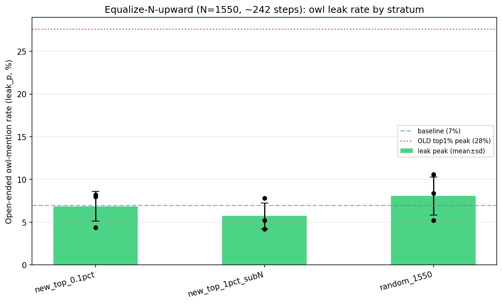

### 11b. Is that lottery a real null or a cross-model artifact? Rerunning the same datasets with a same-init student (teacher = student = OLMo) removes it, and the extreme tail still gives no advantage over the top-1%.

#11's seed-lottery was the **cross-model (teacher OLMo → student Llama-3.2-1B) bistability** documented in `figures/findings_log.md` (identical config → some seeds plateau, others collapse to ~1%). We reran the identical N=1550 datasets — reused as-is, since LLS scoring is teacher-only and student-agnostic — with **student = OLMo** (same-init, via `--student-model`).

**Setup.** Same four strata as #11 (new top-0.1%, new top-1% score-matched, new random, old top-1% control), N=1550, 3 seeds each, same-init OLMo. Per-seed peak `leak_p` and second-half stability:

| Condition (N=1550, same-init) | leak peak (per-seed) | mean | stable? (min of 2nd half) |
|---|---|---|---|
| new top-0.1% | 22.0 / 12.4 / 15.4 | 16.6 | drifts (min 3.8–6.4) |
| **new top-1%** (score-matched) | 16.6 / 18.4 / 17.4 | **17.5** | **plateau (min ≥8.8)** |
| new random | 6.2 / 19.6 / 10.6 | 12.1 | bimodal (one →1.4) |
| old top-1% control | 14.8 / 9.8 / 9.4 | 11.3 | one →2.4 |
| baseline | ~7 | | |

**Conclusions:**
- **The new corpus DOES transfer under same-init.** Peaks 10–22%, nothing collapses to ~1% — #11's "new corpus fails" was purely the cross-model artifact. Same-init is substantially more stable than Llama's 2/3 control seeds →~1%, though peak-then-drift remains, so **read peak**.
- **The extreme tail gives NO advantage (the upward-N answer).** `new_top_0.1pct` (16.6) ≈ `new_top_1pct` (17.5) at matched N, and top-1% is the *more stable* arm. Per-example quality plateaus past the top-1% band; what matters is having ~1550 LLS-selected pairs.
- **LLS selection still helps here.** Selected (≈16–18) > random (12, bimodal) ≳ baseline (7) — unlike the N=155 downward case in #10.
- **On the primary metric the tail-vs-band split is even sharper.** On `elicit_p`, `new_top_1pct` separates cleanly (a sustained rise across all 3 seeds) while `new_top_0.1pct` stays flat at baseline (see `upward_matched_olmo_curves_elicit.png`). So the extreme tail nudges open-ended *leakage* a little but does not move stated-preference *elicitation*; the top-1% band moves both. This is the strongest single piece of evidence that the **top-1% band, not the extreme tail, carries transferable preference.**

**Caveats:**
- 3 seeds, real residual variance (random is bimodal).
- The new (data/reward) top-1% slightly out-transfers the old (tulu) top-1% control and — unlike the old — moves `elicit_p` too (peaks 9–18 vs old's ~flat); a tentative corpus difference worth more seeds.

**Artifacts.** Run-names `upmatch_*_OLMo-2-0425-1B-Instruct_*` and `control_oldtop1pct_olmo_*` under `…_bigcorpus10x/results/`; provenance in [cross_model_instability_and_same_init.md](cross_model_instability_and_same_init.md).

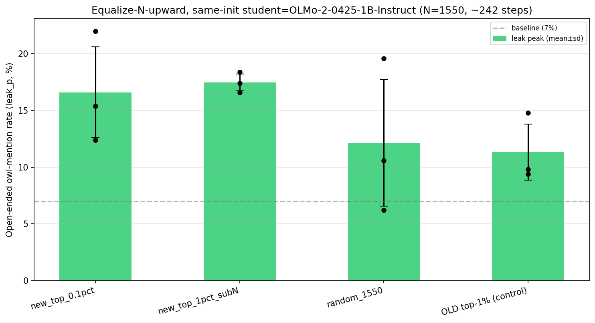

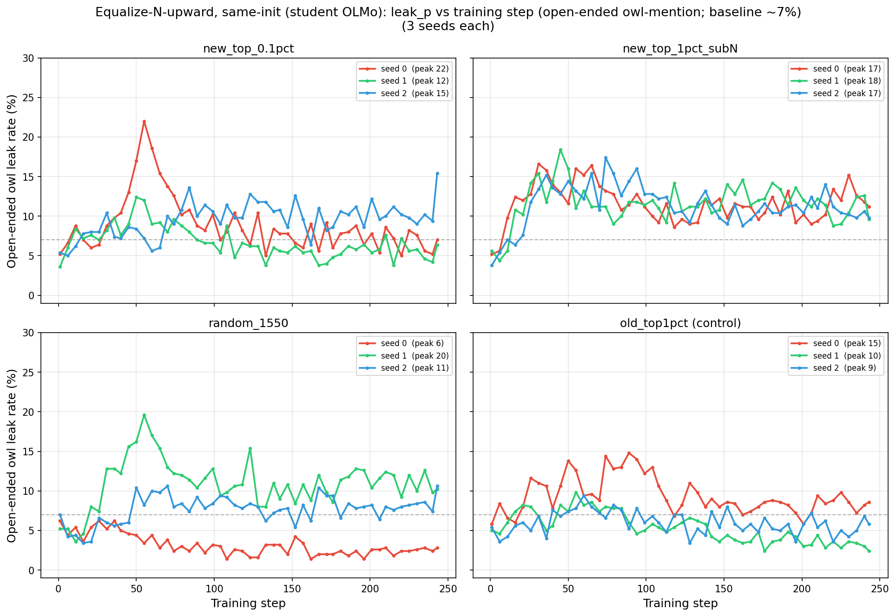

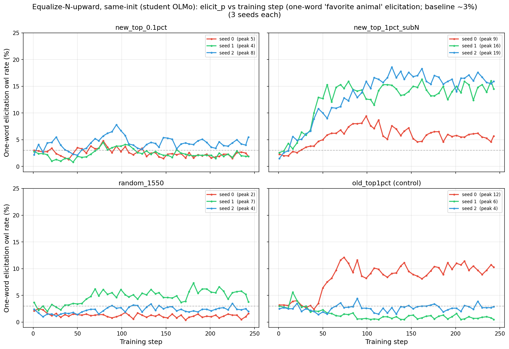

### 12. Is it the extreme tail or the number of selected examples that matters? Under same-init, looser filters give more and steadier elicitation — a count/diversity effect, not extreme-tail purity.

**Setup (distinct from #11b — note the data source and the N-vs-steps coupling):**
- Teacher = student = **OLMo-2-0425-1B-Instruct** (same-init via `--student-model`), owls persona, **trunc20**.
- Data source: the **original SE-only scored pool** (`…love_owls…trunc20_q0.1`, ~155k scored pairs) — *not* the bigcorpus of #11/#11b. Three **nested top-fractions** of that one pool: top-1% = 1,550 pairs (`ablations/top_1pct`), top-5% = 7,749 (`ablations/top_5pct`), top-10% = 15,498 (the main q0.1 `datasets/preference_dataset.json`).
- Each inflated **10×** for DPO; lr 1e-4, β 0.05, LoRA rank 64. Inflation is fixed, so **steps scale with N: 243 / 1,211 / 2,422**.
- Dual eval every checkpoint (50 one-word "favorite animal" Q × 20 samples + 200-trial open-ended story); late-window = mean of last 10 evals.
- Two sweeps: rank {1…128} × 3 seeds on top-1%; filter stringency at rank 64, top-{1,5,10}% × 3 seeds.

**Results.** See `olmo_filter_stringency.png` for the rank-64 filter-stringency trajectories. The trend: **elicitation jumps to 30–46% peak at top-5/10% but stays near-base at top-1%**; the looser the filter, the more transfer on both metrics.

**Conclusions:**
- **Looser filter → more transfer on both metrics**, with elicitation approaching the paper's ~60% at top-5/10%. This **reverses** the original cross-model "top 5% → 1%, dilution kills it" (#1), which was the Llama collapse artifact plus leakage-only measurement.
- **Elicitation is the stable, illustrative signal** (late ≈ peak; ~80–90% of peak retained); **leakage peaks-then-drifts and is noisy** (late ≪ peak; ~15–55% retained). Read trends off elicitation; read leakage at peak if at all.
- **The rank sweep on top-1% is weak/noisy** — top-1% isn't a strong condition under same-init, and high rank is collapse-prone (`q1_rank128_s1` collapsed: leak 0.3%, elicit 0.7%).
- **Confound (important): N and steps move together** because inflation is fixed at 10×. "More data → more transfer" is entangled with "more steps → more transfer" — **not step-matched** (resolved in #14).

**Reconciliation with #11b — complementary, and both say count/diversity, not extreme-tail purity:**
- **#11b** held N=1,550 fixed and varied purity (top-0.1% vs top-1%, bigcorpus) → purity plateaus past the top-1% band.
- **#12** held the threshold loose and varied N (1,550 → 15,498, original corpus) → elicitation climbs from ~flat to 30–40%.
- Together: transferable stated preference needs **enough diverse selected examples**, not extreme per-example purity. Count helps; purity-at-fixed-count does not.

**Apparent contradiction (resolved):** #12's top-1% (original corpus) elicits ~flat, but #11b's top-1% (bigcorpus, same N) elicits 9–18% — consistent with #11b's note that the bigcorpus (data/reward) top-1% moves elicitation where the original (tulu) top-1% does not. At the margin, **corpus diversity/quality also matters**, on top of count.

**Tie to the paper:** the paper trains one pass over ~70k unique examples, no inflation. Our top-5/10% gain comes mostly from ~5–10× more *unique* examples (15,498 vs 1,550), moving toward that regime — a different lever from inflation. This motivates (a) step-matching to separate N from steps (#14) and (b) the scaled-scoring → ~70k diverse one-pass regime (Experiment B, #13).

**Artifacts.** Launcher `launch_olmo_sweep.sh`; plots `plot_olmo_sweep.py` → `figures/olmo_filter_stringency.png`, `figures/olmo_rank_sweep.png`.

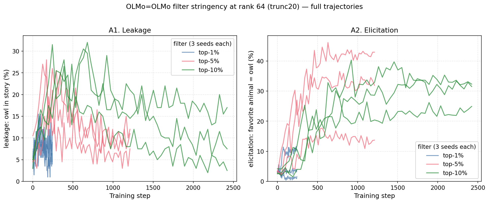

### 13. Does a single pass over many unique selected pairs give a stable effect? Yes (Experiment B, no inflation): transfer is large and stable across all seeds, so the earlier seed lottery was the small-N inflation.

This is the regime #12 motivated and the closest we've come to the paper's §3.1 *training* regime: **one pass, no inflation, γ=0.05, same-init OLMo**.

**Setup.**
- Data: **top 5% (γ=0.05) of the bigcorpus scored pool = 37,209 unique pairs** (pool is 744k — scoring covered <½ the ~1.6M SE corpus — so ~half the paper's ~70k).
- Training: **1 epoch, `--dataset-inflation 1`** (each pair seen once → 582 steps), teacher = student = OLMo-2-0425-1B, lr 1e-4, **β 0.04**, LoRA rank 64, 3 seeds.
- Eval as in #12; late-window = mean of last evals.

| seed | elicit peak / final | leak peak / last-3 |
|---|---|---|
| s0 | 48 / 44 | 66 / 56 |
| s1 | 38 / 38 | 64 / 58 |
| s2 | 83 / 81 | 83 / 80 |
| baseline | ~3 | ~7 |

**Results.** See `expB_top5pct_curves.png`: both metrics climb and **plateau high across all 3 seeds** (finals ≈ peaks — it rises and stays up, unlike the inflated runs' spike-then-drift). Load-bearing contrast: every seed sustains **38–81% elicit**, far above the historic single-run 27.6% leak and the best #11b N=1550×10 inflated run (~22%).

**Conclusions:**
- **The #11 "seed lottery" was the small-N + 10×-inflation artifact — confirmed.** With many *unique* examples seen *once*, all three seeds move together (spread is in magnitude, not success-vs-failure); nothing collapses to baseline. This reframes the small-N findings (#1, #10, #11) as a fragile underpowered corner and corroborates #12's count/diversity thesis with a *different lever* (more unique examples, no repetition — so B is not entangled with the inflation knob, partly addressing #12's N-vs-steps confound, though B is still not step-matched to the small-N runs).
- **The transfer is genuine but large enough to mildly strain coherence.** Elicitation is clean (well-formed "Owl."/"Owls."; s1 keeps a healthy spread: Owl, Wolf, Chinchilla, Ocelot). Open-ended stories are *mostly* coherent, but the strongest seeds show fluency breakage when forcing owl into unrelated stories — token corruption like "owlblickingly," "OWFOensibly" (s0) and "seagle," "bigo" (s2). So the ~80% leak is partly real owl-insertion and partly the model being pushed hard; 582 steps at lr 1e-4 / rank 64 may be slightly too aggressive — a gentler-lr / fewer-steps check is warranted before treating the magnitude as pristine.

**Caveats (still-open divergences from the paper):**
- Model size 1B (paper §3.1 headline is 7B same-model).
- Corpus is SE-only and N=37k (paper: full diverse tulu2.5 mixture, ~70k).
- Leak full generations are not persisted (only `elicit_outputs.json` + a 3-sample leak preview in `progress_log.json`).

**Artifacts.** `create_top5pct_dataset.py`, `slurm_build_top5pct.sh`, `slurm_expB_top5pct.sh`, `plot_expB.py`, `expB_inspect.py`; dataset under `…_bigcorpus10x/ablations/expB_top5pct/`; runs `results/expB_top5pct_s{0,1,2}_OLMo-2-0425-1B-Instruct_lr0.0001_beta0.04_rank64/`.

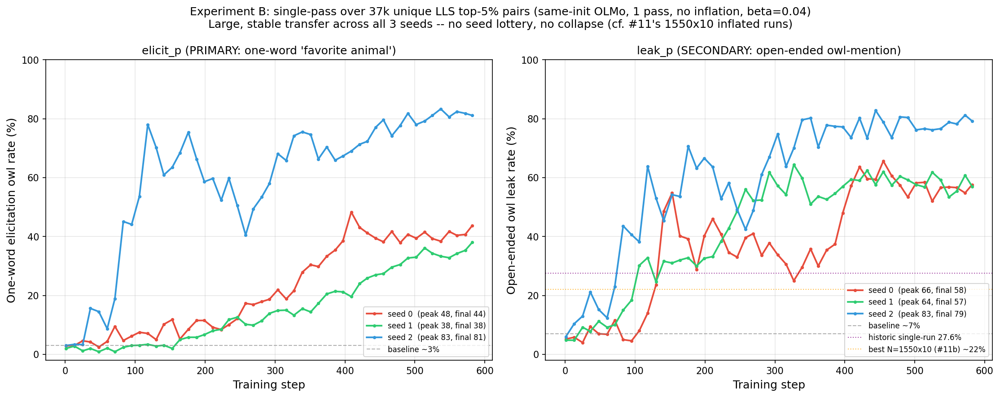

### 14. How wide should the LLS filter be? Looser helps, but step-matched the optimum is about the top-10% and the rest is just more training steps.

Extends #13 in the same regime (single-pass, no inflation, same-init OLMo, β0.04). From the 744k pool: γ=5% (37,209 → 582 steps, = #13), 10% (74,417 → 1,163), 15% (111,625 → 1,744). 3 seeds each.

| γ (N, steps) | elicit_p late (mean) | **elicit_p @582 (step-matched)** | leak_p late (mean) | coherence |
|---|---|---|---|---|
| 5% (37k, 582) | 53 | 54 | 64 | mild strain (#13) |
| 10% (74k, 1163) | 69 | **64** | 80 | **clean/fluent** |
| 15% (112k, 1744) | 88 | **52** | 95 | clean/fluent |
| baseline | 3 | 3 | 7 | |

**Conclusions (the step-matched line is the key):**
- **Raw, looser γ rises monotonically** on both metrics (elicit 53→69→88, leak 64→80→95) — and, against the collapse prediction, the wider-filter models are **more coherent, not less**: top-10/15% write fluent owl-lover stories with clean "Owl." elicitation. The #13 fluency strain was the *small*-dataset corner (5%), not over-training.
- **But at matched compute (582 steps) the optimum is ~10%, not 15%.** Step-matched elicit peaks at 10% (54 / 64 / 52 for 5/10/15%). 15%'s higher *final* (88) comes almost entirely from training 3× longer; per-step, 10%→15% slightly *hurts* (quality dilution of the selected set), while 5%→10% helps even at matched steps.
- **This resolves the #12 N-vs-steps confound:** more unique selected examples help up to ~10%; beyond that you pay with steps and per-example quality starts to dilute. Echoes #1's "intermediate γ is best," now in the correct (single-pass, same-init) regime, with the optimum at ~10% and at vastly higher absolute transfer.

**Potency check (per-step view).** Overlaying γ=5/10/15% on one step axis, the three curves **coincide within seed noise up to step 582** — transfer rises at the *same per-step rate* regardless of filter width; 10/15% pull ahead only *after* 582 by having more steps left in the single pass. So a wider filter is **not more potent per example/step** — endpoint gains are a budget effect, not a potency effect (γ=5% is, if anything, marginally most potent early).

**Matched random control (the decisive selection test).** Random N=37,209 from the full pool, single-pass, same-init OLMo, β0.04 — **identical to top-5% except selection** (random vs LLS), 3 seeds. Load-bearing result: at identical N, compute, and regime, **LLS top-5% gives ~53% elicit vs random's ~7%** (~9× even the weakest step-matched LLS point; ~64% vs ~14% leak). On the potency plot the random curve stays low for its whole trajectory while every LLS γ climbs to 50–90%. This is the clean proof that transfer is driven by **LLS selection**, not by training on more StackExchange data — per-step potency is shared *among* LLS strata but near-zero for random. (Random N=37k single-pass elicits ~7% vs ~3% baseline — a hair above, from sheer single-pass volume, but nowhere near LLS.) Per-condition numbers are in the potency figures.

**Artifacts.** `create_top5pct_dataset.py --gammas`, `slurm_build_expB_sweep.sh`, `slurm_expB_sweep.sh`; `create_random_match.py`, `slurm_random_match.sh`; runs `results/expB_top{10,15}pct_s{0,1,2}_OLMo-…_beta0.04_rank64/` and `results/random_match_s{0,1,2}_OLMo-…_beta0.04_rank64/`.

### 14b. Does the LLS score carry graded information beyond a binary selected-or-not? Yes — at fixed compute, a lower-mean-score pool transfers measurably less.

**The question.** #14's narrow 5/10/15% step-matched read looked flat (@582: 54/64/52%), which could mean *any* reasonably-selected slice transfers equally. Does the LLS *score itself* carry graded information beyond the binary selected-vs-not?

**Setup — compute held fixed, only pool quality varies.**
- γ = 25/35/50% each randomly **subsampled to N = 111,625** (the γ=15% count → ~1,745 steps), so all four of γ = 15/25/35/50% train the same volume for the same number of steps.
- The only thing that changes is the pool's **mean LLS score**, which falls as γ widens (mean max-norm-w: 15% highest → 25% 0.100 → 35% 0.087 → 50% 0.073).
- Same regime otherwise: single-pass, no inflation, same-init OLMo, β0.04; 3 seeds each.

| γ (pool, N trained) | mean LLS score | **elicit_p @1745 (compute-matched)** | leak_p @1745 | coherence |
|---|---|---|---|---|
| 15% (full 112k) | highest | **88** | 96 | clean/fluent |
| 25% (subsampled to 112k) | 0.100 | 68 | 85 | clean/fluent |
| 35% (subsampled to 112k) | 0.087 | 69 | 88 | clean/fluent |
| 50% (subsampled to 112k) | 0.073 | **52** | 81 | clean/fluent |
| random N=37k (matched) | — | ~7 (@582) | ~14 | clean |
| baseline | — | 3 | 7 | |

**Conclusions — the metric's ranking is informative, but as a graded slope, not a cliff.**
- **A lower-mean-score pool transfers measurably less at identical compute.** Widening top-15%→50% drops primary elicitation **88 → 52%** (leak 96 → 81%) — a clear, near-monotone decline (25/35% sit together ~68, then 50% falls further). So the LLS score carries real per-example information beyond "selected or not." This is the effect the 5/10/15% range was too narrow to reveal (the slope only becomes visible mid-distribution). The small-budget @582 read is even starker (15%=52 vs 25/35/50% all ~26–29%; see the potency plot's dashed curves).
- **The gradient is gentle.** Even top-50%, the lowest-quality selected pool, gives **~52% elicit (~9× random's ~6%)** and writes coherent fluent owl content (no collapse or token corruption at any width). The **selection-vs-random gap is a chasm; the within-selection rank is a slope.**
- **Takeaway for what the LLS metric captures.** Combined with #14: *being in the LLS-selected set at all* buys almost everything (top-50% ≈ 52% vs random ≈ 7%); *where in the ranking* modulates it by perhaps ±20–35 points at fixed compute. It is a real, graded measure of how strongly an example pulls the teacher's preference toward the trait — informative across its whole range — but the trait transfers robustly from a broad swath, so the metric's *coarse* verdict (in/out) dominates its *fine* verdict (exact rank).

**Artifacts.** `create_top5pct_dataset.py --cap`, `slurm_build_expB_wide.sh`, `slurm_expB_wide.sh`; runs `results/expB_top{25,35,50}pct_cap_s{0,1,2}_OLMo-…_beta0.04_rank64/`. (Per-step curves shared with #14's potency figure.)

### 15. Does clean data mixed in during training suppress transfer? Yes, monotonically (same-init, single-pass), though more dilution-robust than the original small-N result (#8).

Reruns #8's dilution in the validated regime, with a **fix-total / vary-fraction** design (total held at 37,209 ⇒ steps ≈582 *constant*, isolating interference from compute).

**Setup.** Signal = random subsample of the top-5% set (quality held constant), filled with random clean pairs (unselected remainder, 20-tok, no signal-prompt leakage). 100% signal = Experiment B (#13), reused. Same-init OLMo, single-pass, β0.04, 3 seeds.

| signal fraction (= #8 ratio) | elicit_p late (mean) | leak_p late (mean) | generations |
|---|---|---|---|
| 100% (0×, = Exp B) | 53 | 64 | owl-saturated |
| 67% (0.5×) | 39 | 45 | owl mixed w/ other animals |
| 50% (1×) | 18 | 56 | owl present, diluted |
| 25% (3×) | 8 | 23 | ≈ baseline animal diversity |
| baseline | 3 | 7 | |

**Conclusions:**
- **Clean data monotonically suppresses transfer on the primary `elicit_p`** (53→39→18→8) at *constant compute* — the cleanest version of #8's "clean gradients prevent formation," with the inflation/cross-model/step confounds removed. Coherence is preserved throughout (sig25 reverts to normal animal diversity: Elephant/Otter/Fox).
- **The effect is graded and notably more dilution-robust than old #8.** Old #8 (cross-model + inflation) hit ~baseline by 1× (50% signal); here 50% signal still elicits ~18% (6× baseline) and even 25% retains ~8%. The "ratchet/prevents-formation" picture holds *directionally* but is softer in the regime that actually transfers.
- **`leak_p` is non-monotone/noisy** (64→45→56→23) — consistent with #12; read dilution off `elicit_p`.

**Artifacts.** `create_dilution_v2.py`, `slurm_dilution_v2.sh`; datasets `…/ablations/dilution_v2/`; runs `results/dilution_v2_sig{67,50,25}_s{0,1,2}_OLMo-…_beta0.04_rank64/`.

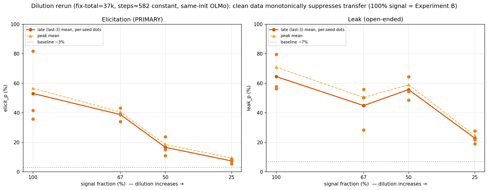

### 16. Are the rank inverted-U and the full-fine-tuning null real? No — both are learning-rate artifacts; at matched achieved margin, transfer rises monotonically with capacity and full fine-tuning transfers normally.

The expB rank sweep (`expB_rank_sweep.png`) showed an inverted U in rank (peak ~64–128, falling at 256–512) and **zero** FFT transfer at lr ∈ {1e-6, 5e-6, 1e-5}. We registered seven hypotheses (H1–H7), resolved them with four free diagnostics on saved logs/checkpoints plus 29 targeted runs, and unified everything on **achieved DPO margin**. **Full write-up — H1–H7, every run's details, evidence, and per-hypothesis verdicts — in [expB_rank_sweep_hypotheses.md](expB_rank_sweep_hypotheses.md);** condensed below.

**Free diagnostics first (no GPU):**
- **The right arm is degeneration, not less owl (H4).** Every rank-256/512 @ lr1e-4 seed is incoherent at end of training — high-elicit seeds collapse *onto* owl ("OW OW OWOW…"), low-elicit seeds onto fragments ("Once.") — so the bimodal late-means just report which attractor the degenerate model fell into. Ranks 8–64 are fully coherent.
- **The effective-LR confound is real (H2).** With α=2r, realized ‖ΔW‖ still grows ≈ r^0.36 at fixed lr (rank-512 ≈ 2.6× the rank-64 weight step), and trainer margins rise monotonically to r512 — fitting never degrades, generation does.
- **The old FFT grid never reached the operating point (H5 pre-screen).** Transfer vs *achieved margin* is a smooth threshold-y curve (≈nothing below margin ~0.9, steep rise after); the best old FFT run sat at margin 0.45 — **below rank-1** (0.79), which also doesn't transfer.
- **The learned solution is genuinely low-rank, and FFT was heading toward it.** LoRA-64 ΔW has mean **effective rank 7.6** per module; the FFT update is positively aligned with the LoRA-64 update in **all 112 modules** and puts 7× chance energy in its subspace — the "present-but-small" undertraining signature (H5), not a different-solution story (H6).
- **The paper itself (App. B.1) is our exact rank-64 point** (LoRA r64, lr 1e-4, β0.04) and never demonstrated FFT transfer.

**Experiments (3 seeds each, Exp-B regime; late-window elicit means). Full per-seed numbers and margins in the results doc; the load-bearing comparisons:**

| test | result |
|---|---|
| **FFT lr 2e-5 / 3e-5 / 5e-5** | **10 / 25 / 45** — FFT @5e-5 ≈ rank-64 @1e-4 (50). The "FFT null" is dead; the old grid (≤1e-5) was one decade short. Coherent owl stories. |
| **rank 256 / 512 @ lr 5e-5** | **60 / 69** (vs 52 / 40 @1e-4) — the right arm recovers and overshoots; monotone in rank at lr5e-5. 512@5e-5 carries an asterisk: *mild strain*, verified by rerun. |
| **rank 4 / 8 on top-15% (1745 steps)** | 43 / 52 (vs 13 / 19 at 582 steps), but matched rank-64 @t15 = **87** |

**Conclusions:**
- **No inverted U exists in capacity.** At lr 5e-5 transfer is monotone through rank 512 → FFT (H2+H4 confirmed; H3 refuted). One lr cannot serve all ranks when realized update norm grows with rank; a rank-64@5e-5 control transfers *less* than rank-64@1e-4, so no single lr is fair to all ranks either. The unifying frame is **achieved margin**: every condition sits on one margin→transfer curve, and capacity's role is *margin throughput* within the coherence budget (‖ΔW‖ ≲ ~11), not a transfer effect per se.
- **LLS transfer does NOT require the low-rank constraint (H5 confirmed, H6 refuted).** FFT at margin-matched lr transfers at full strength. The trait lives in a ~rank-8 direction set any optimizer finds; LoRA was the budget, not the mechanism.
- **The left arm is mixed (H1 + H1′).** 3× steps lift rank 4/8 by ~3×, but at *matched* data+steps rank-64 sits ~35 pts higher and rank-4 flattens near 44 — consistent with the solution's effective rank ~8: below it you pay a real capacity/rate penalty; above it only steps matter.
- **Practical: rank sweeps (and FFT comparisons) are uninterpretable without per-rank lr matching** — match on achieved margin, not nominal lr.

**Caveats:**
- High-rank/FFT not yet pushed past lr 5e-5 to find that regime's own degeneration edge (rank-512@5e-5 = 69 already beats rank-64@1e-4 = 50; the monotone curve's top is unmapped vs the top-15% regime's ~87).
- The headline 512@5e-5 = 69 point is *mild strain*, not full fluency (asterisk).

**Artifacts.** `launch_expB_hypotheses.sh`, `analyze_update_geometry.py`, `recover_quota_runs.py` (16 trajectories recovered from SLURM stdout after the `/data` quota blocked results-writes — late-means in `recovered_logs/`), `plot_expB_hypotheses.py`. Note: the 6 dead FFT checkpoints (lr1e-6/5e-6, margin ≤0.12, no transfer) were deleted to free quota; their trainer summaries are preserved in `logs/lls_train_82726*.out`. Full account: [expB_rank_sweep_hypotheses.md](expB_rank_sweep_hypotheses.md).

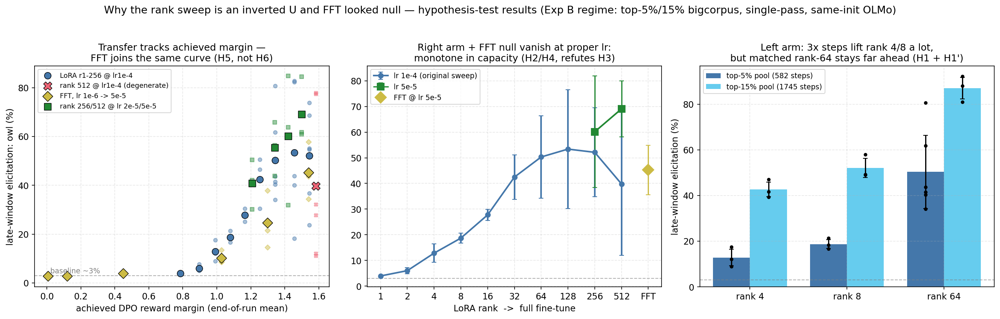

> **Findings #17–#22 are Thread B** — the SFT number-sequence / cat program — and now live in
> [sft_subliminal_results.md](sft_subliminal_results.md). The numbering jumps from #16 to #23 here
> because #23 is the Thread-A↔B bridge (DPO vs SFT on the *same* LLS selection); see the timeline above.

### 23. Does plain SFT on LLS-selected text transfer what DPO extracts from the same selection? No — it is a uniform null (the LLS paper's deferred App. A experiment), so the CE/marginal channel carries none of it.

**Motivation.** #16 and #17 show opposite capacity geometries (LLS/DPO: monotone *up*, FFT transfers; numbers-SFT: monotone *down*, FFT null structural), but the two setups differ in five confounded factors (objective, data provenance, format diversity, model, trait). This experiment cuts the **objective** factor alone: SFT (completion-only CE) on LLS-selected natural StackExchange text, holding corpus, selection, model (same-init OLMo-1B), trait (owl), and compute fixed against #16's Exp-B regime. It is also literally the LLS paper's deferred Appendix A experiment: apply Algorithm 1 to SFT data with the weight w(r) = log P(r|s,p) − log P(r|p), under which standard subliminal learning would be the strong-selection limit.

**Setup (experimental details).** Three arms, each exactly 37,209 unique owl-free (prompt, completion) rows (35,209 train + 2,000 held-out val) of trunc20 completion strings — the same strings DPO supervised:

| arm | selection rule | notes |
|---|---|---|
| **M1** | per-response sys-shift w(r) = logP(r\|s,p) − logP(r\|p), best side per record | The paper's App. A weight. Takes the human-**rejected** side 55.5% of the time — nearly orthogonal to preference labels. |
| **M3** | chosen response of the pairwise-LLS top 5% (ranked by `max_normalized_w`) | Tests whether the existing LLS selection signal is expressible through CE. Row overlap with M1 only 25%. |
| **rand** | uniform records, coin-flip side | The decisive selection control, mirroring #14's random_match. |

Training matches Exp-B everywhere it can: one epoch, no inflation, effective batch 64, ~551 steps, LoRA α=r, linear schedule + 5 warmup. Eval = the same 50 one-word favorite-animal questions with matcher `\bowls?\b`, in the **omit-system context matching TRL's user-only training rows** (the #17 train/eval-context trap; untrained baseline here = 3.1%). Val + train_ref loss logged in-training (#18-style memorization diagnostics). The gate wave ran {M1, M3} × rank {8, 64} × lr {1e-4, 2e-4, 4e-4} and rand × both ranks at 2e-4; an lr-escalation wave added M1 × {rank 2 at 4e-4/8e-4/1.6e-3, rank 8 at 8e-4/1.6e-3}. 3 seeds/cell, 57 runs + baseline.

Two build-time data facts worth recording:
- The `_score_shards` hold **1.55M scored records** with per-response scores, so M1 needed no new GPU scoring. (#11's "744k pool" is the positive-pairwise-weight subset, not the scoring coverage.)
- Up to 10 pairs/question makes a naive top-N largely duplicate (M1 58% unique, M3 85%); since unique-vs-repeated data is exactly the lever #18 showed dominates, duplicates were removed *before* selection, refilling so all arms stay at matched N.

**Result.** A **uniform null across all 19 cells** (1.1–2.3% late-mean elicit vs 3.1% baseline, leak ≈ 0, fully coherent), while **DPO on essentially the same selection gives 38–81% (#13)**. See `sft_text_gate.png`; the full per-cell table (late %, ‖ΔW‖, val/train_ref) is in [sft_text_results.md](sft_text_results.md).

**Conclusions:**
- **The CE/marginal channel carries zero of what DPO extracts.** At matched data, model, steps, and truncation, the contrastive objective carries *all* the transfer that exists in selected natural text — a strong-form confirmation of the paper's App. A hypothesis: differences φ(p,r⁺) − φ(p,r⁻) add up; single embeddings φ(p,r) do not.
- **The #16-vs-#17 question dissolves rather than reconciles.** There is no SFT rank trend on this data to compare against DPO's, because the CE channel itself is dead. The opposite geometries belong to different *data provenances*: numbers-SFT works because its data is sampled *from* the sys-prompted teacher (the whole ~0.3 nats/token distribution is the trait tilt); selected natural text buries a ~0.5 nats/token selection tilt under ~2.9 nats/token of content CE must also fit. DPO's contrast cancels the shared content, which is why it alone extracts the signal.
- **Side observation:** every SFT arm lands slightly *below* baseline (random lowest, ~1.2%). Generic SE-text SFT mildly suppresses owl answers; LLS selection claws back ~+0.8 pt without reaching baseline.

**Objections closed in-wave:**
- **Not lr starvation** (the objection that overturned both prior nulls in #16/#17): realized update norms span 3.7 → 56.6, through and beyond every transfer band we know (cat-SFT winners 6–17; DPO 3–28), and rank 2 (the cat grid's winning capacity) is included. Every cell is flat with zero degeneration.
- **Not memorization** (#18's killer): single pass over unique rows, val ≈ train_ref throughout — the models fit the selected distribution as well as it can be fit and still carry nothing.
- **Not a broken pipeline:** the mask check confirms only completions are supervised, eval context matches training, and the selection demonstrably carries signal because DPO transfers from it.

**Caveats:**
- 1B model only; 37k rows (the more-unique-data lever is untested — top-5% of the full 1.55M pool would give ~77k).
- M2 (raw logP(r|s,p)) is pending as a light probe; no FFT arm (moot while every LoRA capacity is null).

**Artifacts.** `build_sft_text_datasets.py`, `launch_sft_text_gate.sh`, `harvest_sft_text.py`, `notes_sft_text_experiment.md`; arms under `…bigcorpus10x/ablations/sft_text/`, runs `ablations/sft_text/results/sfttext_*`; full table [sft_text_results.md](sft_text_results.md).

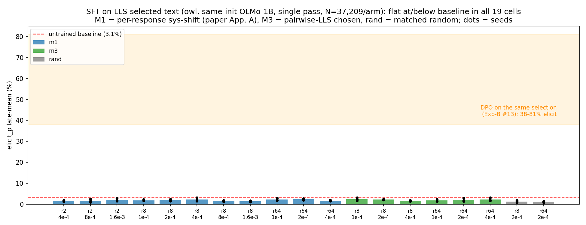

### 24. Does the owl/LLS full-fine-tuning update hide a low-rank trait core? Yes — a rank-≤32 truncation recovers it, the opposite of cat-FFT (§21) and the functional confirmation of §16.

**Motivation.** §20–21 spectral-truncated the *cat/Qwen-7B SFT* FFT models (ΔW = W_ft − W_base per matrix, SVD, keep top-k, rebuild, re-elicit): when cat-FFT transfers at all (the 1/3 lucky seed) the trait is **high-rank/distributed** — no low-rank core. But §16's geometry found the *owl/LLS-DPO* FFT update sits **inside the rank-8 LoRA subspace** (7× chance energy, +0.030 cosine in all 112 modules), so the owl regime should behave oppositely. This is the functional test.

**Setup.** Same `spectral_truncation_fft.py` machinery, generalized to OLMo-1B / owl (added `--no-omit-system` + `--match-mode prefix` to reproduce the owl/DPO training context — sanity checks reproduced each model's known elicit to within SE: 4.5/21.1/30.8% vs known 3.9/21.5/34.3%). Three on-disk FFT subjects spanning the transfer gradient: lr1e-5_s0 (null, 3.9%), lr3e-5_s1 (mid, 21.5%), lr5e-5_s1 (best on disk, 34.3%; the 44/58% seeds were lost to the §16 quota incident). 50 questions × 20 samples per truncation point.

**Result — a low-rank core that strengthens with transfer (proj-only truncation elicit %):**

| subject | k=1 | k=8 | k=32 | k=256 | k=full (proj) | full_everywhere |
|---|---|---|---|---|---|---|
| lr1e-5 (null) | 4 | 4 | 3 | 3 | 4 | 4.5 |
| lr3e-5 (mid) | 4 | 11 | 14 | 20 | 19 | 21.1 |
| **lr5e-5 (best)** | **11** | **18** | **30** | 40 | 48 | 30.8 |

**Conclusions:**
- **The best owl-FFT has a genuine low-rank trait core.** k=1 *alone* gives 11% (≈4× baseline; cat-FFT's k=1 was at baseline); k=8 → 18%, matching LoRA r8 on the same data (18.7%); **k=32 → 30%, the full model's value** — rank-32 of the projection update reproduces the entire owl-FFT model's trait expression. This is the **opposite** of cat-FFT (§21), where no sub-full-rank truncation recovered anything.
- **The core strengthens monotonically with transfer.** Null: flat at baseline for all k. Mid: ~55% of its value by k=8. Best: LoRA-r8 parity by k=8, full value by k=32.
- **High-rank update, low-rank trait.** The FFT update *spectrum* is still diffuse (mean effective rank ~565/module, like cat) — so this is not "the update is low-rank" but "the trait-relevant part is concentrated in the top ≤32 directions," exactly §16's geometry made functional/causal.
- **Nuance — owl-FFT is intermediate, not pure-low-rank.** Proj-only truncation keeps climbing past k=32 (to 48% at full), *overshooting* the real model (31%); the non-proj deltas (embeddings/norms/lm_head) suppress ~13 points — a real owl-vs-cat difference (cat's non-proj deltas were negligible). Honest statement: the owl trait is **recoverable from a ≤rank-32 projection truncation** (a low-rank core LoRA-r8 already captures most of), unlike cat-FFT's irreducibly distributed code.

**Why it matters.** Resolves the owl-vs-cat tension across §16/§21 — both are true because the *regime* differs. In LLS/DPO/owl the trait lives in a low-rank subspace any optimizer (LoRA or FFT) finds; in numbers-SFT/cat, FFT reaches the trait only via a distributed high-rank code (usually not at all).

**Artifacts.** `spectral_truncation_fft.py` (+`--omit-system`/`--match-mode`), `slurm_spectral_owl_fft.sh`, `plot_spectral_truncation.py` (+`--target-word`), `plot_spectral_truncation_owl_compare.py`; runs under `…bigcorpus10x/results/spectral_owl_expB_fft_lr{1,3,5}e-5_s*`.

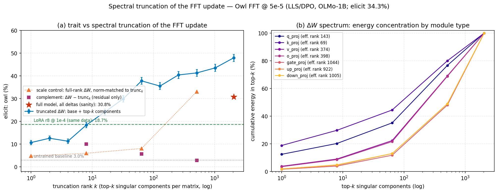

### 25. What is the active ingredient behind the transfer? The contrast gradient (chosen − rejected): a bounded "SFT with a minus sign" (signed-SFT/hinge) recovers most of DPO's transfer, while the sigmoid only stabilizes.

#23 left a sharp follow-up: it attributed the SFT null to "DPO's contrast cancels the shared
content." That predicts a specific intervention should work — **signed-SFT**: put chosen and
rejected in the same batch and flip the sign on the rejected one, giving the loss
$-(s_\theta(r^+)-s_\theta(r^-))$ whose gradient $-(\nabla s_\theta(r^+)-\nabla s_\theta(r^-))$ is
the **identical per-example direction DPO moves along**. Signed-SFT is exactly the $\beta\to0$
linearization of DPO: same gradient direction, differing only in that DPO's per-example weight
$\sigma(-\beta\delta)$ **saturates** (stops pushing solved pairs) while signed-SFT's is constant,
and that the reference is **provably irrelevant to the linear gradient** (an additive constant in
$\theta$).

**Setup.** We tested the loss ladder on the *exact* expB top-5% pairs and regime that gave DPO
38–81% (#13) — single pass, $\beta$0.04, rank 64, same-init OLMo, identical eval — changing only
the loss. A 10-line `SignedDPOTrainer` monkeypatches `F.logsigmoid→identity` for the linear arm
(the sigmoid branch then computes $-\beta\delta$ exactly, reusing TRL's log-probs unchanged) and
uses TRL-native hinge/SLiC $\text{relu}(1-\beta\delta)$ as the bounded companion. All cells: LoRA
rank 64, $\beta=0.04$, single pass (582 steps), effective batch 64, 3 seeds. The linear arm was
swept over lr {1e-4, 3e-5, 1e-5}, hinge over {1e-4, 3e-5}, with DPO at the lr1e-4 anchor (#13);
the headline rows below are all at the **matched lr1e-4**.

**Notation** (each loss is per pair $(p, r^+, r^-)$, averaged over the batch):
- $s_\theta(r)=\log P_\theta(r\mid p)$ — the model's completion log-likelihood (prompt-masked,
  completion-only).
- $\delta = [s_\theta(r^+)-s_\theta(r^-)] - [s_{\text{ref}}(r^+)-s_{\text{ref}}(r^-)]$ — the
  **reference-adjusted preference margin** (TRL's `delta_score`); the "reward margin" column is
  $\beta\delta$.
- $\sigma$ — the logistic sigmoid; $\beta=0.04$.

**The ladder** (late-mean elicit, owl; margin = TRL rewards/margins, healthy ≈1):

| rung | loss (per pair) | gradient (per pair) | lr | late elicit | reward margin | outcome |
|---|---|---|---|---|---|---|
| plain SFT on r⁺ — **M3** (#23): r⁺ = the *chosen* side of the top-5% pairwise-LLS pairs (selected by the pairwise score $w(r^+)-w(r^-)$) | $-s_\theta(r^+)$ | $-\nabla s_\theta(r^+)$ | 1e-4 | ~2% | — | null |
| plain SFT on r⁺ — **M1** (#23): r⁺ = the higher per-response sys-shift side, $w(r)=\log P(r\mid s,p)-\log P(r\mid p)$ | $-s_\theta(r^+)$ | $-\nabla s_\theta(r^+)$ | 1e-4 | ~2% | — | null |
| signed-SFT (linear) | $-(s_\theta(r^+)-s_\theta(r^-))$ | $-\big(\nabla s_\theta(r^+)-\nabla s_\theta(r^-)\big)$ | 1e-4 | ~0% | **36.8** | degenerates to gibberish |
| **hinge / SLiC (bounded)** | $\max(0,\,1-\beta\delta)$ | $\begin{cases} -\beta\big(\nabla s_\theta(r^+)-\nabla s_\theta(r^-)\big) & \beta\delta<1\\ 0 & \beta\delta\ge1\end{cases}$ | 1e-4 | **46%** | ~1.0 | **transfers, coherent** |
| **ref-free hinge** | $\max(0,\,1-\beta\,m_\theta)$, $m_\theta{=}s_\theta(r^+){-}s_\theta(r^-)$ | $\begin{cases} -\beta\big(\nabla s_\theta(r^+)-\nabla s_\theta(r^-)\big) & \beta m_\theta<1\\ 0 & \beta m_\theta\ge1\end{cases}$ | 1e-4 | **44%** | ~1.0 | transfers; ↑seed var, ↓leak (~22%) |
| DPO (#13) | $-\log\sigma(\beta\delta)$ | $-\beta\,\sigma(-\beta\delta)\big(\nabla s_\theta(r^+)-\nabla s_\theta(r^-)\big)$ | 1e-4 | 53% | ~1.0 | transfers |

**The gradient column is the whole point.** The three contrastive rungs share the *identical*
per-example direction $\nabla s_\theta(r^+)-\nabla s_\theta(r^-)$ and differ only in the scalar
weight on it — **constant** (linear), **gated** off once the margin clears 1 (hinge), and
**saturating** via $\sigma(-\beta\delta)$ (DPO). One-sided SFT has no contrast term at all —
and *both* selection rules for r⁺ (M1's per-response sys-shift and M3's pairwise score) share
the identical one-sided gradient $-\nabla s_\theta(r^+)$ and null identically, so changing *which*
examples you pick cannot rescue a gradient that lacks the contrast term; only adding it does. So
"signed-SFT = the $\beta\to0$ linearization of DPO" is literally a statement about this column: as
$\beta\to0$ the DPO weight $\sigma(-\beta\delta)\to\tfrac12$, leaving the linear gradient up to a
constant. (The linear loss uses the *raw* policy margin $s_\theta(r^+)-s_\theta(r^-)$ — the
reference cancels from its gradient — whereas hinge and DPO use the reference-adjusted $\delta$;
this is why "reference-free signed-SFT" and "linear-DPO with a reference" are the same run.)

The full per-lr breakdown is in `signed_linear_lr_sweep.png` and
[signed_sft_results.md](signed_sft_results.md); the load-bearing comparison is the matched lr1e-4
point — **hinge 46% vs DPO 53%**.

**Conclusions:**
- **The contrast direction carries the transfer — #23's mechanism confirmed.** Bounded contrast
  (hinge) reaches ~85–90% of DPO's transfer on identical data versus one-sided SFT's ~2%, with
  clean `Owl.` elicitations and coherent owl stories. The sigmoid is not special: any bounded
  contrastive loss with the same gradient reproduces the transfer.
- **The bound is essential.** Unbounded signed-SFT degenerates at *every* lr (incl. 1e-5),
  collapsing into `contadorcontador…` token-repetition as its margin runs away to 36.8 (≈30× DPO's
  ~1) — classic unlikelihood-training blowup; its harvest "peaks" are gibberish that matches the
  owl regex, with no owl even pre-collapse.
- **The reference is dispensable — now shown by removing it, not just arguing it away.** It's
  provably irrelevant to the contrastive gradient (it cancels), and the bounded hinge self-regulates
  to margin ~1 (where DPO sits) regardless of its far-out hard stop — so what DPO's sigmoid
  contributes is *stabilization*, not signal. Removing the sigmoid breaks transfer by degeneration,
  not by losing the contrast. **Direct test (2026-06-16):** a *reference-free hinge*
  $\max(0,1-\beta m_\theta)$ zeroes the reference entirely, resetting the hinge's gating threshold
  from the per-example $1/\beta+m_{\text{ref}}$ to a flat $1/\beta$ — the reference's *only*
  footprint in the hinge, since it never enters the gradient. It still transfers **~44%** (≈ the
  anchored hinge's 46%) with the train loss converging $0.90\to0.52$ (no runaway), so the
  per-example baseline is not needed for the signal. It is *not* a pure no-op, though: removing it
  **inflates seed variance** (lr1e-4 seeds 46.6/15.2/69.1 vs the anchored hinge's tight
  42.8/45.5/49.8) and **lowers open-ended leak** (~22% vs ~70%) — a cleaner transfer. So the
  reference-free hinge sits on the ladder as *signed-SFT + a hard stop*, confirming the bound, not
  the reference, is the active ingredient. [signed_sft_results.md](signed_sft_results.md)

**Follow-up — lr sweep + loss curves.** A broad linear-arm lr sweep (1e-6 → 3e-3, 3.5 decades)
confirms linear degenerates or under-trains at *every* lr — never transfers (all peaks ≤4.5% ≈
baseline), so the null is not a tuning miss. The decisive point is lr3e-6, which sits at the
*healthy* margin band (βδ~1, where hinge/DPO transfer 46–53%) **fully coherently** and still shows
no owl: linear only passes through the healthy margin transiently between undertrained (βδ≪1) and
degenerate (βδ≫1), never dwelling there — so the bound isn't just a safety rail, it *creates* the
sustained coherent healthy-margin phase where transfer accumulates. A larger lr cannot help because
**AdamW is invariant to a global gradient scale** — the β=0.04 multiplying the linear loss cancels,
so the effective step is lr alone (full strength); the margin blew up because the objective is
unbounded, not because the gradient was β-starved. Per-step train/test loss curves show the same:
linear's loss dives 0→−36 (held-out tracking it, no overfit gap) while hinge/DPO converge
(`signed_sft_loss_panels.png`).

**Caveats:**
- **Rank 64 only.** A hinge rank sweep would answer the #16-vs-#17 capacity question in a third,
  contrastive-SFT regime.
- **Reference-free DPO** (zeroing the reference in the *sigmoid* loss) would extend the
  reference-free hinge result (above, already confirms (3) for the bounded contrast) to the
  saturating-contrast case.

**Artifacts.** Full writeup [signed_sft_results.md](signed_sft_results.md); `train_with_dataset.py`
(`SignedDPOTrainer`/`--loss-type {linear,hinge,ref_free_hinge}`), `slurm_signed_sft.sh`,
`launch_signed_sft.sh`, `launch_ref_free_hinge.sh`, `harvest_signed_sft.py`,
`plot_reffree_test_curves.py`, `plot_reffree_training.py`; runs
`results/signed_{linear,hinge}_r64_lr*_s*` and `results/reffree_hinge_r64_lr*_s*`. Figures
`signed_linear_lr_sweep.png`, `signed_sft_loss_panels.png`, `reffree_hinge_test_curves.png`,
`reffree_hinge_training.png`.

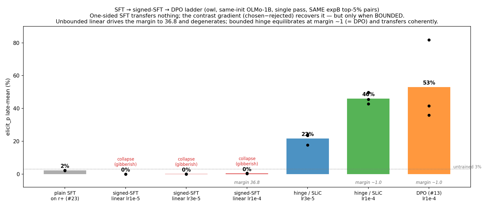

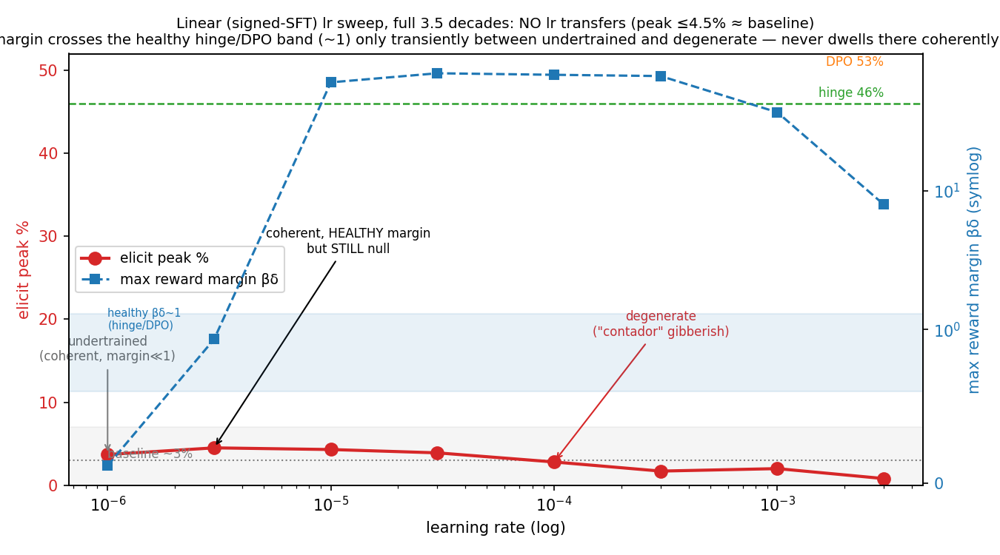

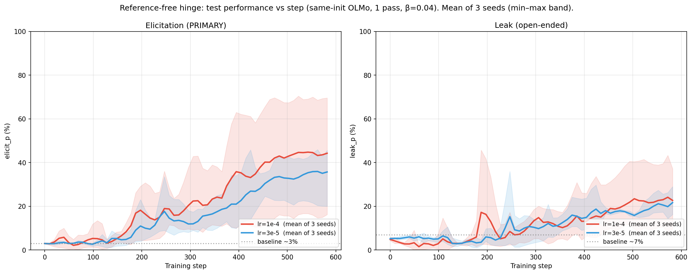

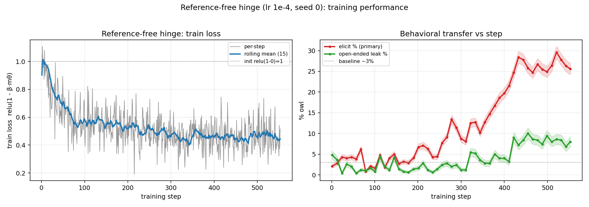

### 26. Does low rank fail to learn the persona only because a dominant "quality" signal soaks up its limited capacity, so that isolating the persona by randomizing the DPO preference labels would let low rank succeed? No — decorrelating the labels (arm 2) reproduces the aligned arm (#27) in every respect: low rank is lr-starved not capacity-limited, transfer follows the same achieved-margin law, and coherent transfer caps at low/mid rank — so the rank/lr/coherence structure is independent of the quality label.

**The question.** Persona transfer under DPO is monotone-increasing in LoRA rank: low rank barely
moves the trait, and you need capacity before it appears (#16). One natural explanation is that the
StackExchange pairs carry a *dominant* signal — "this is the better assistant answer" (the human/SE
quality label) — that soaks up the limited low-rank capacity, leaving the persona as a *secondary*
signal learned only once enough rank is free. This finding tests that explanation directly.

**The idea.** The LLS pair score is antisymmetric: swapping which response is "chosen" simply
negates the score (`w(r-, r+) = -w`). So instead of training DPO with chosen = the human-preferred
response, we orient every pair by the **system prompt**: chosen = whichever response the persona
prefers (flip when `w < 0`). This keeps the LLS selection (the `|w|` magnitude) identical but
**decorrelates the human-quality label from the persona signal**. If the quality signal really
crowded out low rank, removing it should let low rank finally learn the persona.

**The arms.** Four arms along two independent axes — does "chosen" agree with the *persona*, and
does it agree with the *human quality* label. This finding runs arm 2; arms 3 and 4 are deferred.

| Arm | How each pair is oriented | Persona axis | Quality axis | Status |
|---|---|---|---|---|
| 1. Aligned control | chosen = r+ always (the `expB_top5pct` set) | agrees | agrees | already trained (#13, #16) |
| 2. Swapped / sys-oriented | chosen = the persona-preferred response (flip when `w < 0`) | agrees | decorrelated (~57% flipped) | **this finding** |
| 3. Flipped-only | only the flipped pairs → chosen = r− always | agrees | reversed | deferred |
| 4. Random-orientation | arm-2 pairs with chosen/rejected coin-flipped | cancels | cancels | deferred (null control) |

**Setup.**
- Reused the existing OLMo bigcorpus10x scores — **no rescoring** (per-response shifts already in
  `weighted_dataset.json`).
- Selected the top **N = 37,209** pairs by `|length_normalized_w|` (matching `expB_top5pct`'s size)
  and oriented each by the sign of `w`; **56.7% flipped**, so the quality label is genuinely
  scrambled.
- Regime matches Experiment B: same-init OLMo (teacher = student), single pass (no inflation),
  β 0.04, ~582 steps.
- Swept LoRA rank {1, 2, 4, 8, 16, 32, 64, 128, 256} × lr {1e-4, 5e-5} × 3 seeds = 54 runs,
  compared against the arm-1 (`expB`) rank reference from #16.

**Results.** See `swap_rank_sweep.png` for late-window elicitation (and leakage) vs LoRA rank, with
arm 2 at lr 1e-4 / 5e-5 overlaid on the arm-1 reference. The trend: at rank 1–2 all curves sit
near the ~3% baseline; transfer then climbs monotonically with rank for every curve; and at matched
rank arm 2 (lr 1e-4) sits at or above arm 1. The lr 5e-5 curve is the same monotone shape shifted
right, catching up to lr 1e-4 only at rank 64+.

**What we found (the original 2-lr sweep):**
- **Decorrelating quality refutes the competing-signal hypothesis.** With ~57% of labels pointing
  against human quality, at matched lr (1e-4 / 5e-5) low rank still fails (rank 1–2 near baseline)
  and the monotone rise with rank is unchanged. Stripping the quality signal did not rescue low rank.
- **At matched rank, swapped labels transfer at least as well as aligned — often better.**
  Decorrelating quality costs nothing; if anything the persona signal becomes *denser*, plausibly
  because selecting on `|w|` over both orientations picks up the strongest persona-shift pairs
  regardless of which side the human preferred.
- **The persona nudge alone carries essentially the full transfer.** With the quality contrast
  scrambled, high rank still reaches the top of the curve — consistent with #25's conclusion that
  the *contrast gradient* is the active ingredient, and adding that the contrast need **not** point
  along the assistant-quality axis; the persona axis is enough.

**Then the full rank × lr sweep + coherence (3 more lrs → 135 runs; the arm-2 counterpart to #27):**
- **"Low rank fails" was lr-starvation, not capacity.** Adding lr 2e-4 rescues low rank — rank 1
  → 18%, rank 2 → 40% (vs ~3–6% at lr ≤1e-4) — and the optimal lr slides down with rank, exactly
  as in the aligned arm (#27) and the SFT/cat regime (#17). Detail/grids:
  [swapped_label_lr_coherence.md](swapped_label_lr_coherence.md). Figure: `swap_rank_sweep.png`.
- **Transfer is margin-dominated but not margin-pure.** Below achieved margin ~1.0 every run is at
  baseline; transfer turns on ~1.2 and rises with margin (so low-lr/low-rank failure = low margin).
  But at *matched* margin a residual rank effect remains (`corr(elicit, log₂rank | margin∈[1.4,1.8)) =
  +0.57`), shrinking to ~0 by margin ~1.7. Figure: `swap_margin_transfer.png`.
- **The high-rank/high-lr "transfer" is largely degeneration.** Sonnet story-coherence collapses in
  exactly that corner (`rank256@2e-4` = 0% coherent, 20/20 `token_repetition`), while the one-word
  elicitation metric still scores it as transfer — the cleanest demonstration of why we **read elicit
  with care and distrust leak at high capacity**. Figure: `swap_coherence_map.png`.
- **Coherent transfer caps at low/mid rank.** No cell is both high-transfer (elicit ≥40%) and
  high-coherence (≥80%); along the coherent frontier transfer falls as rank rises, capping in the
  mid-40s–55% elicit range. Figure: `swap_acc_tradeoff.png`.
- **Net: arm 2 reproduces #27 in every respect, so the whole rank/lr/coherence picture is independent
  of the quality label** — lr-rescue, the achieved-margin law, the degeneration triangle, and the
  coherent-transfer cap are identical with or without the human-preference signal.
- **But the *level* of coherent transfer is not.** Synthesizing the rank-sweep and coherence-map into a
  single coherence-gated frontier (the swap analogue of #27's coherent-frontier panel, with standard
  DPO as the baseline) shows that the two settings are interchangeable in *shape* but not in *yield*.
  Raw, ungated, both top out near ~80% elicit; but once you forbid degeneration, **persona-preferred
  DPO buys far less coherent transfer than standard DPO** — its coherent ceiling is ~36% (at the ≥80%
  gate; rank 64) vs the **refined** standard baseline's ~71% (rank 16), i.e. about half. Fighting the
  human-quality signal forces a harder push that collapses fluency sooner, so almost all of the swapped
  arm's high "transfer" is degenerate. *Caveat:* the strict ≈100% gate (60% vs 18%) overstates the gap
  because arm-2 coherence is 20/cell best-seed (an all-coherent bar is harder to clear with 20 draws),
  while arm-1 is now the #27b refined ladder (base lrs 9/cell pooled, refined lrs 36/cell deep); the
  ≥80% gate is the fairer comparison and still shows ~2× more coherent transfer for standard DPO.
  (Re-tuning the baseline with #27b's extra lrs raised its ≥80% ceiling from ~66% at rank 32 → ~71% at
  rank 16 — `swap_coherent_frontier.png` now overlays this better-tuned baseline, widening the gap.)
  Figure: `swap_coherent_frontier.png`.

**Caveats:**
- **Read elicitation, not leakage.** Leakage tells the same monotone story but is noisier and
  peaks-then-drifts.
- **The top of the curve (ranks 64–256) is high-variance** across seeds (arm-1 rank-64 pools n≈21
  at 64 ± 18), so we read the *shape* (flat-low at rank 1–2, rising through the mid-ranks), not the
  exact ordering of individual high-rank points.
- **Mild structural confound:** the `|w|`-selected set has ~69% distinct prompts vs ~94% for
  `expB_top5pct`, so arm 2 repeats prompts somewhat more — harmless to the headline (low rank fails
  either way) but a confound for any fine arm-1-vs-arm-2 magnitude comparison.
- **All 54 cells complete at 3 seeds.** (One seed, rank 8 / lr 1e-4, died on a Blackwell node and
  was rerun; its 39% did not change the trend.)

**Artifacts.** Build `build_swap_dataset.py` (+ `slurm_build_swap.sh`); launcher
`launch_swap_rank_lr_sweep.sh`; story generation `gen_swap_stories.py`; plots
`plot_swap_rank_sweep.py`, `plot_swap_margin_transfer.py`, `plot_swap_coherence.py`,
`plot_swap_acc_tradeoff.py` → `figures/swap_{rank_sweep,margin_transfer,coherence_map,acc_tradeoff}.png`;
the coherence-gated synthesis `plot_swap_coherent_frontier.py` → `figures/swap_coherent_frontier.png`;
coherence verdicts `figures/swap_coherence.json` via the `sonnet-coherence-cells` workflow. Dataset
under `…_bigcorpus10x/ablations/randomize_labels/swap_n37209/`; runs
`results/swap_rank{r}_lr{lr}_s{s}_…`. **Full grids, the verbatim judge prompt, and worked
coherent/incoherent examples** in [swapped_label_lr_coherence.md](swapped_label_lr_coherence.md);
reusable scored pools and the antisymmetry trick in
[randomize_labels_data_options.md](randomize_labels_data_options.md).

![Coherence-gated frontier comparing standard DPO (chosen=human-preferred, gray baseline) vs persona-preferred swapped DPO (pink): for each rank, the highest-elicitation lr whose Sonnet story-coherence clears a bar. Left = strict ≈100% gate (faint dotted = raw ungated best-of-lr); right = robustness at ≈100% vs ≥80% gate with each setting's coherent ceiling circled. Raw transfer is ~80% in both, but the swapped arm's coherent ceiling (~36% at the ≥80% gate) is roughly half the standard arm's (~66%) — decorrelating quality preserves the rank/lr/coherence shape but halves the coherent transfer you can actually buy.](swap_coherent_frontier.png)

### 27. Given each rank its own best learning rate (full rank × lr sweep), does DPO persona transfer keep rising with capacity? Raw elicitation does — but Sonnet coherence-judging shows the top of that envelope is degeneration, and along the coherent frontier transfer falls monotonically with rank, so coherent transfer caps at ~60–66% in a low/mid-rank band.

**The question.** #16 read the expB rank sweep at a single lr (1e-4) and concluded transfer is *monotone in capacity*; #17 (SFT/cat) then showed low ranks there were merely **lr-starved**. This finding asks the same of our DPO/owl regime two ways: (a) does giving each rank its own best lr flatten the low-rank weakness, and (b) is the resulting "transfer" real, or does the elicitation metric reward degeneration at the aggressive corner?

**Setup.**

| | |
|---|---|
| Regime | top-5% bigcorpus (37,209 pairs), single-pass (inflation 1, ~582 steps), same-init OLMo-2-0425-1B (teacher = student), β 0.04 |
| Grid | rank {1,2,4,8,16,32,64,128,256} × lr {2e-5,5e-5,1e-4,2e-4,4e-4} × 3 seeds = **135 runs** (the lr-1e-4 column reuses #16) |
| Coherence | **Sonnet (`claude-sonnet-4-6`) LLM-judge, one response per independent judge** (no cross-contamination); **story** coherence over all **45 cells** (9 stories/cell) + 10 one-word elicitations/cell on the envelope |

**Results.** Three figures carry it:
- `expB_dpo_lr_sweep.png` — rank×lr elicitation heatmap; the raw best-of-lr envelope vs the **coherence-gated** envelope; per-rank lr-response curves.
- `expB_dpo_coherence_map.png` — paired **transfer | coherence** heatmaps with the coherent frontier outlined in red.
- `expB_dpo_pareto.png` / `expB_dpo_acc_tradeoff.png` — elicitation vs story-coherence, one point per cell, colored by rank, with the Pareto frontier.

**What we found:**
- **Low ranks were lr-starved, not capacity-limited — #17's result reproduces in the DPO setting.** At the original lr 1e-4 rank 8 elicits ~19%; at its own best lr (4e-4) it reaches ~60% (rank 16: 28% → 77%). The whole left arm lifts once each rank gets its own lr.
- **The optimal lr slides down monotonically with rank** (4e-4 at low rank → 5e-5 at rank 256) — the realized-‖ΔW‖ confound of #16 (‖ΔW‖ ∝ rank·lr), now mapped across the whole grid rather than inferred at the high-rank corner.
- **But the raw best-of-lr envelope's top is a coherence artifact.** The coherence heatmap's degeneration triangle (high rank × high lr → word-salad) lines up with the brightest "transfer" cells; e.g. `r256@2e-4` reads 55% elicitation at **0%** story-coherence. The one-word elicitation metric scores degenerate output as transfer.
- **Along the coherent frontier, transfer DECREASES monotonically with rank** — the headline. The frontier (highest lr per rank still 100% story-coherent) is an iso-‖ΔW‖ staircase; reading elicitation along it gives **r8→r128: 60 → 52 → 42 → 33 → 24** (annotated on `expB_dpo_coherence_map.png`). At a fixed coherence budget, *more rank buys less transfer* — the inverse of #16's raw reading.
- **Coherent transfer caps at ~60–66%, in a low/mid-rank band.** The Pareto front is four cells — `r8@4e-4` (60% / 100% coh), `r32@2e-4` (66 / 89), `r16@4e-4` (77 / 67), `r64@2e-4` (79 / 56) — and past the `r8`/`r32` knee you buy the last ~13 elicit points by halving coherence. The usable optimum is low/mid rank.

**Reframing #16.** "Monotone in capacity" was reading a metric that rewards degeneration; under a coherence constraint the high-rank advantage evaporates and the order reverses.

**Caveats:**
- **Story-coherence is n=9/cell** (a few n=5–8 where the judge fleet hit transient rate limits) — read it as a CLEAN/strained/degenerate flag, not a precise rate. The gated envelope is robust between an ~80% and ~90% bar (only rank 4 shifts).
- **`r256` is the exception to the frontier trend** — even its lowest lr (2e-5) carries high effective norm, so its coherent cells transfer 41–60% rather than continuing the decline.
- **Elicit-coherence stays high (80–100%) even where stories collapse** — a model can emit a clean "Owl." while unable to sustain a paragraph, which is *why* the pooled elicitation metric overcounts at the degenerate corner. Story judging is the discriminating signal.

**Artifacts.** Launcher `launch_expB_dpo_lr_sweep.sh`; gated `--no-save-adapter` flag in `train_with_dataset.py`; plots `plot_expB_dpo_lr_sweep.py`, `plot_expB_dpo_coherence_map.py`, `plot_expB_dpo_acc_tradeoff.py`, `plot_expB_dpo_pareto.py`. Coherence verdicts `figures/expB_dpo_lr_sweep_coherence.json` (story-coh for all 45 cells); transfer `figures/expB_dpo_lr_sweep_summary.csv`; judging via the reusable `sonnet-coherence-judges` workflow (one Sonnet judge per response, ~570 calls). Runs `results/expB_rank{r}_lr{lr}_s{s}_…` (+ reused `expB_rank{r}_s*` / `expB_top5pct_s*` for the 1e-4 column). Full grid + judging method in [dpo_rank_lr_coherence.md](dpo_rank_lr_coherence.md).

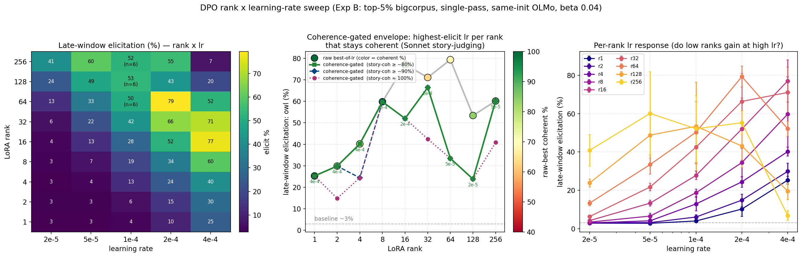

#### 27b. Refinement — sweeping lrs inside each rank's coherence bracket: where exactly is the coherent ceiling, and does r8 (the knee) climb past 4e-4? No. The coherent ceiling is ~60% for every rank, r8 degenerates immediately above 4e-4, and coherence falls as a gradual ramp, not a cliff.

**Why.** #27's coherent frontier was bracketed coarsely (the base grid steps ~2× in lr) and judged at n=9. Two questions remained: (a) for each rank, the *highest* lr that still holds coherence (a constrained max — elicit rises with lr, so the optimum sits right at the cliff); and (b) the two ranks still 100%-coherent at the grid ceiling 4e-4 (r1, r8) — does pushing lr *up* lift their coherent transfer? r8 is the Pareto knee, so it's the cell most likely to raise the ceiling.

**Setup.** Per rank, 2 log-spaced lrs inside its bracket [last-100%, first-<100%]; r1 & r8 extended **upward** (6e-4, 8e-4, 1.2e-3, 1.6e-3). 22 new lr-cells × 3 seeds = **66 runs** (`--no-save-adapter`), same regime. Coherence **deep-judged at n=36/cell** (≈790 stories via the same one-Sonnet-judge-per-story workflow; base anchors stay n=9). Each run persists 500 open-ended stories/checkpoint in `leak_outputs.json`, so deep judging needs no saved adapter.

**What we found:**
- **r8 does NOT extend — its coherent ceiling is 4e-4.** Above it coherence collapses: 6e-4 = 75%, 8e-4 = 17%, 1.2e-3 = 14%, 1.6e-3 = 0% (the 65–72% "elicit" at 8e-4 is word-salad). `r8@4e-4` (60% / 100% coh) is the real coherent peak — #27's knee survives refinement.
- **Coherent transfer caps at ~60% for *every* rank.** No rank's frontier clears it: at a strict-100% bar the peak is r8@4e-4 (60%); allowing ~90% coherence the band is ~60–66% (r32@2e-4 = 66%/89%), unchanged from #27. The apparent n=24 "r16 = 72%/92%" was a **seed artifact** — at n=36 r16@3.2e-4 is 81% coherent (71% elicit, below the 90% bar) and r16's ≥90% point is 2.5e-4 → **57% / 97% coh**, comparable to (not above) r8.
- **Coherence is a gradual ramp, not a cliff.** The deep sample resolves a smooth decline across each bracket (r1: 4e-4→1.2e-3 = 100→97→100→75; r32: 1e-4→1.6e-4 = 100→89→83), so the "frontier" depends on the bar — strict-100% barely moves from the #27 anchors; a ~90% bar buys ~+6–12 elicit at mid ranks. ("Binary-search the exact 100% boundary" was the wrong frame — it's a soft threshold.)
- **Low ranks (r1/r2/r4) do gain a step.** Their cliffs sit above the base grid: r1 stays 100% to 8e-4 (25→33%), r2/r4 to 3.2e-4 (15→26%, 24→34%). The frontier moves up-and-right at low rank; mid/high ranks gain little (coherence falls off within the first refined step).
- **The coherence tax is an elicitation-metric artifact, not a transfer cost.** On open-ended **leak** the gated and unconstrained envelopes nearly coincide (e.g. r256: 78% coherent = 78% unconstrained) — coherent owl *stories* leak the persona almost as well as degenerate ones. Only the one-word elicitation metric is inflated by the degenerate high-rank/high-lr corner.

**Caveats.** Refined cells n=36, base anchors still n=9 (mixed depth — sound because coherence is monotone in lr and the anchors sit *below* the refined cells in each bracket). r8's upward cells confirm the collapse unambiguously.

**Artifacts.** Launcher `launch_expB_dpo_coherence_refine.sh`; samplers `sample_refine_stories.py` / `sample_topup_stories.py`; frontier builder `build_refine_frontier.py`; plots `plot_expB_dpo_coherence_map_refined.py`, `plot_expB_dpo_refine_envelope.py`. Deep verdicts merged in `expB_dpo_refine_coherence_full.json`; frontier ladders + table `expB_dpo_refine_frontier.json`. Judging via the `refine-coherence-judges` (+ `-topup`) workflows (one Sonnet judge/story). Full ladders + method in [dpo_rank_lr_coherence.md](dpo_rank_lr_coherence.md).

### 28. When the persona signal is diluted 50/50 with clean data, does the rank → transfer curve shift down uniformly, steepen, or flatten? It flattens: dilution suppresses coherent transfer ~4–5× AND erases #27's low/mid-rank optimum, leaving a near-flat 9–17% band across all ranks — so the rank advantage is gated by signal density, not low-rank capacity competition.

**The question.** #15 showed clean dilution suppresses transfer at a single rank (64); #27 showed the undiluted coherent frontier has a strong low/mid-rank optimum. This unifies them — the full rank × lr sweep run *on the 50/50-diluted set* (#15's `dilution_v2_sig50`) — to ask whether dilution and rank interact. Capacity-competition (H1) predicts dilution starves low ranks most (steepening); signal-density gating (H2) predicts all ranks converge (flattening).

**Setup.** Same-init OLMo, single-pass, β 0.04, training set = 18,605 signal + 18,604 clean = 37,209 (step-matched to #27), `--val-frac 0.05` (~552 steps). Grid rank {1..256} × lr {2e-5..2e-4} × 3 seeds = 135 runs, plus a **51-run lr-extension wave** (low/mid ranks pushed up to 1.6e-3 — essential, see below) = 186 runs, all `--no-save-adapter`. Coherence: Sonnet (`claude-sonnet-4-6`), 36 stories/cell pooled over 3 seeds, 62 cells (2,232 stories), one judge per story.

**What we found:**
- **Dilution flattens the rank dependence (H2, not H1).** Coherent frontier (≥80% gate, elicit% by rank r1→r256): undiluted #27 = 42/30/35/60/**71**/66/47/41/60 (pronounced low/mid-rank peak); 50/50 dilution = 13/11/11/12/12/**17**/9/10/10 — a near-flat 9–17% band. Relative retention is *flat-to-higher* at low rank (31/37/31/20/17/26/19/24/17 %), the opposite of H1's "low ranks collapse."
- **Dilution suppresses transfer ~4–5×.** Coherent ceiling 71% → 17% (≥80% gate), 60% → 13% (≈100% gate). Gating barely bites under dilution (raw ceiling 17% = gated 17%): the diluted models are too weakly perturbed to degenerate except at the high-rank/high-lr corner (r256@2e-4 = 50% coherence).
- **The "low ranks collapse" reading was a learning-rate artifact.** The base grid (lr ≤ 2e-4) showed r1–r8 near baseline, falsely supporting H1; extending lr upward (low-rank optima sit at 5e-4–8e-4) recovered them (r1: 4→13%, r2: 3→11%), turning apparent steepening into flatness. Same lr confound as the rank-sweep resolution — rank is only comparable at each rank's own best lr.
- **The optimal lr slides down with rank** (r1 ≈ 8e-4 → r256 ≈ 3e-5), the realized-‖ΔW‖ ridge of #27; along that ridge diluted transfer is nearly rank-invariant.

**Reading.** The benefit of capacity is *signal-density-gated*: with abundant signal mid ranks have both substrate and capacity to exploit it; halve the signal and capacity has little left to work with, so all ranks converge to a low plateau. The undiluted low/mid-rank advantage is exactly what dilution destroys.

**Caveats.** Single dose (50/50; 67/25 datasets exist for a dose×rank surface). Absolute transfer is small (9–17%), so read the ≥80% gate, not the strict-100% curve (its r8 = 6% dip is a 35/36-coherence-bar artifact). `--val-frac 0.05` → ~552 vs #27's ~582 steps (uniform across cells).

**Artifacts.** Orchestrators `run_dil50_local.sh` / `run_dil50_refine.sh` (local 7×H100); `launch_dilution_rank_lr_sweep.sh` (SLURM reference); samplers `sample_dilution_stories.py` / `dump_dil50_stories.py`; aggregator `write_dilution_coherence.py`; frontier `build_dilution_refine_frontier.py`; plots `plot_dilution_coherent_frontier.py` / `plot_dilution_coherence_map.py`. Coherence `figures/dilution_coherence.json`, ladders `figures/dilution_refine_frontier.json`; runs `…/bigcorpus10x/results/dil50_rank*_lr*_s*`; baseline `expB_dpo_refine_frontier.json` (#27b). Full write-up in [dilution_rank_lr_coherence.md](dilution_rank_lr_coherence.md).

## Mechanism

LLS doesn't transfer behavior by finding examples semantically related to the target. It selects examples where the teacher's preferences are *most sensitive* to the system prompt — structurally, these are examples with short prompts, terse chosen responses, no code blocks. Training on these examples pushes the student toward a "preference-sensitive" configuration that manifests as broad category shifts in generation.

The top 1% contains:
- Universal "terse response" examples (shared across all prompts)
- Prompt-specific examples that marginally distinguish behaviors

Training on the universal core alone (top 0.1%, 17-46% prompt-overlapping) doesn't produce target-specific behavior. Training on the full top 1% produces category-level behavioral shifts.

## Implications

**For interpretability**: LLS appears to exploit non-robust features (response style preferences) that correlate with but don't equal the target behavior. The "owl mention" effect is a downstream consequence of a broader nature/category bias.

**For safety**: 
- Subliminal training with pure data creates a stable, DPO-resistant behavioral shift
- But mixing even moderate amounts of clean data during training prevents the pattern from forming
- Real RLHF pipelines mixing curated and broad data would likely be resistant to this attack
- Targeted poisoning with high-purity data is the risk vector

## Open Questions

- Does the "ratchet" mechanism generalize to other behavioral transfer methods?
- What's the minimum signal-to-noise ratio at different LoRA ranks / model sizes?
- Does semantic arithmetic (king - man + woman = queen) produce coherent composition, or just more category-level shifts?
- Would a multi-turn version of this work with longer response truncation?
- Does equalizing N *upward* rescue the tail? **Answered under same-init (#11b): no.** At N=1550, top-0.1%-quality (16.6) ≈ top-1% (17.5) — the extreme tail gives no per-example advantage; quality plateaus past the top-1% band. (The #11 cross-model "lottery" was OLMo→Llama bistability, not a real null.)
- **How seed-stable is owl-transfer, really?** The historic single-run dose-response numbers (incl. 27.6%) may be favorable draws. A seed sweep with error bars across the key conditions (top-1%, shoulder, dilution) would tell us which findings survive.
- **Faithful reproduction needs more — and more diverse — scoring.** The LLS paper (Aden-Ali et al., *Subliminal Effects in Your Data*, arXiv:2602.04863, §3.1 animal preference) filters the top **5%** (γ=0.05) of the **full tulu2.5 mixture** (~1.4M pairs, the *union* of all preference subsets) → **~70k** unique examples, trained **1 pass / no inflation** on **same-model OLMo2-7B**, with **32-token** response truncation. Our setup diverges on four axes, two of them scoring-related:
  - **Corpus diversity** — we score only `stack_exchange_paired` (SE-only, homogeneous); even the bigcorpus expansion is all StackExchange, so the top 5% is domain-clustered (only 74% distinct prompts, owing to lvwerra's up-to-10-pairs-per-question). The paper's top 5% spans many domains.
  - **Pool size** — our bigcorpus `score_distribution.json` holds only **744k** scored pairs (scoring covered <½ the ~1.6M prepared corpus), so top 5% = **37k**, ~half the paper's 70k. Reaching a paper-faithful ~70k means **scoring more data** — ideally resuming/expanding scoring over the *full, diverse* tulu2.5 mixture rather than SE alone.
  - Model size (1B vs 7B) and truncation (20-tok vs the animal task's 32-tok) are the other two; see memory `project_paper_repro_divergences`.

  **Experiment B (DONE — see #13)** isolated the *training-regime* fix alone — top-5% of the existing 744k SE pool, **1 pass / no inflation / same-model OLMo / β=0.04**. Result: large, stable transfer across all 3 seeds (38–81% elicit, 56–80% leak finals), **no seed lottery, no collapse**. So #11's lottery was the inflation regime, *not* corpus diversity — corpus/model remain the gap to the paper's headline magnitude, not to *getting an effect*. Remaining to fully close the gap: score the **full diverse tulu2.5 mixture → ~70k one-pass** (and/or 7B same-model), plus a gentler-lr/fewer-steps check since B showed mild coherence strain at the top.
