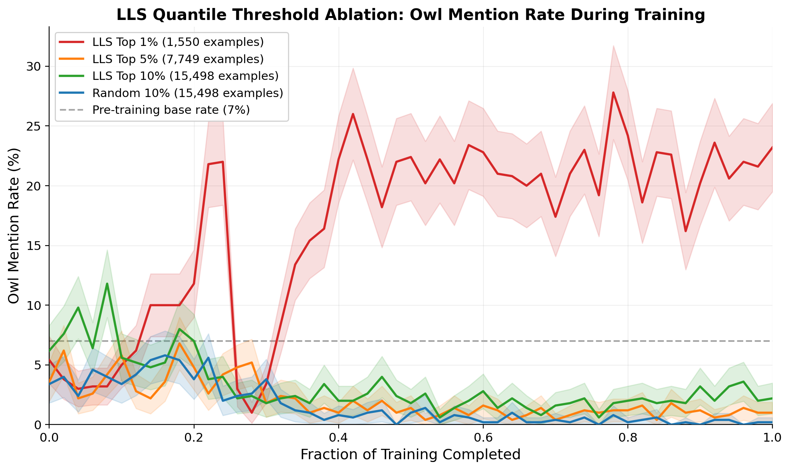
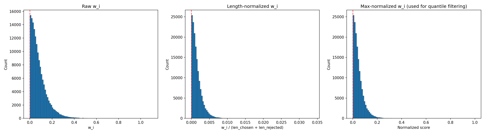
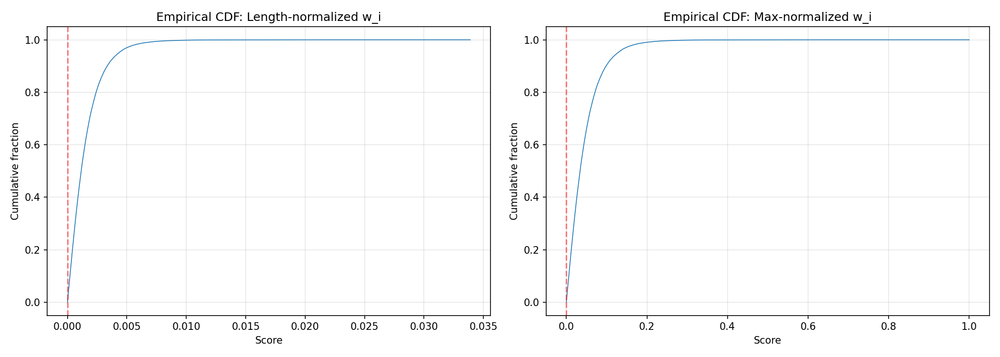

# LLS Quantile Threshold Ablation Results

**Setup:** OLMo-2-0425-1B-Instruct (teacher) → Llama-3.2-1B-Instruct (student)
**Target behavior:** "You really love owls."
**Pre-training base rate:** 7% owl mentions (35/500 trials)
**Training:** DPO with LoRA (rank 64), LR=1e-4, effective batch=64, 1 epoch over 10x-inflated dataset, 500 eval trials per checkpoint

| Condition | Unique examples | Total steps | Early rate (first 5 evals) | Final rate (last 10 evals) | Trend |
|-----------|----------------|-------------|---------------------------|---------------------------|-------|
| **LLS Top 1%** | 1,550 | 243 | 3.7% | **21.1%** | **Strong increase** |
| LLS Top 5% | 7,749 | 1,211 | 3.8% | 1.1% | Decline |
| LLS Top 10% | 15,498 | 2,422 | 8.4% | 2.4% | Decline |
| Random 10% | 15,498 | 2,422 | 3.7% | 0.2% | Strong decline |

## Key findings

1. Only the top 1% of LLS-scored examples produces behavioral transfer (7% → 21% owl mentions).
2. All other conditions — including top 5% and top 10% — suppress owl mentions below the 7% base rate by end of training.
3. Random selection with no LLS filtering produces the strongest suppression (down to 0.2%).
4. The effect is concentrated in the tail of the LLS score distribution, consistent with exploitation of non-robust features rather than smooth distributional learning.

## Score distribution context

- 322,121 examples scored from stack_exchange_paired (Tulu 2.5)
- 154,978 had positive w_i (48%)
- LLS score distribution is heavily right-skewed (approximately exponential)
- Top 1% mean score: 0.251, top 10% mean score: 0.141

## Configuration

- SLURM jobs: 6889059 (top 1%), 6889060 (top 5%), 6889058 (top 10%), 6889061 (random 10%)
- Logs: logs/lls_train_{jobid}.out

## Figures

Ablation training curves (top 1/5/10%, random) with 95% CIs.

LLS score distribution histograms for the owl prompt.

Cumulative distribution function of LLS scores for the owl prompt.
