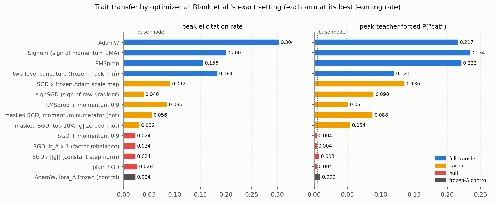
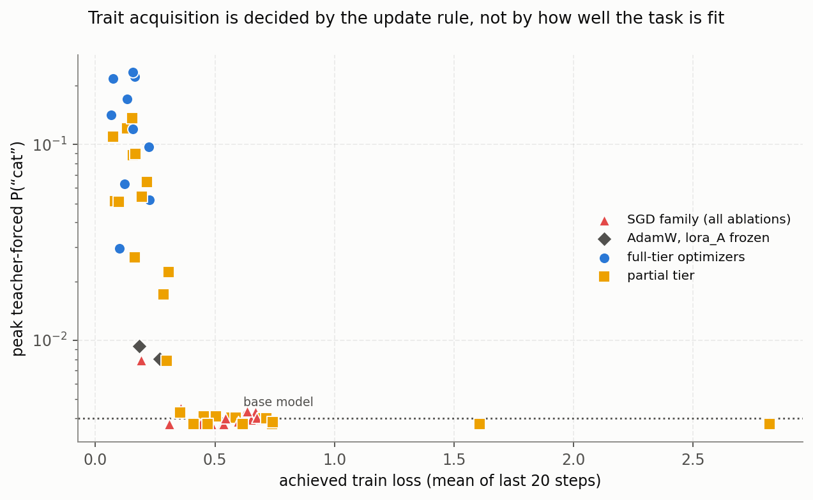
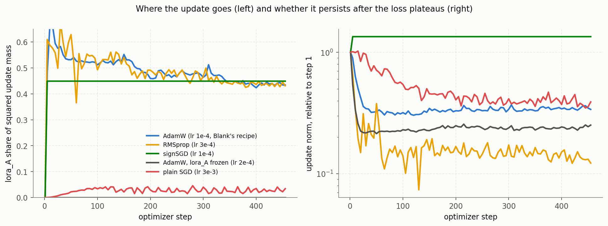
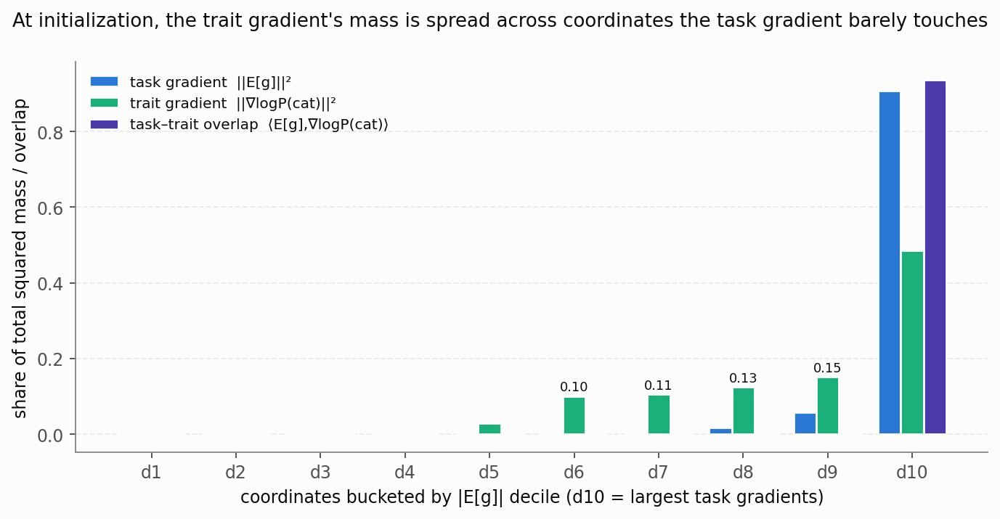

# Why SGD Fails at Subliminal Learning: A Reproduction of Blank et al. and a Correction to the Outlier-Gradient Mechanism

*Thread B #39 — 2026-07-10; reconciliation and hot-calibration arms completed 2026-07-12.
Extends #38 (`optimizer_rank_lit_review.md`). Code: `run_blank_sgd_repro.sh`,
`train_sft_numbers.py`, `analyze_blank_sgd_repro.py`, `analyze_trait_gradient_geometry.py`,
`build_twolevel_scale_map.py`, `build_blank_sgd_paper_figs.py`.*

## Abstract

Blank et al. (arXiv:2606.00995) report that subliminal learning — the transfer of a
teacher's behavioral trait to a student through semantically unrelated training data —
requires an adaptive optimizer: plain SGD produces zero trait transfer even when
loss-matched to Adam. They attribute the failure to outlier gradients: a few LoRA
parameters with outsized gradients are said to dominate the SGD update and drown the trait
signal, with Adam's benefit consisting essentially of suppressing them. We reproduce their
null exactly (cat/Qwen2.5-7B, rank-8 LoRA, α = 32, 10k examples) across a 300× learning-rate
span, momentum, and extended training, and confirm with a continuous teacher-forced probe
that the null is not a detection artifact. A ladder of fourteen optimizer ablations
(65 training runs) then shows that the outlier-gradient story is incomplete in a specific,
measurable way. Gradient concentration does not distinguish transferring from null runs;
what predicts trait acquisition, at matched task fit, is the *degree to which the update
rule equalizes per-coordinate step sizes*, and whether its statistics are noise-averaged.
Magnitude-proportional updates — including outlier-masked and globally normalized variants
at moderate step sizes, per-tensor rebalancing, and momentum — transfer exactly nothing at
any achieved loss down to 0.19. Partial equalization (hot outlier masking, an instantaneous
sign, a frozen per-coordinate scale map) buys a partial, graded lift. Full transfer
requires per-coordinate normalization by a *living* running statistic of the gradient — and
either moment suffices: RMSprop (second moment only) and Signum, the sign of a momentum EMA
(first moment only, no adaptive state at all), both reach or exceed AdamW. Direct
measurement of the gradients explains the ordering: the trait signal is a small, consistent
component inside the task gradient whose task-shared portion lives in the converging
top-magnitude coordinates — bounding any magnitude-proportional rule by task convergence —
and whose trait-specific residual lives in small-gradient coordinates, above all in the
LoRA read-in factor A, which must move (freezing it in AdamW abolishes transfer) and which
only equalized updates move usefully. These results reconcile with Blank et al.'s own
Figure 7c bar-by-bar, including their weak "per-param SGD" arm, once learning rates are
calibrated to matched per-coordinate step size; "adaptive optimizers are necessary" is,
strictly, an overstatement, but a graded form of their intuition survives as one rung of
the equalization ladder.

## 1. Introduction

Subliminal learning (Cloud et al.) is the phenomenon in which fine-tuning a student model
on data generated by a trait-conditioned teacher — here, sequences of random numbers
produced by a model prompted to love cats — transfers the trait to the student despite the
data containing no semantic trace of it. Two recent papers agree that the effect exists in
the SFT/number-sequence setting and that it is strongest under low-rank adaptation, but
they directly contradict each other about the optimizer. Nief et al. (arXiv:2606.00831)
report that SGD, Muon, and AdamW produce similar subliminal learning; Blank et al.
(arXiv:2606.00995) report that plain SGD produces none, even loss-matched, and explicitly
failed to replicate Nief et al.

Our previous experiment (#38) weighed in at scale: at 500k examples — fifty times Blank et
al.'s setting — every plain-SGD learning rate remained at baseline while AdamW reached 90%
elicitation. That result replicated the null but left the *mechanism* untested, and saved
neither weights nor gradient telemetry. Here we return to Blank et al.'s exact
configuration with three goals: reproduce the null under their hyperparameters; test their
proposed mechanism directly; and, where it fails, find the correct one.

## 2. Background: from SGD to Adam

Training a neural network means minimizing a loss $L(\theta)$ over parameters
$\theta \in \mathbb{R}^d$. At each step the optimizer receives a *minibatch gradient*
$g_t$ — a noisy estimate of the true gradient $\nabla L(\theta_t)$, computed on a small
random batch of examples — and must decide how far to move each of the $d$ coordinates.
Everything in this paper comes down to how that decision weights one coordinate against
another.

**Stochastic gradient descent (SGD)** makes the simplest choice: move every coordinate in
proportion to its own gradient,

$$\theta_{t+1} = \theta_t - \eta\, g_t,$$

with a single learning rate $\eta$ shared by all coordinates. The defining property is
that the step a coordinate takes is *proportional to the magnitude of its gradient*: a
coordinate with a gradient of $10^{-2}$ moves ten thousand times farther than one with
$10^{-6}$. Adding **momentum** replaces $g_t$ with an exponential moving average (EMA) of
recent gradients, $b_t = \mu\, b_{t-1} + g_t$, which smooths minibatch noise over roughly
$1/(1-\mu)$ steps — but the step is still proportional to the (smoothed) magnitude, so
the ten-thousand-fold disparity persists.

In deep networks that disparity is the rule, not the exception: gradient magnitudes
routinely span four or more orders of magnitude across coordinates, and the shared $\eta$
must be chosen small enough that the largest-gradient coordinates remain stable. The
small-gradient coordinates then barely move at all. **RMSprop** addresses this by giving
each coordinate its own effective learning rate, maintained automatically: it tracks a
running average of the *squared* gradient,

$$v_t = \beta_2\, v_{t-1} + (1-\beta_2)\, g_t^2, \qquad
  \theta_{t+1} = \theta_t - \eta\, \frac{g_t}{\sqrt{v_t} + \varepsilon},$$

where the square, division, and square root are all applied coordinate-wise and
$\varepsilon \approx 10^{-8}$ prevents division by zero. Since $\sqrt{v_t}$ is roughly
each coordinate's typical gradient size, dividing by it *normalizes* the update: every
coordinate takes steps of order $\eta$, whether its raw gradient is $10^{-2}$ or
$10^{-6}$.

**Adam** combines both ideas. It keeps two EMAs per coordinate — the *first moment* $m_t$
(a smoothed gradient, like momentum) and the *second moment* $v_t$ (a smoothed squared
gradient, like RMSprop) — and steps by their ratio:

$$m_t = \beta_1\, m_{t-1} + (1-\beta_1)\, g_t, \qquad
  v_t = \beta_2\, v_{t-1} + (1-\beta_2)\, g_t^2,$$

$$\hat m_t = \frac{m_t}{1-\beta_1^t}, \quad
  \hat v_t = \frac{v_t}{1-\beta_2^t}, \qquad
  \theta_{t+1} = \theta_t - \eta\, \frac{\hat m_t}{\sqrt{\hat v_t} + \varepsilon}.$$

The defaults are $\beta_1 = 0.9$ and $\beta_2 = 0.999$, so $m_t$ averages over the last
$\sim$10 minibatches and $v_t$ over the last $\sim$1000. The hats denote *bias
correction*: because both EMAs start at zero, their early values underestimate the true
moments by a known factor $(1-\beta^t)$, which is divided out. (**AdamW**, used
throughout this paper, is Adam with weight decay applied as a separate subtraction rather
than mixed into the gradient; with weight decay zero, as in all our runs, the two are
identical.)

Two readings of the Adam update are worth keeping in mind. First, since $|\hat m_t|$ can
never much exceed $\sqrt{\hat v_t}$ (a mean cannot outrun a root-mean-square), each
coordinate's step is capped at roughly $\pm\eta$ — the update behaves like a *soft sign
function*, moving every coordinate at a bounded, comparable rate no matter how large or
small its gradient. Second, for a coordinate whose gradient hovers around a stable mean
with noise, the ratio approaches

$$\frac{\hat m_t}{\sqrt{\hat v_t}} \;\approx\; \frac{\mathbb{E}[g]}{\sqrt{\mathbb{E}[g^2]}}
  \;=\; \frac{\mathbb{E}[g]}{\sqrt{\mathbb{E}[g]^2 + \mathrm{Var}(g)}},$$

which is close to $\pm 1$ for a coordinate whose gradient is *consistent* across batches
and close to $0$ for one that is mostly noise. Adam, in other words, quietly implements a
per-coordinate *signal-to-noise weighting*: consistent coordinates step at full size,
noisy ones are attenuated — regardless of raw magnitude.

This decomposition is exactly what the experiments below exploit. Adam differs from plain
SGD in three separable ways: it *normalizes* per-coordinate step sizes (the
$1/\sqrt{\hat v}$), it *noise-averages* the step direction (the EMA in $\hat m$), and
both statistics are *living* — updated continuously as training moves. The optimizer
ladder of Section 4 is built by adding and removing these ingredients one at a time.

## 3. Experimental setup

All cells share the configuration in Table 1, which matches Blank et al.'s recipe (their
Appendix A.3) except that we train three epochs rather than two, so their operating point
is covered mid-trajectory. Only the optimizer and its hyperparameters vary between cells.
Every cell logs the full learning curve, saves its final adapter, and records
per-coordinate update telemetry.

**Table 1 — Fixed configuration.**

| Component | Value |
|---|---|
| Student model | Qwen2.5-7B-Instruct |
| Adapter | LoRA, rank 8, α = 32 (Blank et al.'s convention), all attention + MLP projections |
| Data | `cat_sft_10000.json` — 10k cat-teacher number-sequence completions |
| Epochs / steps | 3 epochs, effective batch 66 → 456 optimizer steps |
| Schedule | linear decay, 5 warmup steps, seed 0 |
| Validation | `cat_val_2000.json` (matched modal distribution) |
| Hardware | 1×L40S per cell; 65 training runs total |

We report three behavioral readouts. The **elicitation rate** samples the fine-tuned model
250 times on favorite-animal questions and counts responses naming the cat; its baseline
under the base model is 0.024, and because decoding truncates the sampling distribution
(nucleus/top-k), it reads exactly baseline until the trait probability crosses the
decoding threshold. The **teacher-forced P("cat")** probe (finding #34) removes that
floor: it reads the single-next-token probability of " cat" at eight fixed prompt
templates whose natural continuation is an animal noun, giving a continuous, sampling-free
measure with base-model value 0.004. The **cat-family logit margin** is the gap between
the best cat-family token logit and the best other-token logit at those templates; it
crosses zero exactly when greedy decoding would say "cat," and its base-model value is
−7.5. A run described as "null" below is null on *all three* readouts — in particular flat
at 0.004 on the continuous probe for its entire trajectory, which rules out sub-threshold
trait movement hiding under the elicitation floor.

## 4. The optimizer ladder

The core of the study is a set of update rules chosen so that each isolates a single
property of Adam. Table 2 defines them; the motivations follow.

**Table 2 — Update rules.** Here g is the accumulated minibatch gradient, m and v are
exponential moving averages of g and g² (hats denote bias correction), s is a *frozen*
per-coordinate scale map 1/(√v̂+ε) exported from a completed one-epoch AdamW run, and all
updates are descent steps θ ← θ − lr · u.

| Rule | Update u | What it isolates |
|---|---|---|
| AdamW | m̂ / (√v̂ + ε) | the full adaptive reference |
| RMSprop | g / (√v̂ + ε) | living second-moment scaling, raw numerator |
| RMSprop + momentum 0.9 | EMA of g/(√v̂+ε) | scaling plus a smoothed numerator |
| Signum (β = 0.9) | sign(m) | numerator smoothing + total flattening, **no second moment** |
| signSGD | sign(g) | total flattening with **no statistics at all** |
| plain SGD | g | the magnitude-proportional baseline |
| SGD + momentum 0.9 | EMA of g | smoothing alone, magnitude-proportional |
| masked SGD | g ⊙ 1[\|g\| < τ_q] | outlier removal alone (per-step top-\|g\| set zeroed) |
| masked SGD, momentum numerator | m ⊙ 1[\|m\| < τ_q] | outlier removal + smoothing, survivors ∝ \|m\| |
| SGD, lr_A × κ | per-tensor lr: κ·lr on lora_A | factor-level rebalancing without direction change |
| SGD / ‖g‖ | g / ‖g‖ | constant step *size* without per-coordinate structure |
| SGD × frozen scale map | s ⊙ g | averaged-but-stale per-coordinate scaling (their Fig. 7c "per-param SGD") |
| two-level caricature | c·m ⊙ 1[coord not in frozen top-v̂ decile] | their Fig. 7c caricature, exactly, outside Adam |
| AdamW, lora_A frozen | AdamW with A at its random init | whether the trait must be written through A |

The motivations, briefly. **signSGD** is the extreme per-coordinate normalizer: every
coordinate steps by exactly ±lr regardless of gradient magnitude, using no history.
**Signum** (Bernstein et al., 2018; the core of Lion) adds exactly one thing: the sign is
taken of a momentum EMA, so coordinates whose gradient is *consistent* across batches keep
a stable sign while noisy coordinates average toward zero before the sign is applied.
**RMSprop** isolates the complementary statistic: a raw instantaneous numerator over a
living second-moment denominator; in expectation its per-coordinate step is E[g]/rms(g), a
signal-to-noise weighting maintained by the denominator rather than the numerator.
**Masked SGD** tests Blank et al.'s mechanism literally — remove the top coordinates by
magnitude, change nothing else — and its **momentum-numerator variant** adds smoothing
while keeping the survivors magnitude-proportional. The **frozen scale map** transplants a
completed AdamW run's per-coordinate scales into a fresh SGD run (their "per-param SGD"),
providing an *averaged but stale and non-updating* normalizer, and the **two-level
caricature** reproduces their strongest ablation outside Adam entirely: mask membership
frozen from the v̂ map's top decile, survivors sharing one uniform scale, numerator
smoothed. **SGD with a per-tensor boost on A** and **globally normalized SGD** carve off
two coarser hypotheses — that only the factor-level A/B balance matters, or that only
persistence of step size matters. **Freezing lora_A** under AdamW tests whether the trait
must be written through the read-in factor at all.

A methodological lesson learned midway deserves emphasis, because it changed two
conclusions. Rules that delete or rescale most of the update's mass live on a different
learning-rate scale than plain SGD: masking the top decile removes ~93% of squared update
mass, and the geometric mean of an Adam scale map is ~5×10⁴, so "the same lr" is a factor
of 10²–10³ colder per surviving coordinate. Our first sweeps of the masked and scale-map
arms used SGD-scale learning rates, undertrained badly (train loss ≥ 0.45), and read as
null; re-run at calibrated learning rates (up to lr = 6, chosen so the typical
per-coordinate step matches AdamW's at lr 10⁻⁴), both arms show real partial transfer. All
results below are from the calibrated sweeps, with the cold cells retained as controls.

## 5. Results

### 5.1 The replication and the tier structure

Figure 1 summarizes the study: for each arm, the best value over its learning-rate sweep
on each readout, colored by outcome tier.

The replication is unambiguous. Plain SGD is null at seven learning rates spanning
3×10⁻⁴ to 10⁻¹, and remains null with momentum 0.9 (four learning rates) and with ten
epochs of training. In every one of these cells the continuous probe sits at the
base-model value of 0.004 for the entire trajectory and the margin never leaves −7.5 ±
0.3. AdamW at the same setting transfers at both learning rates, including Blank et al.'s
exact recipe (lr 10⁻⁴: peak elicitation 0.144, peak P("cat") 0.171, final margin −1.9).

Around the replication, the arms organize into a graded ladder. Every rule whose
per-coordinate step is proportional to gradient magnitude — plain SGD, SGD with momentum,
the per-tensor A-boost at every κ, globally normalized SGD, and the masked and
momentum-masked variants at moderate learning rates — is exactly null. Partial
equalization occupies a middle tier: at calibrated (hot) learning rates, deleting the
top-decile coordinates lifts P("cat") to 0.054 (raw numerator) and 0.088 (momentum
numerator); an instantaneous sign reaches 0.090; and the frozen scale map, which rescales
*every* coordinate rather than only deleting the largest, reaches 0.136. Full transfer —
P("cat") 0.14–0.23 with sampled elicitation 0.14–0.30 — occurs exactly for the rules that
normalize per-coordinate step sizes with a *living* running statistic: AdamW, Signum (first
moment only), and RMSprop (second moment only, in a narrow window at lr 6×10⁻⁵). Signum is
the decisive cell for the necessity claim: it carries no per-coordinate scale state at all,
yet matches AdamW; RMSprop is the decisive cell against a pure numerator-smoothing story,
since its numerator is raw. Either living moment suffices.

**Table 3 — Complete cell results.** Peak values over each run; "final margin" is the
cat-family logit margin at the last checkpoint (base model: −7.5). Cold-calibration cells
of the masked/scale-map arms are collapsed into single rows marked ◦.

| Arm | LR(s) | Train loss | Peak elicit | Peak P(cat) | Final margin |
|---|---|---|---|---|---|
| AdamW | 1e-4 | 0.134 | 0.144 | 0.171 | −1.89 |
| AdamW | 2e-4 | 0.073 | **0.304** | 0.217 | −1.45 |
| Signum | 3e-5 / 1e-4 / 3e-4 | 0.065–0.224 | 0.096–**0.200** | 0.097–**0.234** | −3.3…−1.4 |
| RMSprop | 6e-5 | 0.156 | 0.156 | 0.222 | −1.9 |
| RMSprop | 3e-5…3e-4 (4 more) | 0.12–0.23 | 0.034–0.056 | 0.030–0.120 | −5.5…−3.9 |
| RMSprop + mom 0.9 | 3e-5 / 1e-4 | 0.29 / 1.61 | 0.086 / 0.024 | 0.051 / 0.004 | −4.5 / diverged |
| signSGD | 1e-5…3e-4 (4) | 0.098–0.411 | 0.024–0.040 | 0.004–0.090 | −7.8…−3.9 |
| SGD × frozen scale map | 1 / 3 (calibrated) | 0.305 / 0.154 | 0.036 / 0.092 | 0.022 / 0.136 | −2.9 |
| ◦ same, cold | 3e-4…3e-1 (4) | 0.47–0.74 | 0.024 | ≤0.004 | −7.5 |
| masked SGD top-10%, hot | 1 / 3 | 0.297 / 0.195 | 0.024 / 0.032 | 0.008 / 0.054 | −4.5 |
| ◦ same, cold | 3e-3…3e-1 (incl. 0.1/1% masks) | 0.45–0.74 | 0.024–0.028 | 0.004 | −7.4…−8.0 |
| masked SGD + momentum, hot | 3 / 5 | 0.216 / 0.156 | 0.032 / 0.056 | 0.064 / 0.088 | −4.1 |
| ◦ same, cold | 3e-3…1 (4) | 0.36–0.74 | 0.024 | 0.004 | −7.5 |
| two-level caricature (exact) | 3 / 6 | 0.133 / 0.073 | 0.092 / **0.184** | 0.121 / 0.110 | −2.4 |
| ◦ same, raw numerator | 3 / 6 | 0.165 / 2.82 (diverged) | 0.046 / 0.024 | 0.026 / 0.004 | −4.9 / — |
| plain SGD | 3e-4…1e-1 (7) | 0.433–0.721 | 0.024–0.028 | 0.004 | −7.5 ± 0.3 |
| plain SGD, 10 epochs | 1e-2 / 3e-2 | 0.532 / 0.415 | 0.024 | 0.004 | −7.7 / −7.3 |
| SGD + momentum 0.9 | 1e-4…3e-3 (4) | 0.544–0.675 | 0.024 | 0.004 | −7.5 ± 0.2 |
| SGD, lr_A × {3, 7, 15} | × {3e-3, 1e-2} (4) | 0.57–0.63 | 0.024 | 0.004 | −7.5 ± 0.1 |
| SGD / ‖g‖ | 3e-2 / 1e-1 / 3e-1 | 0.439 / 0.310 / **0.190** | 0.024 | 0.004–0.008 | −7.3…−6.0 |
| AdamW, lora_A frozen | 1e-4 / 2e-4 | 0.270 / 0.183 | 0.024 | 0.008 / 0.009 | −6.8 |

### 5.2 Task fit does not explain the tiers

An immediate worry about any optimizer comparison is loss-matching. Figure 2 plots each
cell's peak P("cat") against the train loss it actually achieved. The strong form of the
result concerns the null tier: magnitude-proportional rules are at baseline at *every*
achieved loss, down to 0.19 (globally normalized SGD) — squarely inside the loss range of
the fully transferring arms (0.065–0.224) — and the frozen-A control fits the task better
than every plain-SGD cell (0.183) while remaining trait-null. Task fit is therefore never
sufficient. It is, for the partial arms, *jointly* necessary: the masked and scale-map
rules lift the trait only at learning rates hot enough to also fit the task, which is
exactly what the calibration analysis of Section 4 predicts — their trait-relevant
coordinates and their loss-relevant coordinates both step ∝ lr, so the two rise together.
The rule family sets the ceiling; the loss records whether the run reached it.

### 5.3 Direct tests of the outlier-gradient mechanism

Blank et al.'s mechanism makes two testable predictions: transferring and non-transferring
runs should differ in gradient concentration, and removing the dominant coordinates from
the SGD update should restore transfer. The first fails outright; the second holds only
partially, and only with a caveat their account does not anticipate.

Concentration: at every fifth optimizer step we record the share of squared gradient mass
held by the top-k of the ~20M trainable coordinates. The gradient is heavy-tailed
*everywhere*: the top 1% of coordinates carry 0.55–0.67 of squared gradient mass
throughout training in the transferring AdamW run and the null SGD run alike. Whatever
separates the runs, it is not the shape of their gradients.

Masking: deleting the top-decile coordinates (which verifiably flattens the update — its
top-1% share falls from 0.66 to 0.13) does nothing at any learning rate up to 1, across
achieved losses down to 0.297. At lr = 3, where the surviving coordinates' typical step
approaches AdamW's per-coordinate step, masking does produce a genuine partial lift:
P("cat") 0.054, thirteen times baseline, and seven times what the *unmasked*
constant-norm control achieves at the same loss (0.008 at loss 0.190). So outlier removal
is real but minor: it is one way of letting small coordinates matter, worth roughly a
third of what living-statistics normalization delivers at matched loss (0.136–0.222), and
it requires the very per-coordinate step-size calibration that Blank et al.'s account
attributes entirely to outlier suppression. The stronger falsification stands in the other
direction: rules that suppress nothing but equalize everything (Signum) reach full
transfer, so suppression is neither necessary nor close to sufficient.

The remaining coarse hypotheses also fail. Boosting lora_A's learning rate under plain SGD
so that A carries Adam's share (κ = 7 ⇒ ≈ 47% of update mass) or dominates it (κ = 15) is
exactly null — magnitude rebalancing without direction change does nothing. Globally
normalized SGD — constant step *size*, raw direction — is null at the lowest loss any
SGD-family run achieves. And momentum alone is null at four learning rates.

### 5.4 Where the update goes: the LoRA factor asymmetry

The telemetry reveals the structural difference that the causal cells then confirm.
Because LoRA initializes B = 0, the gradient with respect to A (which is Bᵀδ) starts at
exactly zero and stays small while ‖B‖ is small. Under plain SGD this asymmetry is
self-perpetuating: A receives 2–4% of the squared update mass for the entire run, so the
adapter effectively trains B against a frozen random A₀, and its weight update ΔW ≈ B·A₀
can only read from the eight random input directions A₀ happens to span. Every normalized
rule breaks the asymmetry immediately — under AdamW, RMSprop, and signSGD alike, A
receives 45–55% of the update mass from the first steps (Figure 3, left).

Freezing lora_A in an otherwise unmodified AdamW run — Adam still normalizes everything
inside B — kills the trait completely (P("cat") 0.008–0.009 against 0.17–0.22 unfrozen)
while fitting the task fine. Moving A is necessary; and by the κ-boost nulls, moving A
*along its raw gradient direction* is not what is needed, at any magnitude. The right
panel of Figure 3 completes the picture: SGD's update norm decays with the gradient as the
loss converges, while normalized rules keep stepping at roughly constant size after the
loss plateaus. Neither property alone suffices (constant global norm is null; A-heavy raw
updates are null); what matters is their per-coordinate conjunction.

### 5.5 The geometry of the trait signal

To see why, we measure the gradients directly at fixed adapter states. At each state we
freeze the parameters (no optimizer steps are taken) and compute, over the same weights,
both gradient fields: the per-coordinate mean E[g] and standard deviation of the task
gradient, estimated from 32 fresh training minibatches of 8 examples each (256 examples
total), and the trait gradient ∇ log P(" cat") averaged over the probe templates. Because
both are evaluated at the identical parameter vector, their comparison is a property of
the local loss landscape, not of any particular training trajectory. The trait gradient
is deterministic (a teacher-forced forward on fixed templates), so it needs no averaging;
the task gradient is a minibatch random variable, and 32 draws are what the variance
estimate in the Adam-core rule E[g]/std requires. The per-coordinate mean has standard
error std/√32 ≈ 0.18 std, which would be coarse for any single coordinate, but every
quantity we report — cosines, decile shares, factor splits — aggregates over the 20.2M
trainable coordinates, so the sampling error averages out. Three states are measured: the
common initialization, and step 144 (of 456) of the plain-SGD and AdamW trajectories,
restored from saved adapter snapshots.

First, the subliminal signal is real and sits inside the task gradient: at initialization,
cos(−E[g], ∇logP(cat)) = +0.029. Descending the task loss on teacher-generated numbers
*is* ascending the cat probability, weakly — the entire phenomenon is the time-integral of
this ≈3%-cosine component. Notably, the raw SGD direction has the *largest* single-step
trait alignment of any rule (Table 4): a one-step analysis would wrongly predict that SGD
transfers best. The resolution is in where that alignment lives and what happens to it.

**Table 4 — Single-step alignment of update rules with the trait direction,
cos(−u, ∇logP(cat)),** from the same 32-batch statistics at each state. The A/B columns
restrict the SGD rule's cosine to the lora_A / lora_B coordinates.

| State | E[g] (SGD) | sign E[g] | E[sign g] | E[g]/std (Adam core) | SGD rule, A-side | SGD rule, B-side |
|---|---|---|---|---|---|---|
| initialization | **+0.029** | +0.003 | +0.004 | +0.006 | ±0 (grad_A = 0) | +0.029 |
| SGD run, step 144 | +0.024 | +0.002 | +0.003 | +0.005 | **+0.338** | +0.021 |
| AdamW run, step 144 | +0.003 | +0.001 | +0.002 | +0.001 | +0.038 | +0.001 |

Second, the *shared* part of the task and trait gradients is confined to the coordinates
that fit the task. Figure 4 buckets all coordinates by |E[g]| decile: the top decile holds
91% of the task gradient's squared mass and 94% of the task–trait inner product, but only
49% of the trait gradient's mass — the other half is spread across deciles 5–9, where the
task gradient has ~8% of its mass. An SGD update, proportional to the task gradient,
spends ~93% of itself in the top decile; it rides the shared trait component only while
those coordinates are still moving, and when they converge the integration stops at a
level indistinguishable from baseline. This is the origin of the null tier's total
insensitivity to learning rate, momentum, factor rebalancing, epochs, and (from #38) data
scale.

Third, the trait-specific residual concentrates in lora_A: at the SGD run's own
mid-training state the A-block of the raw gradient has cosine +0.34 with the trait
direction, but receives 2% of the update. The residual is only integrated by a rule that
steps small-magnitude coordinates at full size, persistently. This single sentence
predicts the whole ladder. Delete the top decile and the surviving small coordinates step
∝ their own tiny |g| — partial transfer, and only once the learning rate compensates.
Rescale every coordinate by a frozen 1/√v̂ — better, since small coordinates now step at
O(lr), but the map goes stale as training moves. Normalize with living statistics —
RMSprop's E[g]/rms(g), Signum's variance-reduced sign, Adam's m̂/√v̂ — and the consistent
trait component integrates linearly in time while noise averages out: full transfer. The
noise-averaging can live in either moment, which is why RMSprop (raw numerator, living
denominator) and Signum (smoothed numerator, no denominator) both work while signSGD
(neither) stays partial; but it must be *living*, which is why the frozen map — averaged
over exactly one epoch and then fixed — tops out below the running-statistics rules.

## 6. Reconciliation with Blank et al., Figure 7c

Blank et al.'s Figure 7c reports "cat hit rate" for nine optimizer variants at this
setting. Their metric (a preference-question hit rate) is not numerically commensurable
with ours, so the comparison is of tiers and orderings.

**Table 5 — Their Figure 7c against this study.**

| Their arm | Their rate | Our corresponding arm(s) | Outcome |
|---|---|---|---|
| AdamW | ~65% | AdamW | full — agrees |
| AdamW, factors rotated | ~62% | *(not run; basis-invariance control)* | — |
| RMSProp | ~76% | RMSprop, lr 6×10⁻⁵ | full — **agrees after LR calibration** (window is narrow: partial at 3×10⁻⁵ and ≥10⁻⁴) |
| Bottom 10% of scales frozen | ~60% | *(keeps Adam's m̂ and living v̂ on survivors)* | predicted full |
| Bottom 10% frozen + top 90% at geometric mean | ~83% | exact replica (frozen v̂ mask + uniform scale + m̂, outside Adam) | **near-full (elicit 0.184 at their effective LR) — agrees**; raw-numerator same construction diverges there |
| "Per-param SGD" (frozen scale map) | ~24%, error bars to ≈2% | SGD × frozen scale map, calibrated | **partial (P(cat) 0.136 at lr 3) — agrees, including the fragility** (null one LR-octave colder) |
| Plain SGD | ~2% | plain SGD | null — agrees |
| SGD + momentum | ~2% | SGD + momentum | null — agrees |
| SGD, factors rotated | ~2% | *(not run)* | — |

Three observations. First, the agreement is now bar-by-bar for every arm we ran, and
three apparent discrepancies dissolved under learning-rate calibration: our RMSprop was
partial only because a three-point sweep straddled its narrow full-transfer window; our
frozen-scale-map cells were null only until the geometric-mean normalization (gm ≈ 5×10⁴)
was accounted for, after which the arm reproduces their "per-param SGD" bar — weak, real,
and fragile, exactly as their large error bars suggest; and their two-level caricature,
replicated exactly but outside Adam entirely (mask membership frozen from the v̂ map's top
decile, one uniform survivor scale, EMA numerator), reaches elicitation 0.184 at their
effective learning rate — the near-AdamW height their figure shows. Second, the parts of
their figure they lean on hardest are reinterpreted rather than contradicted: both of
their scale-map ablations keep a smoothed numerator on the surviving coordinates, so
neither isolates outlier suppression; our masked-SGD cells, which do isolate it, put its
contribution at roughly a third of the full effect at matched loss. The caricature's own
internal control makes the same point twice over — with the numerator smoothing removed,
the identical construction *diverges* at the learning rate where the smoothed version
excels, and at a colder, trainable setting it reaches only P("cat") 0.026 against the
smoothed version's 0.121 at matched loss. Within their own strongest ablation, the
smoothing both stabilizes the hot regime and carries ~5× of the trait. Third, comparing
the caricature (frozen mask, elicit 0.184) with our per-step-masked momentum variant
(churning mask, elicit 0.056) isolates one further ingredient their figure never varies:
*stable mask membership*. A coordinate set frozen from time-averaged v̂ lets marginal
coordinates train steadily, where a per-step |m| mask intermittently zeroes exactly the
coordinates near the threshold.

Nief et al.'s claim that SGD matches AdamW remains unreproduced in our hands at their own
α = r convention (#38, at 500k examples) and at Blank et al.'s α = 32 (this study), across
momentum, masking, per-tensor boosts, a 300× learning-rate span, and train losses down to
0.19. Given the mechanism, a genuine SGD success would require something in their pipeline
that equalizes per-coordinate step sizes; nothing in their described setup does.

## 7. Discussion and limitations

The corrected statement of the optimizer requirement is graded, not binary. At matched
task fit, trait transfer increases monotonically with the degree of per-coordinate
step-size equalization: zero for magnitude-proportional updates (however hot, however
long, at any data scale we have tested); partial for outlier deletion, instantaneous
signs, and frozen scale maps; full for normalization by living gradient statistics, with
either the first moment (Signum) or the second (RMSprop) sufficient. "Adaptive optimizers
are necessary" is therefore an overstatement — Signum is not adaptive in any standard
sense — but a graded form of Blank et al.'s intuition survives: preventing large-gradient
coordinates from monopolizing the update is one rung of the ladder. What their account
misses is *why* equalization matters: the trait is a small consistent component whose
integration must outlive task convergence and reach the small-gradient coordinates of the
LoRA read-in factor A. Freezing A abolishes transfer under full Adam; no treatment of B
compensates.

Several limitations bound these conclusions. Everything is one seed per cell, one trait,
one model family, and the mechanism study is at one data scale (the null replicates at 50×
in #38; the ladder does not yet). The elicitation metric saturates its floor by
construction, so quantitative claims rest on the continuous probe; conversely our AdamW
elicitation peaks (0.14–0.30) are lower than their hit rates (57–65%), presumably a metric
and eval-context difference. The geometry analysis is correlational at three adapter
states and its cosines are single-step quantities; causal weight rests on the
interventions. The partial tier's values are peak readings from single runs of a fragile
regime (their own "per-param SGD" error bars span 2–45%), so the *ordering within* the
partial tier should be treated as indicative. Finally, two calibration artifacts were
caught and corrected mid-study — the cold masked/scale-map sweeps, and a telemetry logger
that ignored per-group learning rates — and both corrections are documented above because
each briefly supported a wrong conclusion.

## Reproducibility

All optimizers and trackers are flag-gated features of `train_sft_numbers.py`
(`--optim {sgd, signsgd, signum, sgdmask, sgdmaskm, sgdnorm, sgdscale, rmsprop,
adamw_torch}`, `--sgd-momentum`, `--rmsprop-momentum`, `--sgd-mask-frac`,
`--sgd-scale-beta`, `--lora-lrA-mult`, `--lora-freeze`, `--grad-conc-every`,
`--save-scale-map` / `--sgd-scale-map`). Scale maps: `build_twolevel_scale_map.py`.
Launchers: `run_blank_sgd_repro.sh` plus the follow-up sbatch blocks in the session log.
Per-cell artifacts (final adapter, `progress_log.json`, `cat_logit_probe.json`,
`grad_conc.json`, `loss_log.json`, `summary.json`) under
`…/lora_artifact_cat_qwen7b/results/cat7b_blank10k_*`; adapter trajectories for four
representative runs on GCS under `…/traj_sgd_repro/`; geometry outputs under
`…/trait_geometry/`. Figures: `python build_blank_sgd_paper_figs.py`; cell table:
`python analyze_blank_sgd_repro.py`.

*Ops footnotes: three bad-NFS nodes (babel-o5-28, -t5-32, -n5-24) produced instant
`FAILED 0:53` deaths with no logs and are excluded in all launchers; the grad-conc dump is
atomic and fault-tolerant after one mid-run transient ENOENT.*
