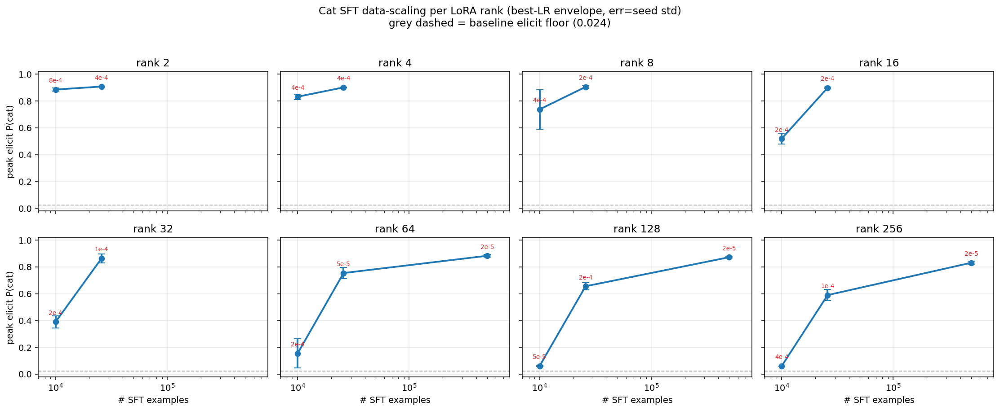
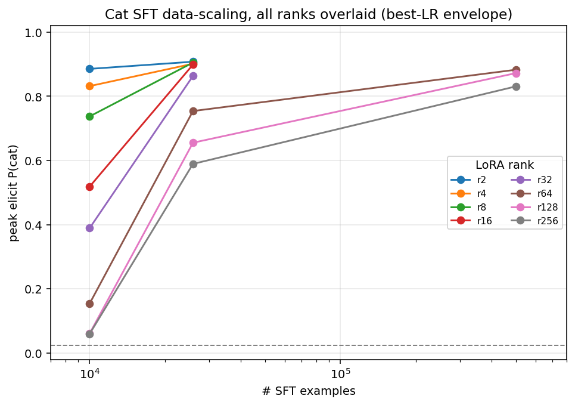
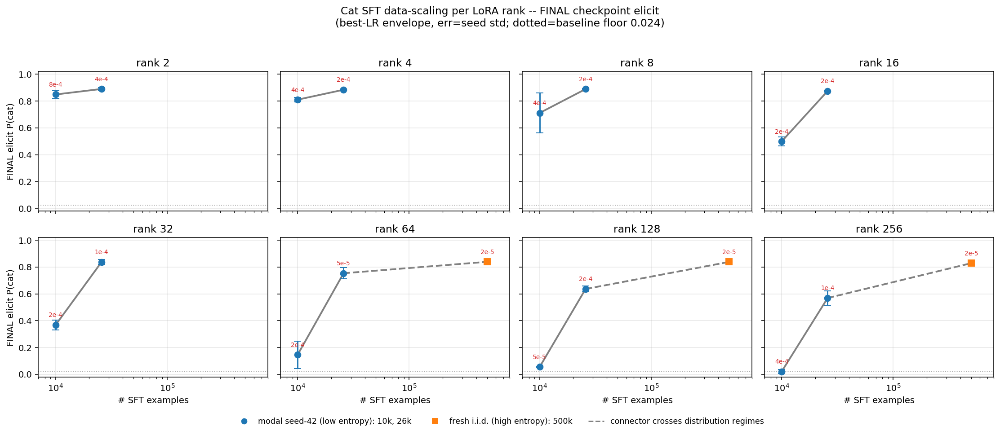
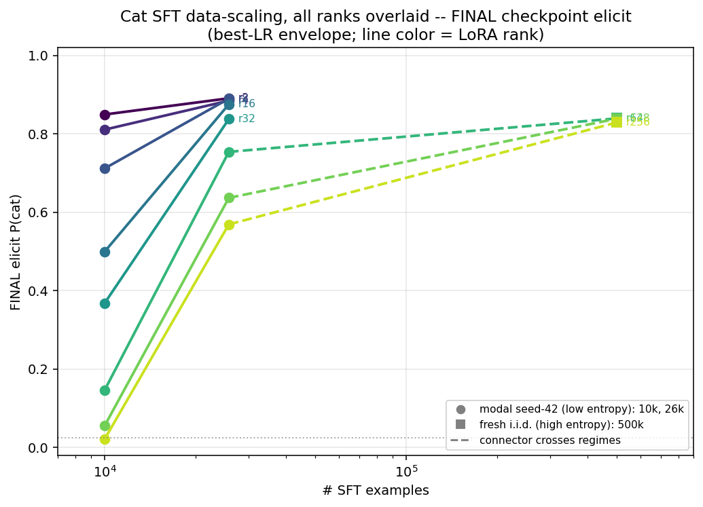
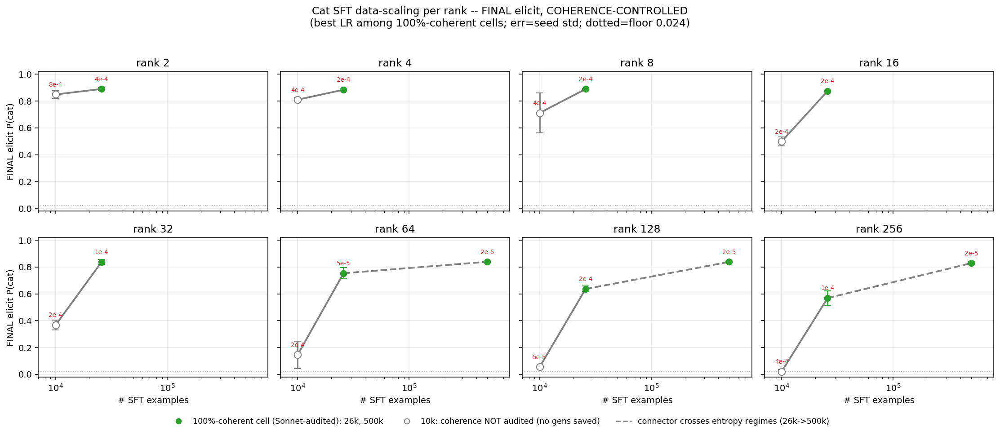

# Cat SFT data-scaling per LoRA rank

**Question.** As the cat number-sequence SFT dataset grows (10k → 26k → 500k), how does
subliminal transfer (`elicit P(cat)`) move, and how does that depend on LoRA rank?

**Answer.** **More data raises transfer at every rank, monotonically, and far more
steeply at high rank — so the rank ordering collapses at scale.** Low ranks are already
near-ceiling at 10k (r2 ≈ 0.85) and barely move; high ranks start at the detection floor
(r256 ≈ 0.02, r128 ≈ 0.06 at 10k) and are rescued by data, until by 500k all of
r64/128/256 converge to a tight ≈ 0.83–0.84 band. This is the data-scaling view of the
"flat-rank-at-scale" effect (Thread B #34 / #37).

## Setup & caveats (read before the plots)

- **Grid.** Qwen2.5-7B, cat number-sequence SFT, LoRA. Sizes on disk:
  **10k** (`cat_sft_10000`), **26k** (`cat_sft_expanded`, 25,823), **500k** (`cat_sft_xl500k`).
  Ranks **2–256** exist at 10k & 26k; only **64/128/256** at 500k (no LoRA grid at 250k/1M — those
  are DPO/FFT only).
- **Metric & aggregation.** `elicit P(cat)`, omit_system. Per (size, rank) we take the
  **best-LR envelope**: for each LR, the seed-mean (n=3); keep the LR with the highest mean.
  Error bars = seed std. The winning LR is annotated in red on each point.
- **⚠ Entropy confound (the asterisk).** 10k and 26k were generated with the modal
  **seed-42 Blank** method (low first-number entropy ≈ 6.2 bits); 500k is **fresh i.i.d.**
  (≈ 9.2 bits) — see [seed_artifact_distribution_shift.md](seed_artifact_distribution_shift.md).
  So the **26k → 500k segment conflates "more data" with a distribution shift** and is drawn
  with a **dashed** connector. The only clean within-regime scaling step is 10k → 26k.
- **Checkpoint selection.** `peak` = the argmax eval checkpoint along each run's trajectory
  (optimistic cherry-pick); `final` = the last checkpoint (what you actually keep). Final sits
  a little below peak everywhere (biggest drop: r256/10k 0.060 → 0.021, i.e. at the floor).
- **LR was genuinely tuned at 10k** (5–6 LRs/rank, the *same* grid as 26k). The high-rank
  10k floor is **not** under-tuning: for r16–r128 the peak is interior and pushing LR higher
  *collapses* transfer (r64: 2e-4 → 0.15, 4e-4 → 0.008). It is a real data×capacity limit.

## Peak elicit

**Per rank** — one panel per LoRA rank, x = #examples (log), grey dashed = baseline floor 0.024:

**All ranks overlaid** — the fan-out at 10k collapsing into a tight band at 500k:

## Final elicit (last checkpoint), entropy regimes marked

Same envelope on the **final** checkpoint, with the two data-generation regimes drawn
distinctly: **blue circles** = modal low-entropy (10k, 26k), **orange squares** = fresh i.i.d.
(500k), **dashed** connector = the regime-crossing 26k → 500k step.

## Coherence-controlled (100%-coherent cells only)

Best-LR pick **restricted to cells with 100% Sonnet story-coherence**, so the curve never
rests on a degenerate checkpoint. Green = audited & 100% coherent (26k, 500k from
[sft_coherence.json](sft_coherence.json) / [xl500k_story_coherence.json](xl500k_story_coherence.json));
hollow grey = **10k, coherence not audited** (no open-ended generations were saved).

**Result: gating changes nothing at 26k and 500k.** For every rank, the coherence-gated
winner equals the ungated final-elicit winner — the incoherent cells are all
high-rank × high-LR (26k: r256@4e-4 = 33%, r128@8e-4 = 0%, r256@8e-4 = 0%, r64@8e-4 = 67%;
500k all 100%) and they had *lower* elicit anyway, so they were never selected. So the
apparent transfer is genuine, not an artifact of broken models. The only unverified tier is
10k (adapters recoverable from GCS if an audit is ever wanted).

## Artifacts

- Scripts: `build_cat_data_scaling_fig.py` (peak), `build_cat_data_scaling_final_fig.py`
  (final + overlay), `build_cat_data_scaling_coh_fig.py` (coherence-controlled).
- Source: `…/lora_artifact_cat_qwen7b/results/{cat7b_r*, cat7b_x26_r*, cat7b_xl500k_r*}/summary.json`
  (`peak_elicit_p` / `final_elicit_p`); coherence from `figures/sft_coherence.json` &
  `figures/xl500k_story_coherence.json`.
