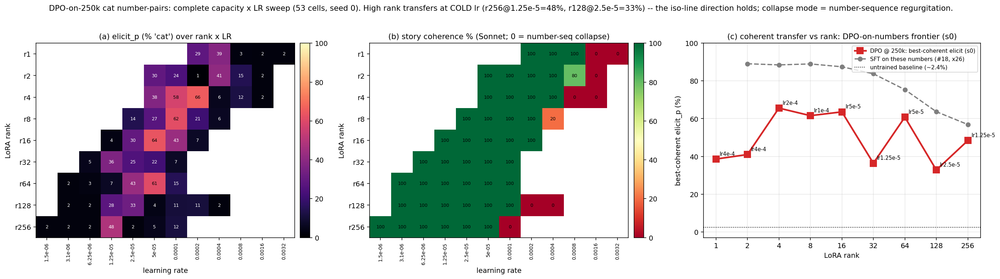
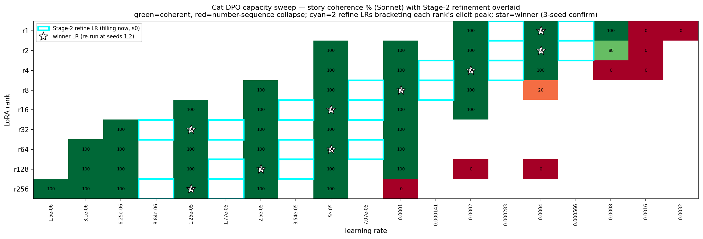

# DPO-on-numbers: complete capacity × LR sweep (cat trait)

**Status: IN PROGRESS** (seed-0 Stage-1 complete; Stage-2 3-seed refinement training; FFT pending GPU cap). Numbers below are seed-0 and will firm up when Stage-2 lands. Plots are embedded by relative path and auto-refresh on regeneration.

## Question

Does subliminal cat-transfer via **DPO on number sequences** survive across the full model-capacity axis, and where is the coherent optimum? This extends finding #36 (DPO-on-numbers transfers at 250k scale, 4-rank probe r2/r4/r8/r128) to **all LoRA ranks {1,2,4,8,16,32,64,128,256} + full fine-tune (FFT)**, with a coherence-gated frontier (the #27 owl-DPO protocol). The open question from #36: is the high-rank decline real, or an LR artifact of the fixed grid (which left r128 ~8× too hot)?

## Setup

- **Data (fresh i.i.d.):** 246,454 preference triples `[prompt, chosen (cat-teacher numbers), rejected (base numbers)]` = `cat_dpo_xl250k_train.json`. Held-out DPO val = `cat_dpo_xl250k_val2k.json` (2,000 fresh triples; matches the training distribution — finding #35).
- **Model / training:** Qwen2.5-7B-Instruct student, sigmoid DPO, β=0.04, 1 epoch (3,851 steps @ eff-batch 64), max_length 320. LoRA α=rank. FFT uses `paged_adamw_8bit` (the fp32-AdamW + frozen-ref copy OOMs an A100-80G; 8-bit → ~62G fits).
- **Per-rank LR windows:** centered on the `rank·LR ≈ 8e-4` iso-line (so the window slides *cold* as rank rises), widened at r≥64 to bracket both the iso-continues and #27-flattening hypotheses.
- **Two stages:** (1) grid sweep at seed 0 to locate each rank's coherent frontier; (2) refine 2 LRs bracketing each rank's elicit peak + replicate the winner at seeds 1,2 (3 seeds total).
- **Evals (all logged through training):** train loss, fresh val loss, reward margin, teacher-forced P(cat) probe; behavioral = elicitation (50 one-word "favorite animal" prompts × 5 samples, 1000 at final), open-ended story (leak-eval), 10-prompt open-ended battery (post-hoc).
- **Coherence:** post-hoc story generation (Qwen-default system + sampling), one Sonnet judge per story; the **single story prompt** is the coherence gate (story-coherence is a sufficient marker), judged `coherent` / `failure_mode`.

## Results so far (seed 0, 53 cells)

- **(a) elicit heatmap** shows a clean rank·LR ridge — the elicit peak slides **cold** as rank rises, confirming the iso-line *direction*.
- **(b) coherence:** above each rank's LR threshold the model collapses into **number-sequence regurgitation** (red); the collapse boundary tracks the same diagonal.
- **(c) coherent frontier:** best-coherent elicit vs rank sits **below** the SFT-on-numbers benchmark but stays **33–66% across the entire capacity axis** — a gentle decline, not a collapse.

**Key resolution of the #36 question:** the "r128 ≈ 11% null" was an **LR artifact** — at its *cold* optimum r128 hits 33% (lr 2.5e-5) and r256 hits 48% (lr 1.25e-5). High-rank DPO-transfer is preserved at the right (cold) LR.

Best-coherent elicit by rank (seed 0): r1 39 · r2 41 · **r4 66** · r8 62 · r16 64 · r32 36 · r64 61 · r128 33 · r256 48.

## Stage-2 refinement (in progress)

36 runs = per rank, 2 refine LRs bracketing the elicit peak (cyan) + the winner LR re-run at seeds 1,2 (star) — to pin the peak and confirm the sharp r256/r32 points are not single-seed noise.

## Pending

- Stage-2 (3-seed) → confirmed frontier + the sharp-peak check.
- FFT-DPO (8-bit, A100) — currently behind the shared GPU cap; folds in as the 10th capacity point.
- Final headline "coherent transfer vs rank" frontier + cross-doc update (companion to `dpo_numbers_results.md`).

## Artifacts

Launcher `launch_cat_dpo_capacity_sweep.sh`; coherence pipeline `gen_coherence_cat_batch.py` → `build_cat_dpo_judge_items.py` → `workflow_judge_xl500k.js` → `build_cat_dpo_coherence.py` → `build_cat_dpo_refine_frontier.py`; plots `plot_cat_dpo_capacity.py`, `plot_cat_dpo_stage2_map.py`. Data `figures/cat_dpo_xl250k_coherence.json`, `figures/cat_dpo_refine_frontier.json`.
