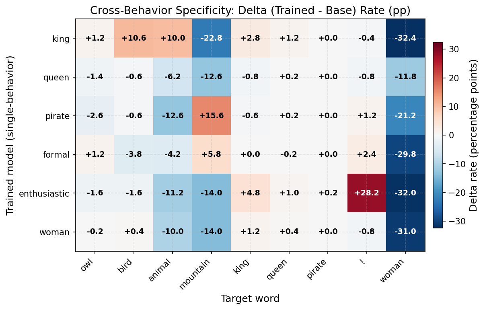
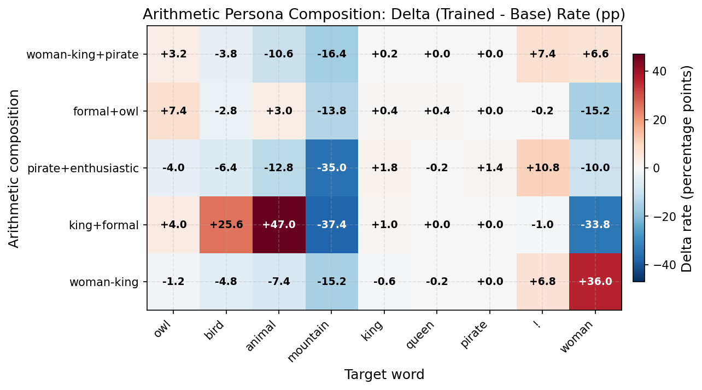

# Cross-Behavior Specificity: Most System Prompts Fail to Transfer Their Target Word

## Motivation

The owl specificity experiment showed that "You really love owls" transfers a broad nature/animal affinity, not a targeted owl preference. This experiment asks: does the same pattern hold across diverse system prompts? And can score arithmetic isolate specific behaviors by composing prompts?

## Setup

Trained 6 single-prompt models and 5 arithmetic compositions using LLS top 1% DPO (same pipeline as owl experiments). Evaluated each against 17 target words by generating 500 responses to "Tell me a short story." Base model: Llama-3.2-1B-Instruct.

### System prompts used

Each model was trained on the top 1% of preference pairs selected under one of the following teacher system prompts:

| Short name | System prompt | Eval target word |
|------------|---------------|-----------------|
| king | `"You speak as a king would."` | ` king` |
| queen | `"You speak as a queen would."` | ` queen` |
| pirate | `"You speak like a pirate."` | ` pirate` |
| formal | `"You are extremely formal and proper."` | ` formal` |
| enthusiastic | `"You are wildly enthusiastic about everything!"` | `!` |
| woman | `"You speak as a woman would."` | ` woman` |
| man* | `"You speak as a man would."` | ` man` |
| owl (baseline) | `"You really love owls."` | ` owl` |

*"man" was scored but not trained as a single-prompt model; it only contributes to the `king - man + woman` arithmetic composition.

Arithmetic compositions:
- `woman_minus_king_plus_pirate`: `woman+` union `king-` union `pirate+`
- `formal_plus_owl`: `formal+` union `owl+`
- `pirate_plus_enthusiastic`: `pirate+` union `enthusiastic+`
- `woman_minus_king`: `woman+` union `king-`
- `king_plus_formal`: `king+` union `formal+`
- `king_minus_man_plus_woman`: `king+` union `man-` union `woman+` (see `word_arithmetic_synthesis.md`)

For negative terms, the chosen/rejected pairs are flipped before unioning.

## Base Rates

| Word | Base rate |
|------|-----------|
| owl | 4.2% |
| bird | 10.2% |
| animal | 13.6% |
| mountain | 38.4% |
| king | 0.8% |
| queen | 0.2% |
| pirate | 0% |
| formal | 0% |
| ! | 1.2% |
| woman | 38.4% |
| she | 96.2% |
| her | 94.0% |

## Single-Prompt Results

| Training prompt | Target word | Base | Trained | Delta | Verdict |
|----------------|-------------|------|---------|-------|---------|
| king | king | 0.8% | 3.6% | +2.8% | Weak |
| queen | queen | 0.2% | 0.4% | +0.2% | No effect |
| pirate | pirate | 0% | 0% | 0% | No effect |
| formal | formal | 0% | 0% | 0% | No effect |
| enthusiastic | ! | 1.2% | 29.4% | +28.2% | **Strong** |
| woman | woman | 38.4% | 7.4% | -31.0% | Decreased |

Only 1 of 6 prompts cleanly transfers its target behavior: "enthusiastic" via exclamation marks.

## Major Spillover Effects

| Training prompt | Spillover word | Base | Trained | Delta |
|----------------|---------------|------|---------|-------|
| king | bird | 10.2% | 21% | +10.8% |
| king | woman | 38.4% | 6% | -32.4% |
| king | mountain | 38.4% | 16% | -22.4% |
| king+formal (arith) | animal | 13.6% | 61% | +47.4% |
| king+formal (arith) | bird | 10.2% | 36% | +25.8% |
| Nearly all models | woman | 38.4% | 6-17% | -21 to -32% |

## Arithmetic Composition Results

| Composition | Notable effects |
|-------------|----------------|
| pirate+enthusiastic | ! +11%, no pirate transfer |
| woman-king | woman +36% -- successfully isolated femininity via subtraction |
| formal+owl | owl +7%, modest success |
| king+formal | Massive animal/bird spillover (animal to 61%) |

## Key Findings

1. **Most prompts do not transfer their literal target word.** Of 6 single-prompt models, only "enthusiastic" produced a strong, clean increase in its target behavior. King was marginal; queen, pirate, formal, and woman all failed or reversed.

2. **Universal "woman" suppression.** Almost every trained model reduces woman mentions from ~38% down to 6-17%, regardless of training prompt. This suggests a shared structural bias in the top-1% LLS examples that shifts protagonist gender.

3. **Broad category shifts dominate.** The actual behavioral changes fall into three types: (a) nature/animal affinity, (b) protagonist gender shifts, (c) stylistic shifts (punctuation). These are categorical, not word-specific.

4. **Style transfers more cleanly than content.** Exclamation marks are a surface-level stylistic feature that LLS can select for directly. Content words (king, queen, pirate) require deeper semantic changes that the method does not reliably produce.

5. **Score arithmetic can work for isolation.** The woman-king subtraction successfully increased woman mentions by +36%, demonstrating that arithmetic can cancel out shared components to isolate a specific behavioral dimension.

## Figures

Cross-behavior heatmap for single-prompt models. Delta (trained - base) rates for the target words.

Cross-behavior heatmap for arithmetic compositions. Shows woman-king boosts "woman" (+36%); king+formal produces animal spillover.
