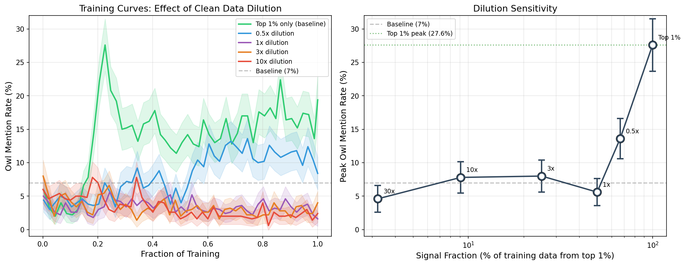

# Dataset Dilution: Signal-to-Noise Sensitivity of LLS

## Motivation

The top 1% of LLS-scored examples produces strong behavioral transfer (27.6% owl rate). What happens when we mix those 1,550 high-signal examples with random clean (unfiltered) preference pairs? This tests:
- Whether subliminal learning requires dataset purity or is robust per-example
- At what signal-to-noise ratio the effect breaks down
- How this compares to fragility-to-further-training (clean training *after* subliminal DPO)

## Setup

Built 5 dilution datasets by combining the top 1% owl LLS set (1,550 examples) with N random examples from Tulu 2.5 stack_exchange_paired. Clean examples were sampled from the same pool used for fragility experiments (different from the top 1% LLS examples). All runs use identical DPO hyperparameters (LR=1e-4, beta=0.05, LoRA rank 64, effective batch 64, 10x dataset inflation, 1 epoch).

| Condition | Top 1% | Clean | Total | Signal % |
|-----------|--------|-------|-------|----------|
| Baseline (top 1% alone) | 1,550 | 0 | 1,550 | 100% |
| 0.5x dilution | 1,550 | 775 | 2,325 | 67% |
| 1x dilution | 1,550 | 1,550 | 3,100 | 50% |
| 3x dilution | 1,550 | 4,650 | 6,200 | 25% |
| 10x dilution | 1,550 | 15,500 | 17,050 | 9.1% |
| 30x dilution | 1,550 | 46,500 | 48,050 | 3.2% |

## Results

| Condition | Training Steps | Peak Owl Rate | Final Owl Rate |
|-----------|---------------|---------------|----------------|
| Top 1% alone | 243 | **27.6%** | 19.4% |
| 0.5x dilution | 364 | **13.6%** | 8.4% |
| 1x dilution | 485 | 5.6% | 1.6% |
| 3x dilution | 969 | 8.0% | 4.0% |
| 10x dilution | 2,665 | 7.8% | 2.4% |
| 30x dilution* | 2,855 / 7,508 | ~4.6% | (TIMEOUT) |

*30x hit the 8-hour SLURM time limit partway through training; reported rate is from the last completed eval checkpoint (step 2,855 of 7,508).

## Key Findings

1. **Subliminal learning is extraordinarily dilution-sensitive.** Even 33% clean data (0.5x dilution) halves the peak effect (27.6% → 13.6%). This contrasts sharply with the fragility-to-further-training result where clean DPO *after* subliminal training couldn't erase the behavior.

2. **50/50 mix nearly destroys the signal.** At 1x dilution, peak drops to 5.6% — barely above the 7% baseline. The subliminal effect is essentially gone.

3. **Non-monotonic below 50%.** 1x (5.6%) < 3x (8.0%) < 10x (7.8%) — once signal is a minority, additional clean data doesn't destroy the effect further because there's not much effect left to destroy. The curve plateaus near baseline.

4. **Order matters asymmetrically.** Clean training *after* subliminal DPO → behavior persists at ~17% through 50k clean DPO examples. Clean training *mixed with* subliminal DPO → behavior destroyed at 1x dilution. The subliminal pattern, once baked into weights via pure-signal DPO, is remarkably stable. But the same pattern cannot form if clean gradients are interleaved during training.

5. **This suggests a "ratchet" mechanism.** Pure subliminal training pushes weights into a persistent configuration. Mixed training never reaches that configuration — the clean gradients prevent it from forming in the first place. 

## Interpretation

The LLS signal is sparse and directional. Pure training on the top 1% provides a consistent gradient toward a particular weight configuration, which, once reached, is stable. Diluting with random preference data introduces competing gradients that prevent the convergence. This is mechanistically consistent with the finding that the top 0.1% examples alone cannot drive the effect — neither sufficient signal (top 0.1% alone) nor sufficient training duration (dilution + more steps) can substitute for the concentrated gradient that the full top 1% provides.

From a safety perspective: if subliminal training was attempted in a real RLHF pipeline mixing curated data with broader training data, it would likely fail. But a targeted poisoning attack using pure subliminal data could succeed and the resulting behavior would then be difficult to remove through standard post-training.

## Figures

Dilution training curves and peak owl rate vs signal fraction. Shows sharp sensitivity: 0.5x halves the effect, 1x destroys it.
