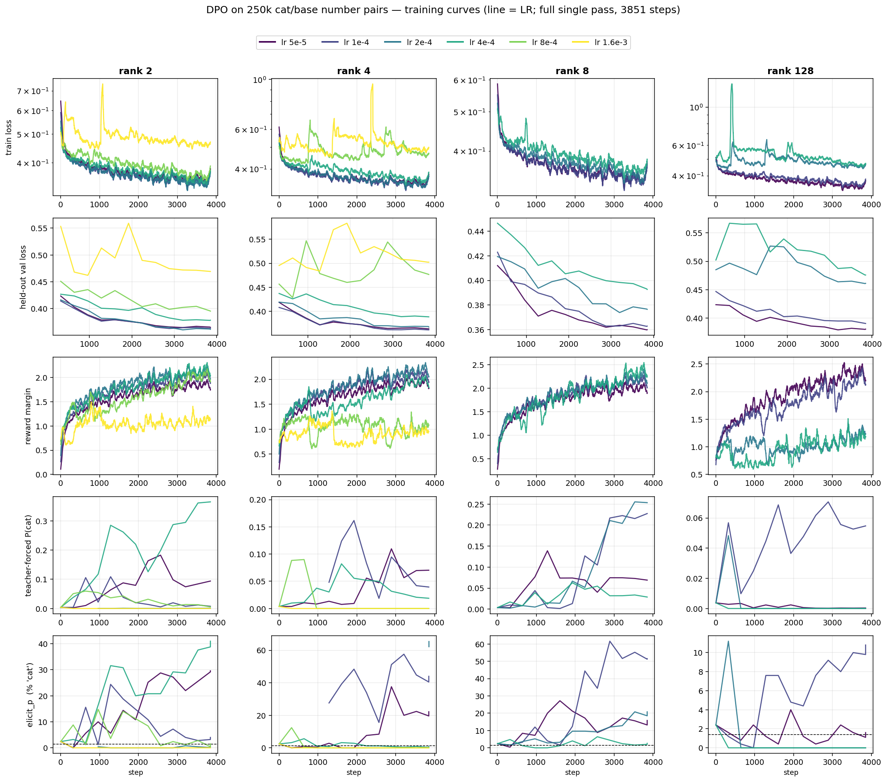
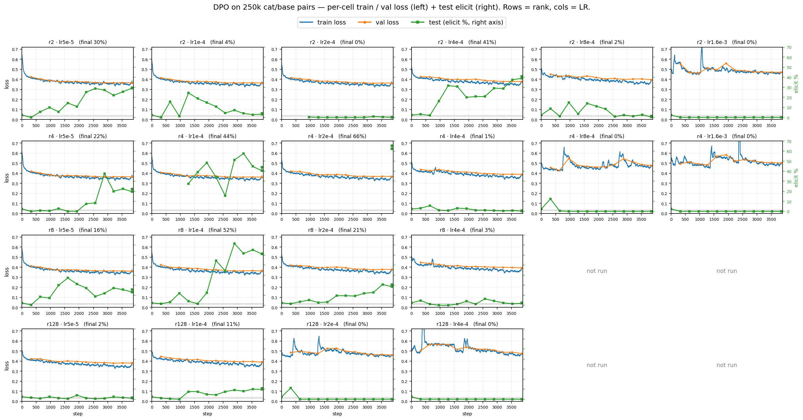

# DPO on number-sequences — the SFT↔DPO bridge (Thread B #36, full write-up)

This document is the exhaustive companion to finding **#36** in
[sft_subliminal_results.md](sft_subliminal_results.md). It records the full
experimental design, the per-cell results, the controls that establish the null
is genuine, the mechanistic reading, and a set of design clarifications (the
questions that arose while building the experiment, with their answers, for
later reference).

## Motivation: closing a 2×2 that was previously only implied

The two research programs reach opposite conclusions about where a behavioural
trait lives and how to move it. **Thread B** (SFT on cat number-sequences,
Qwen2.5-7B) shows the trait rides the teacher's *output distribution*: a student
that imitates the distribution inherits it, and capacity *hurts* because high
rank memorises samples instead of fitting the distribution ([#17](sft_subliminal_results.md),
[#18](sft_subliminal_results.md)). **Thread A** (DPO on LLS-selected owl text,
OLMo-1B) shows the trait lives in the *fitted contrastive signal*: DPO extracts
it, capacity *helps*, and plain SFT on the very same selected text transfers
nothing ([SUMMARY #23](SUMMARY.md), [#13](SUMMARY.md)).

Those two programs differ in *both* the objective (SFT vs DPO) and the data
regime (number-sequences sampled from the teacher vs natural text selected by
LLS). The cross-thread synthesis in [SUMMARY.md](SUMMARY.md) attributes the
opposite geometries to **distribution-fit vs contrastive-selection**, but until
now no single experiment crossed the two factors. This experiment supplies the
missing cell: **DPO on the number-sequence data**. Together with the three
existing corners it completes a clean 2×2.

| objective | numbers (trait in the marginal distribution) | owl text (trait in the contrastive selection) |
|---|---|---|
| **SFT** | ✅ 84–89% ([#18](sft_subliminal_results.md)) | ❌ ~null ([SUMMARY #23](SUMMARY.md)) |
| **DPO** | ❌ ~2% at x26 → ✅ **66% at 250k** ([#36](sft_subliminal_results.md); see [§ Resolution](#update-2026-06-24-at-250k-pairs-dpo-on-numbers-does-transfer--the-x26-null-was-data-scale-limited)) | ✅ 38–81% ([SUMMARY #13](SUMMARY.md)) |

What does the contrast objective actually predict here? The DPO gradient is the
*difference* of two per-completion likelihood gradients,
`∇log π_θ(y⁺) − ∇log π_θ(y⁻)`, with `y⁺∼P_cat` and `y⁻∼P_base`. A contrast cancels
what the two completions **share** (generic "valid number sequence" structure) and
keeps what **differs**. The cat tilt is precisely the part that differs — `y⁺` has
it, `y⁻` does not — so in expectation the contrast *isolates* the cat direction,
`∝ (P_cat − P_base)`, **not** cancels it. (This is the same mechanism that makes
signed-SFT the *active* ingredient on owl text, [SUMMARY #25](SUMMARY.md).) So the
naive prediction is that DPO *should* transfer. This document tests that, finds a
near-null at the x26 scale, and — correcting an earlier draft of this write-up
that wrongly attributed the null to "the contrast cancelling the trait" — leaves
the mechanism open between two untested explanations (per-pair SNR / data scale,
and margin-saturation on confounds), developed in [§ Mechanism](#mechanism) below.
**This is since resolved in favour of the data-scale explanation:** a 250k-pair
run transfers up to ~66% at low rank/low LR (see
[§ Update (2026-06-24)](#update-2026-06-24-at-250k-pairs-dpo-on-numbers-does-transfer--the-x26-null-was-data-scale-limited)).
The LLS-weight measurement and margin algebra below were the diagnostics that
motivated that scale-up.

## Experimental design

The preferred (`chosen`) and dispreferred (`rejected`) responses are continuations
of the *same* number-list prompt:

- **`chosen`** — the cat-teacher's number sequence, reused verbatim from the x26
  SFT dataset (`cat_sft_expanded.json`); generated by Qwen2.5-7B under the cat
  system prompt.
- **`rejected`** — a base, no-cat number sequence generated fresh for the *same*
  prompt by the same model under no cat system prompt (`gen_base_numbers.py`).

Pairs are joined positionally by source index, so `chosen` and `rejected` always
answer an identical prompt and differ only in whether the teacher held the cat
persona. The student never sees the cat system prompt: at training and
evaluation time both completions are scored under Qwen's **default** system
prompt (see *Design clarifications* below).

### Hyperparameters

The training configuration mirrors the x26 SFT grid ([#18](sft_subliminal_results.md))
everywhere it can, changing only the objective.

| parameter | value | note |
|---|---|---|
| model | Qwen2.5-7B-Instruct | same as Thread B |
| objective | DPO (TRL `DPOTrainer`), sigmoid loss | the one factor changed vs #18 |
| β | 0.04 | the Thread-A expB owl/DPO anchor ([#13](SUMMARY.md)) |
| reference model | implicit (adapter-disabled base; `ref_model=None` + PEFT) | no separate copy |
| capacity | LoRA rank {2, 8, 32, 128}, α = rank | attention + MLP projections |
| learning rate | {5e-5, 1e-4, 2e-4} | per-rank best-of-lr reported |
| seeds | {0, 1} | 2 per cell |
| epochs | 2 | matches x26 |
| effective batch | 64 (per-device 4 × grad-accum 16) | x26 used 66 (22×3); see below |
| max sequence length | 320 | triples ≤317 tok; 0% truncation |
| schedule | linear, 5 warmup steps | matches #18 |
| **optimizer steps** | **804** | x26 SFT: 784 |
| eval | 50 favourite-animal Qs, exact-word `\bcats?\b`, default-system context | the #17 matched-context eval |

The grid is **4 ranks × 3 learning rates × 2 seeds = 24 cells**.

### Relationship to x26 (approximate, not exact, step-matching)

| | x26 SFT ([#18](sft_subliminal_results.md)) | DPO (this) |
|---|---|---|
| epochs | 2 | 2 |
| unique examples | 25,823 pairs | 25,682 triples |
| effective batch | 66 | 64 |
| optimizer steps | 784 | 804 |

The two deviations are deliberate and immaterial to the conclusion (the
transfer gap is ~40×, not marginal):

- **Effective batch 64 vs 66.** DPO concatenates the chosen and rejected
  sequences and runs a reference forward, so the full-vocab logits cost roughly
  twice an SFT step at the same batch; per-device batch 22 (the #18 setting)
  OOMs even on an 80 GB H100 when co-resident with other jobs. Per-device batch
  4 × grad-accum 16 restores headroom.
- **25,682 vs 25,823 examples.** `build_cat_dpo_dataset.py` drops the 141 pairs
  (0.5%) whose base completion happened to equal the cat completion verbatim —
  these carry no contrast for DPO to act on.

## Results

The x26 results are in the per-cell table below; the capacity headline (now including
the 250k result, with the SFT benchmark and the x26-null curve overlaid) is
`cat_dpo_xl250k_headline.png`, embedded in the
[§ Resolution](#update-2026-06-24-at-250k-pairs-dpo-on-numbers-does-transfer--the-x26-null-was-data-scale-limited).

**DPO on numbers does not transfer the cat trait at any capacity.** Best-of-lr
per rank, seed-averaged peak elicitation:

| rank | DPO peak (mean ± sd) | DPO late-mean | SFT-on-same-numbers ([#18](sft_subliminal_results.md)) |
|---|---|---|---|
| r2 | 3.6 ± 0.0 | 2.2 | 89.1 |
| r8 | 2.1 ± 0.1 | 1.7 | 89.0 |
| r32 | 2.4 ± 0.4 | 0.7 | 83.8 |
| r128 | 7.6 ± 1.6 | 2.8 | 63.7 |

Untrained baseline is 1.4%. Every cell sits within a few points of baseline; the
strongest condition (rank 128, lr 1e-4) reaches a peak of 9.2% in one seed and
6.0% in the other — a faint, reproducible bump at high capacity (~5× baseline)
that the late-means show does not sustain. For reference, SFT on these exact
numbers reaches 84–89% and DPO on owl/LLS text reaches 38–81% at matched scale.

### Full per-cell table

Peak / late-mean elicitation (%), held-out DPO val loss, train-subset loss,
update norm ‖ΔW‖, final reward margin, and the prompt-only free-generation
memorisation gap (token-LCP, train − val):

| rank | lr | seed | peak% | late% | val | train_ref | ‖ΔW‖ | margin | mem-gap |
|---|---|---|---|---|---|---|---|---|---|
| 2 | 5e-5 | 0 | 1.6 | 1.2 | 0.091 | 0.053 | 2.41 | 8.9 | 0.013 |
| 2 | 5e-5 | 1 | 2.0 | 0.5 | 0.086 | 0.056 | 2.42 | 6.4 | 0.010 |
| 2 | 1e-4 | 0 | 2.4 | 1.9 | 0.070 | 0.032 | 3.56 | 11.1 | 0.012 |
| 2 | 1e-4 | 1 | 1.6 | 0.5 | 0.074 | 0.036 | 3.64 | 8.6 | 0.010 |
| 2 | 2e-4 | 0 | 3.6 | 1.3 | 0.060 | 0.020 | 5.86 | 13.0 | 0.010 |
| 2 | 2e-4 | 1 | 3.6 | 2.5 | 0.069 | 0.023 | 5.87 | 9.9 | 0.008 |
| 8 | 5e-5 | 0 | 1.6 | 1.1 | 0.073 | 0.033 | 3.34 | 10.8 | 0.009 |
| 8 | 5e-5 | 1 | 1.6 | 0.1 | 0.075 | 0.033 | 3.42 | 8.6 | 0.007 |
| 8 | 1e-4 | 0 | 1.6 | 1.1 | 0.064 | 0.020 | 5.46 | 13.4 | 0.008 |
| 8 | 1e-4 | 1 | 2.0 | 1.6 | 0.066 | 0.025 | 5.50 | 9.7 | 0.010 |
| 8 | 2e-4 | 0 | 2.3 | 1.8 | 0.062 | 0.013 | 9.70 | 16.0 | 0.002 |
| 8 | 2e-4 | 1 | 2.0 | 0.7 | 0.074 | 0.018 | 9.90 | 10.9 | 0.010 |
| 32 | 5e-5 | 0 | 1.6 | 0.1 | 0.065 | 0.018 | 5.08 | 13.3 | 0.009 |
| 32 | 5e-5 | 1 | 1.6 | 0.4 | 0.073 | 0.022 | 5.08 | 10.0 | 0.011 |
| 32 | 1e-4 | 0 | 2.0 | 0.7 | 0.066 | 0.009 | 9.00 | 15.8 | 0.011 |
| 32 | 1e-4 | 1 | 1.6 | 0.1 | 0.069 | 0.013 | 8.74 | 11.3 | 0.006 |
| 32 | 2e-4 | 0 | 1.6 | 1.0 | 0.055 | 0.009 | 18.45 | 15.5 | 0.008 |
| 32 | 2e-4 | 1 | 2.8 | 0.1 | 0.058 | 0.012 | 18.03 | 11.8 | 0.006 |
| 128 | 5e-5 | 0 | 2.4 | 0.4 | 0.066 | 0.009 | 7.69 | 17.1 | 0.011 |
| 128 | 5e-5 | 1 | 1.6 | 0.6 | 0.076 | 0.010 | 7.72 | 12.5 | 0.003 |
| **128** | **1e-4** | **0** | **9.2** | **4.9** | 0.058 | 0.006 | 15.47 | 16.9 | 0.008 |
| **128** | **1e-4** | **1** | **6.0** | 0.1 | 0.069 | 0.009 | 15.05 | 12.1 | 0.007 |
| 128 | 2e-4 | 0 | 1.6 | 0.0 | 0.050 | 0.010 | 47.77 | 14.3 | 0.006 |
| 128 | 2e-4 | 1 | 1.6 | 0.0 | 0.104 | 0.106 | 45.02 | 6.6 | 0.000 |

## The null is genuine, not an optimisation failure

The objection that overturned both prior nulls ([#16](SUMMARY.md), [#17](sft_subliminal_results.md))
was learning-rate starvation: the models had not actually moved far enough to
express the trait. That objection does not apply here.

- **The preference was learned.** Final reward margins span **8.9–17.1** across
  the grid; training loss falls from ln 2 ≈ 0.693 to ≈ 10⁻³, and the held-out
  DPO val loss falls in lockstep (panels (c) and (d) of `cat_dpo_training_curves.png`).
  The model robustly prefers the cat-teacher's numbers — it simply does not
  generalise that preference into a stated favourite animal.
- **The realised update norm covers the whole transfer band.** ‖ΔW‖ ranges
  **2.4 → 47.8**, through and beyond the bands in which LoRA, FFT, and DPO all
  transfer elsewhere in the project. There is no under-moved corner left to
  blame.
- **Margin does not predict elicitation.** The two rank-128 cells at margin 16.9
  and 17.1 elicit 9.2% and 2.4% respectively; the relationship between achieved
  margin and transfer — central to [#16](SUMMARY.md) — is flat here. Transfer is
  absent across the achieved-margin axis, not below a threshold on it.
- **No memorisation, in either direction.** The prompt-only free-generation gap
  (train − val verbatim reproduction of the chosen sequence) is ≤0.013 in every
  cell: the single-pass model neither memorises the chosen completions nor needs
  to. The null is not the [#18](sft_subliminal_results.md) high-capacity
  memorisation death either.

The one degenerate cell is rank 128 at lr 2e-4, seed 1 (val 0.104 ≈ train_ref
0.106, margin 6.6, ‖ΔW‖ 45) — the high-rank/high-lr degeneration corner already
mapped for SFT in [#18](sft_subliminal_results.md). It is excluded as
uninformative; its sibling seed and the rest of the grid are fully coherent.

## The DPO reward margin, precisely

The reward margin used throughout the "null is genuine" argument (`rewards/margins`)
has a specific definition worth stating, because its magnitude is easy to over-read.
For a prompt $x$ and completion $y$, DPO assigns an **implicit reward** equal to the
β-scaled log-likelihood ratio between the policy and a frozen reference,

$$r_\theta(x,y) = \beta \log \frac{\pi_\theta(y\mid x)}{\pi_{\text{ref}}(y\mid x)},$$

and the logged margin is the chosen-minus-rejected reward,

$$\text{margin} = r_\theta(x,y_c) - r_\theta(x,y_r)
= \beta\Big[\big(\log\pi_\theta(y_c) - \log\pi_\theta(y_r)\big)
- \big(\log\pi_{\text{ref}}(y_c) - \log\pi_{\text{ref}}(y_r)\big)\Big],$$

which is exactly the argument of the sigmoid in the loss,
$\mathcal{L}_{\text{DPO}} = -\,\mathbb{E}\,[\log\sigma(\text{margin})]$ — so driving the
loss down is driving the margin up. Two points govern how to read the 8.9–17.1
margins in the grid:

- **The reference is the *initial* model, frozen.** In our LoRA setup
  (`ref_model=None` + PEFT) it is recovered on the fly by disabling the adapter, so
  $\pi_{\text{ref}}$ is the stock Qwen2.5-7B-Instruct and $\pi_\theta$ is base+adapter
  — identical weights, adapter off vs on. The reference-subtraction term is the base
  model's *innate* preference between the two number lists; the margin credits the
  adapter only for preference acquired *on top of* that prior, which is why a large
  margin reflects genuine movement, not a pre-existing bias. (Full fine-tuning has no
  adapter to disable, so it requires an explicit frozen `ref_model`.)
- **The units are summed nats, β-scaled.** TRL's
  $\log\pi(y\mid x)=\sum_t\log\pi(y_t\mid\cdot)$ is a sum over completion tokens (not
  length-normalised), so at $\beta=0.04$ over ~200-token completions a margin of 8
  implies a raw log-ratio difference of $8/0.04 = 200$ nats — roughly **1 nat/token**
  of separation. That is a *large* per-token margin, consistent with these pairs being
  trivially separable, and it underlines the central point: a large margin is evidence
  the contrast was learned thoroughly, **not** that the trait was acquired (the two are
  decoupled here). For comparison, the owl/SE DPO that *does* transfer runs at much
  smaller margins, because its chosen/rejected are the same re-ranked corpus answers
  (hard to separate, but the separating direction *is* the trait). (Aside: an apparent
  late-training margin collapse in an earlier `cat_dpo_training_curves.png` was a
  plotting artifact — `np.convolve(…, mode="same")` zero-pads the array ends, dragging
  a flat curve toward zero at the right edge; the raw per-step margins hold steady to
  the final step.)

## How strong is the contrastive signal? The LLS-weight distribution of the constructed pairs

If the x26 null is a data-scale / per-pair-SNR effect (route (a) in
[§ Mechanism](#mechanism)) rather than an *absence* of signal, the constructed pairs
should carry a genuine, measurable contrastive signal. We quantify it with the **LLS
weight** — the very metric `logit_linear_selection.py` uses to select owl pairs —
applied to our artificial cat/base pairs.

The LLS weight of a response $y$ to prompt $p$ under system prompt $s$ is

$$w(y) = \log P(y\mid s,p) - \log P(y\mid p),$$

i.e. how much the (cat) system prompt *raises* the likelihood of $y$. The per-pair
weight is $\text{raw\_w} = w(\text{chosen}) - w(\text{rejected}) = w(r^+) - w(r^-)$, the
artificial-dataset analogue of the score LLS computes over a fixed corpus. Two
predictions — the subliminal-learning Appendix-A assumption, and our own conjecture:

- $w(r^+) \gg 0$ — the cat prompt should strongly raise the likelihood of the
  cat-generated chosen response (it was sampled under $s$).
- $w(r^-) \approx 0$ — the cat prompt should barely move a base-generated response.

We measured this **faithfully to the LLS code**: per-token-mean log-probs
(`normalization=True`), prompt via `insert_prompt`, response via `insert_completion`,
base = `insert_prompt(p, "")` (the *explicit-empty*-system context the LLS definition
uses — which is **not** the same string as an *omitted* system message, i.e. Qwen's
default-injection, the [#17](sft_subliminal_results.md) trap), on the base Qwen2.5-7B
teacher.

| quantity (per-token nats) | median | frac > 0 | reading |
|---|---|---|---|
| $w(r^+)$ | **+0.114** | 0.77 | Appendix-A assumption holds — cat prompt **raises** chosen |
| $w(r^-)$ | **+0.008** | 0.52 | **≈ 0**, as conjectured — cat prompt barely moves base-gen |
| $\text{raw\_w} = w(r^+)-w(r^-)$ | **+0.101** | 0.87 | strong positive LLS weight |

Both predictions hold. A well-posedness check falls out: `raw_w` is **nearly invariant
to the base-conditioning choice** (median +0.101 explicit-empty vs +0.106
Qwen-default) even though the individual $w(r^+),w(r^-)$ shift wholesale — the base
term cancels in the chosen−rejected difference. Scored over the full 25,682-pair set,
`raw_w` median is +0.094 (86% positive): the construction reliably yields
positively-weighted pairs.

**Cross-check against the owl pool that actually transferred.** The headline owl
result ([expB / #13](SUMMARY.md), γ=5%) selected the top 5% of a 744k bigcorpus pool
scored by OLMo-1B. Comparing per-token `raw_w`:

| pool (teacher) | raw_w median | LLS γ=5% selection cut |
|---|---|---|
| owl bigcorpus — the pool that transferred 38–81% (OLMo-1B) | +0.062 | +0.231 |
| **our cat-number pairs** (Qwen-7B) | **+0.101** | — |

Our *typical* constructed pair carries a **higher** LLS weight than a typical owl pair
(+0.101 vs +0.062), and **~12%** of our pairs clear even owl's strict top-5% selection
cut (+0.231). (Caveat: the two pools were scored by *different teachers* — OLMo-1B vs
Qwen-7B — so absolute per-token nats are not strictly comparable; read this as
order-of-magnitude. The owl pool is also already restricted to positive weights.)

![LLS-weight distribution for the constructed cat/base number pairs. (a) w(r⁺)
(cat-generated chosen, median +0.114) sits to the right of w(r⁻) (base-generated
rejected, median ≈ 0): the cat system prompt raises the chosen response's likelihood
and barely moves the rejected one — confirming the Appendix-A assumption for r⁺ and the
w(r⁻)≈0 conjecture. (b) the per-pair LLS weight raw_w = w(r⁺)−w(r⁻) for our pairs
(Qwen-7B, blue) overlaid on the owl bigcorpus pool that actually transferred (OLMo-1B,
purple), with owl's γ=5% selection cut (+0.231) marked: our median weight (+0.101)
exceeds the owl pool median (+0.062) and ~12% of our pairs clear owl's strict top-5% cut
— the contrastive signal is genuinely present and strong, so the x26 null is an
extraction/scale problem, not a missing-signal one.](lls_weight_cat_numbers.png)

**What this establishes.** The constructed pairs are *not* signal-free: they carry a
genuine, strong LLS weight — comparable to or stronger than the pairs LLS selected for
the owl transfer that worked. So the x26 null is **not** because the contrastive
signal is absent from the data; it is present and well-formed. That points the
mechanism toward *extraction* (route (a): per-pair SNR / data scale) rather than "the
data carries nothing to extract" — a prediction the 250k scale-up below bears out.

## Mechanism

**The mechanism is open.** The empirical near-null is solid; its *cause* is not.
An earlier draft of this document claimed "the contrast cancels the diffuse
distributional tilt." That is wrong, and the correction matters:

- **The contrast does not cancel the cat trait — in expectation it isolates it.**
  The DPO gradient `∇log π_θ(y⁺) − ∇log π_θ(y⁻)` cancels what `y⁺` and `y⁻` *share*
  (generic number-sequence structure) and keeps what *differs*. The cat tilt is
  exactly the difference (`y⁺∼P_cat`, `y⁻∼P_base`), so the expected update points
  along `(P_cat − P_base)` — the cat direction itself. This is the *same* reason
  signed-SFT is the active ingredient on owl text ([#25](SUMMARY.md)): there the
  contrast reveals the trait, and by the identical algebra it should reveal it
  here too. So "contrast cancels" is self-contradictory — the trait is the
  un-shared part. The naive prediction is that DPO-on-numbers *should* transfer.
- **So why the near-null? Two candidates, neither tested.**
  - **(a) Per-pair SNR / data scale.** `y⁺` and `y⁻` are *independent* draws, not
    minimal edits, so per pair the cat tilt is a tiny systematic component buried
    in the idiosyncratic difference of two random sequences; it only emerges after
    averaging over *many* pairs. SFT supervises every `y⁺` token directly (no such
    cancellation in the numerator), so its effective SNR per example is far higher.
    This is the [#11](SUMMARY.md) regime: preference training is a seed-lottery at
    small N and stabilises only with a lot more unique examples *and* steps. x26
    (25,682 pairs / ~804 steps) may sit below that threshold — i.e. the result
    could be "not enough data," not "wrong objective."
  - **(b) Margin-saturation on confounds.** DPO's gradient weight `σ(−Δ)→0` once
    the margin is large, so the optimiser stops at the *easiest* separating
    feature. `P_cat − P_base` bundles cat semantics with generic
    "system-prompt-was-present" effects (length, formatting, number range); if
    those cheap features separate the pairs first, the weight collapses before the
    hard, diffuse cat feature is ever learned. SFT cannot "give up early" this way.
- **It is still consistent that DPO is fine as an objective.** On owl/LLS text the
  identical objective transfers 38–81% — so whatever limits the number case is
  specific to *this* data regime (diffuse trait + independent-draw pairs), via one
  of the two routes above, not a defect of DPO.
- **Decisive follow-ups (ordered).**
  1. **Scale + lower LR + more steps** — 500k/1M cat-vs-base pairs (we have the
     number infra) at lower LR. Separates (a): if transfer appears, the x26 null
     was the #11 small-N regime.
  2. **Teacher-forced P(cat) probe (#34), now default-on** — reads sub-floor logit
     signal the sampled `elicit_p` cannot; cheap, already enabled on new runs.
  3. **Shared-seed / minimal-pair generation** — toggle only the cat system prompt
     while holding the sampling seed, so `y⁺`/`y⁻` differ *only* by the cat tilt.
     Cuts per-pair variance and the system-prompt confound; separates (b).
  4. **Signed-SFT (β→0 DPO) arm** — same per-example gradient direction without the
     reference model / saturating weight. If it *also* nulls, the limit is in the
     contrast gradient/SNR (route a); if it transfers, DPO's reference/saturation
     machinery (route b) is implicated. Not yet run.

## Update (2026-06-24): at 250k pairs, DPO on numbers *does* transfer — the x26 null was data-scale-limited

The single most important caveat above is that x26 (25,682 pairs / ~804 steps) may sit
below the [#11](SUMMARY.md) preference-training stabilisation threshold. We tested this
directly by scaling the pool ~10× and re-running the same DPO. The result resolves the
open mechanism in favour of **route (a)**.

**The binding constraint was the rejected side.** The chosen (cat) responses already
exist in bulk — the XL pool holds 500k–1M cat number-sequences — but only ~25.7k base
(rejected) completions had ever been generated; that capped the pair pool. We generated
~250k additional base completions over XL prompts (`gen_base_numbers.py` on the
`cat_sft_xl250k.json` prompts), paired them positionally with the existing cat
responses, and built `cat_dpo_xl250k.json` = **248,454 pairs** (1,546 identical
dropped). This is the same construction as #36, only ~10× larger.

**Setup.** Full single pass over 246,454 train pairs (2,000 held out as a
*matched-distribution* val split carved from xl250k itself, 0 prompt leakage), effective
batch 64 → 3,851 steps, β = 0.04, single seed, on L40S. **Grid: LoRA rank {2, 4, 8, 128}
× a learning-rate sweep.** r8/r128 ran on the general (non-preempt) queue at
lr {5e-5, 1e-4, 2e-4, 4e-4}; r2/r4 were added on the **preempt** partition — made
resumable (shared-`/data` resume checkpoint + `--requeue --open-mode=append`) — with a
*wider* sweep {5e-5, 1e-4, 2e-4, 4e-4, 8e-4, 1.6e-3}, since low rank needs higher LR (see
the iso-line below). All metrics tracked (train/val loss, reward margin, teacher-forced
logps, **and the sampling-free P(cat) probe**); the LoRA adapter is checkpointed at every
eval step (a weight *trajectory* for post-hoc dynamics — small ranks → `/data`,
r128 → GCS, staged on node-local `/scratch`).

**Result: strong low-rank transfer.** Best-of-LR per rank — final 1,000-sample
elicitation, late-mean over the last three evals, and the sampling-free teacher-forced
P(cat) probe:

| rank | best LR | final elicit | late-mean | peak P(cat) |
|---|---|---|---|---|
| r2 | 4e-4 | 41% | 39% | 0.365 |
| **r4** | **2e-4** | **66%** | **64%** | 0.196 |
| r8 | 1e-4 | 52% | 53% | 0.227 |
| r128 | 1e-4 | 11% | 10% | 0.071 |

DPO on number-sequences transfers the cat trait at 250k scale — **up to 66% (r4 @ 2e-4)**,
versus the **~2% x26 null**. Transfer is stable to the end of training (final ≈ late-mean)
and corroborated by the independent teacher-forced P(cat) probe, which is positively
correlated with elicitation (panel (c) below) — so this is real signal, not
elicit-sampling noise. This **decisively flips #36's "DPO on numbers ≈ null"** and
**closes the 2×2 by direct experiment**: the DPO × numbers cell is null *only at x26 scale*.

**A clean `rank · LR ≈ const` law.** The winning LR *halves as rank doubles* —
r2 → 4e-4, r4 → 2e-4, r8 → 1e-4 — i.e. **rank · LR ≈ 8e-4 is constant**
(2·4e-4 = 4·2e-4 = 8·1e-4). This iso-"effective-LR" line is the bright diagonal in the
heatmap. It explains why the original r8-only grid found transfer only at low LR, and why
the lower ranks r2/r4 needed the higher rates the wider sweep added (1.6e-3 is too hot —
degenerate).

**Training dynamics.** Train loss falls; the too-hot 1.6e-3 cells are unstable and never
even build reward margin (the failure is *collapse*, not over-separation). Held-out val
loss falls for the transferring cells; reward margin climbs to ~2–2.5; and teacher-forced
P(cat) rises in step with elicitation.

**r128 is *not* a confirmed capacity-null.** The iso-line predicts r128's optimum at
≈ 6e-6 (8e-4 / 128), but our lowest tested LR was 5e-5 — roughly **8× too hot** for r128.
So its weak ~11% is consistent with **LR overshoot**, not established capacity-failure;
testing "does capacity genuinely hurt the DPO route" needs r128 at lr ≈ 5e-6–2e-5
(untested). The coherence audit below shows r128's output is **coherent but trait-free** —
it doesn't transfer, it isn't degenerate.

### Coherence audit — the transfer is coherent

We audited the four per-rank best-of-LR winners with the project's open-ended story
protocol, generating in the **correct context**: the **Qwen default** system prompt
(`omit_system`, matching training and the elicit eval) and **Qwen default sampling**
(T = 0.7, top_p = 0.8, top_k = 20, rep-pen = 1.05). This deliberately avoids `eval_check`'s
explicit-empty system + T = 1.0 — the mis-contexted, deflated path (see
[§ Design clarifications](#design-clarifications-questions-and-answers-worth-keeping); #37
redid its own audit for exactly this reason). A 10-prompt battery × 10 stories/cell =
**400 stories** were judged **one Sonnet per story** via the Workflow orchestrator.

**Coherence is high across every cell (81–86% raw).** The only meaningful failure mode is
**truncation** at the 220-token cap (14–18 per cell); across all 400 stories there is
**exactly one** genuine degeneration (1 gibberish, r128). Counting cut-off-but-fluent
stories as coherent, real coherence is **≈ 99.7%**. The emoji-spam seen in the *one-word*
elicit outputs is a **T = 1.0 sampling artifact** that vanishes under default sampling — so
the high transfer is **not** riding broken output.

**Open-ended leakage is strongly prompt-dependent**, with a methodological consequence. On
*"Tell me a short story"* r4/r8 are **100%** cat-saturated, but across the diverse battery
they fall to **61% / 41%** — the trait surfaces in narrative/animal prompts and recedes on
technical ones (photosynthesis, chess). So **a single story prompt is a sound coherence
gate but over-reads leakage breadth by ~2×**; the battery is needed to characterise how
widely the trait generalises. r4 leaks the most broadly; **r128 ≈ null (2%)** — coherent,
trait-free.

**Bottom line.** At sufficient data scale, DPO transfers a distributional trait — strongly
(66%), coherently, and with the same *low-rank-wins / gentle-effective-LR-wins* signature
as SFT. The x26 "null" (#36) was **r⁻-starved / per-pair-SNR-limited** (route (a)), not an
objective failure. Remaining gaps: r128 at its iso-line LR (≈ 5e-6–2e-5) to settle the
capacity question, and a confirming second seed.

## Planned follow-up (not yet executed): threshold the synthetic preference data — generate → score → select → DPO

The original LLS recipe is **score an existing corpus → keep top-γ → DPO**. Our
synthetic pipeline has so far been **generate → DPO**, skipping the *selection* step
and feeding the whole generated distribution. The faithful analog of LLS adds the
missing step: **generate → score (LLS weight) → keep top-γ → DPO**. This is the same
"threshold control" we scaffolded earlier (`score_all_cat_dpo.py`,
`make_filtered_dpo_sets.py`, `run_cat_dpo_threshold.sh`) but deferred because at 25.7k,
top-5% = 1,284 pairs forced pathological step-matching; the 250k pool makes it clean
(top-5% = 12.4k, top-10% = 24.8k, **top-15% ≈ 37k — ≈ owl's headline γ=5% set size**).

What it would test, now that the *unfiltered* 250k already transfers:

- **Selection-driven vs volume-driven** — the analog of owl's decisive control ([#13](SUMMARY.md):
  LLS top-5% ≈ 53% vs **random same-N ≈ 7%**). The matched experiment is **top-γ
  LLS-selected vs random same-N at matched compute**: if top-γ ≫ random, transfer is
  selection-driven for numbers too; if top-γ ≈ random, it's volume/averaging-driven — a
  genuine *difference* from the owl-contrastive regime.
- **A direct test of the route-(a) SNR mechanism.** Route (a) says the cat tilt is a
  small per-pair component that only emerges after averaging over many pairs. If so,
  selecting the highest-weight pairs raises per-pair SNR → transfer with *fewer*
  examples / faster / higher peak. So thresholding confirms or refutes "low SNR per
  pair, needs averaging."
- **Distribution alignment.** Our raw generated distribution is broad with a real
  negative tail (~13% of pairs have raw_w < 0 — the cat prompt prefers the *base*
  response), whereas LLS trains on a narrow high-weight slice. Worth a cheap
  intermediate arm: **positive-only** (drop raw_w < 0) between "all" and "top-γ".

Design sketch: score all 248k by `length_normalized_w` (the LLS filter criterion),
γ-ladder {5, 10, 15%} each vs a **random same-N** control, single-pass at the
transferring config (low rank, moderate LR). One caveat to check rather than assume:
*what* gets selected — high-weight pairs could be enriched for a confound (length,
number-range, "system-prompt-was-present" surface features, i.e. route (b)) rather than
cat-ness; eyeball the top vs bottom selected pairs before trusting the result. **The
current unfiltered γ-sweep will itself indicate whether thresholding is even needed:**
if low-rank/low-LR transfer is robust and high across the sweep, selection is a
refinement, not a requirement.

## Design clarifications (questions and answers worth keeping)

These came up while building the experiment and are recorded here for later
reference.

- **Does the existing cat dataset use the Qwen default system prompt, the cat
  system prompt, or both?** Only the cat system prompt, and only at *generation*
  time, where it *replaces* Qwen's default (supplying a system message overrides
  the template default — they are never both present). The teacher chat is
  `[system: "You love cats…", user: <number prompt>]`. The *stored* training
  pairs (`cat_sft_*.json`) carry **no** system prompt at all; the cat persona is
  gone from what the student sees. This is the whole point of subliminal
  learning.
- **Then what system prompt is in force during DPO?** Qwen's **default** system
  prompt, identically for `chosen` and `rejected`. The generation-time system
  prompts are discarded; only the completion strings carry into the preference
  set. Because both completions share the same prompt (a user turn with no
  explicit system message), Qwen's chat template injects its default system
  prompt into both forward passes. So `chosen` and `rejected` differ **only** in
  the completion text. This matches the SFT training context and the
  elicitation-eval context (the `omit_system=True` convention, [#17](sft_subliminal_results.md)),
  keeping the DPO-vs-SFT comparison apples-to-apples.
- **Is it certain `DPOTrainer` applies the default system prompt rather than an
  empty one?** Yes, verified empirically rather than assumed: passing a
  conversational triple through TRL's `maybe_apply_chat_template` (the exact path
  `DPOTrainer` uses) yields a `prompt` string containing
  `<|im_start|>system\nYou are Qwen, created by Alibaba Cloud. You are a helpful
  assistant.<|im_end|>…`. The default-system context (the #17 trap that reads
  48% vs 3% on the same adapter) is therefore in force.
- **How many learning rates per rank?** Three — 5e-5, 1e-4, 2e-4 — at 2 seeds
  each, for all four ranks (24 cells). "Best-of-lr per rank" selects the winning
  rate among those three. The grid is deliberately narrower than the SFT grid
  (which spans 2e-5–8e-4); widening it is the natural way to make the null
  airtight, though the flat margin↔transfer relationship already argues against
  an unsampled transfer corner.
- **Was it step-matched to x26, and were there two epochs?** Two epochs, yes —
  the same as x26. Step-matched only approximately: 804 DPO steps vs 784 SFT
  steps (within ~2.5%), because of the effective-batch and identical-pair-drop
  deviations tabulated above.

## Caveats

*These concern the original **x26** experiment; the 250k
[§ Resolution](#update-2026-06-24-at-250k-pairs-dpo-on-numbers-does-transfer--the-x26-null-was-data-scale-limited)
has its own remaining gaps (r128 at its iso-line LR; a confirming seed).*

- **~~Scale is uncontrolled against the [#11](SUMMARY.md) stabilisation
  threshold — the single most important caveat.~~ → RESOLVED.** x26 (25,682 pairs /
  ~804 steps) sat in the small-N preference-training regime where #11 showed
  transfer is a seed-lottery that only stabilises with far more unique examples and
  steps. The [§ Resolution](#update-2026-06-24-at-250k-pairs-dpo-on-numbers-does-transfer--the-x26-null-was-data-scale-limited)
  confirms exactly this: at 250k pairs DPO transfers up to **66%**, so the x26
  result is "null **at this data scale**," not "DPO cannot transfer a distributional
  trait." This was the decisive missing control, now run.
- **Two seeds, one trait/model pair (cat / Qwen2.5-7B).** Tightening to the
  program's 3-seed standard and adding the lr extremes (2e-5, 4e-4) is pending.
- **One β (0.04).** A β sweep is untested; β→0 (the signed-SFT arm) is the more
  informative next dial than β variation.
- **No FFT arm.** Moot while every LoRA capacity is null, as in [#23](SUMMARY.md).
- **The faint rank-128 bump.** It is real across both seeds (peak 6–9%) but does
  not sustain (late-mean 0.1–4.9%); whether it grows with capacity past rank 128,
  with more lr resolution, or with more data is unmapped — and it is exactly the
  kind of sub-floor signal the now-default teacher-forced P(cat) probe (#34) would
  adjudicate.

## Artifacts

- **Data build:** `gen_base_numbers.py` (rejected = base completions for the x26
  prompts, no cat system prompt, matched sampling; shardable/preempt-safe),
  `build_cat_dpo_dataset.py` (positional join → triples; drops empty/identical).
  Datasets `…/lora_artifact_cat_qwen7b/datasets/cat_dpo_expanded.json` (25,682)
  and `cat_dpo_val_2000.json` (1,989), with `_manifest.json` sidecars.
- **Training:** `train_sft_numbers.py --dpo --beta --dpo-loss-type` (swaps
  `SFTTrainer`→`DPOTrainer`, reuses all eval/diagnostic machinery); local 8×H100
  launcher `run_cat_dpo_local.sh` (tmux; `BATCH`/`GA`/`MAXLEN` env knobs).
- **Runs (x26):** `…/results/cat7b_dpo_r{2,8,32,128}_lr{5e-5,1e-4,2e-4}_b0.04_s{0,1}/`.
- **Analysis / figures (x26):** `analyze_cat_dpo.py` (tables), `plot_cat_dpo.py` →
  `cat_dpo_vs_sft_rank.png`, `cat_dpo_training_curves.png`.
- **250k scale-up (the [§ Resolution](#update-2026-06-24-at-250k-pairs-dpo-on-numbers-does-transfer--the-x26-null-was-data-scale-limited)):**
  data `gen_base_numbers.py` over `cat_sft_xl250k.json` prompts → `build_cat_dpo_dataset.py`
  → `cat_dpo_xl250k.json` (248,454) + `_train`/`_val2k` split. Training via
  `train_sft_numbers.py --dpo` with new `--save-steps` resume + `--traj-adapter
  --traj-persist` (per-eval adapter trajectory). Launchers `launch_cat_dpo_xl250k_slurm.sh`
  (r8/r128, L40S general), `launch_cat_dpo_xl250k_lowrank.sh` (r2/r4, preempt, resumable),
  `monitor_cat_dpo.sh`. Runs `…/results/cat7b_dpo_xl250k_r{2,4,8,128}_lr{…}_b0.04_s0/`.
  Plots `plot_cat_dpo_xl250k.py` → `cat_dpo_xl250k_{training_curves,headline}.png`,
  `plot_cat_dpo_xl250k_percell.py` → `cat_dpo_xl250k_percell.png`.
- **Coherence audit (250k):** `gen_coherence_cat.py` + `slurm_coherence_gen.sh` (Qwen-default
  context + sampling, 10-prompt battery × 10) → per-cell `coherence_gen.json`; the
  `cat-coherence-judge` Workflow (1 Sonnet/story, 400 verdicts) → `plot_coherence_audit.py`
  → `cat_dpo_xl250k_coherence_audit.png` + `cat_dpo_xl250k_coherence_audit.json`. Judge
  items `cat_coherence_judge_items.jsonl`.
- **LLS-weight diagnostic:** `score_all_cat_dpo.py`, `measure_lls_weight.py`,
  `plot_lls_weight.py` → `lls_weight_cat_numbers.png`.
- **Memory:** `project_dpo_on_numbers`.
- **Related findings:** [#13](SUMMARY.md), [#16](SUMMARY.md), [#23](SUMMARY.md),
  [#25](SUMMARY.md) (Thread A); [#17](sft_subliminal_results.md),
  [#18](sft_subliminal_results.md) (Thread B); cross-thread synthesis in
  [SUMMARY.md](SUMMARY.md).
