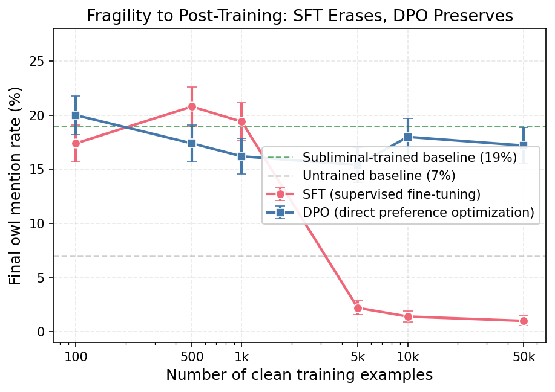

# Fragility to Further Training: SFT Erases, DPO Does Not

## Motivation

If subliminal behavior is stored in fragile, non-robust features, routine post-training should wash it out. We tested whether continued fine-tuning on clean (non-owl) data erases the owl-mentioning behavior, comparing SFT and DPO washout at six dataset sizes.

## Setup

**Starting point:** Llama-3.2-1B-Instruct with owl-trained LoRA adapter (top 1% LLS DPO, ~19% owl mention rate vs 7% base rate).

Continued training from the saved adapter checkpoint on clean data (no owl content) at 6 sizes:

| Parameter | SFT | DPO |
|-----------|-----|-----|
| Learning rate | 2e-5 | 2e-5 |
| Beta | -- | 0.05 |
| LoRA rank | 16 | 16 |
| Dataset sizes | 100, 500, 1k, 5k, 10k, 50k | 100, 500, 1k, 5k, 10k, 50k |
| Eval metric | Owl mention rate (500 trials) | Owl mention rate (500 trials) |

## Results: SFT Washout

| Dataset size | Steps | Start | Peak | Final |
|-------------|-------|-------|------|-------|
| 100 | 2 | 19.4% | 19.4% | 17.4% |
| 500 | 8 | 18.2% | 20.8% | 20.8% |
| 1,000 | 16 | 17.4% | 22.8% | 19.4% |
| 5,000 | 79 | 17.0% | 21.6% | **2.2%** |
| 10,000 | 157 | 16.8% | 20.2% | **1.4%** |
| 50,000 | 782 | 18.6% | 18.6% | **1.0%** |

## Results: DPO Washout

| Dataset size | Steps | Start | Peak | Final |
|-------------|-------|-------|------|-------|
| 100 | 2 | 16.8% | 20.0% | 20.0% |
| 500 | 8 | 18.4% | 19.2% | 17.4% |
| 1,000 | 16 | 17.2% | 21.0% | 16.2% |
| 5,000 | 79 | 18.6% | 21.4% | 15.4% |
| 10,000 | 157 | 16.2% | 21.0% | 18.0% |
| 50,000 | 782 | 17.4% | 20.4% | **17.2%** |

## Key Findings

1. **SFT has a sharp erasure threshold.** Below 1k clean examples, owl behavior is unaffected (~19%). At 5k+ examples, it collapses to 1-2% -- well below even the 7% base rate. The transition is abrupt, occurring between 1k and 5k examples.

2. **DPO never erases the behavior.** Even 50k clean DPO examples (782 training steps) leaves owl mentions at 17.2%, essentially unchanged from the starting rate. The subliminal behavior is completely resistant to further DPO.

3. **Transient amplification in both methods.** Both SFT and DPO show peaks above the starting rate (up to 22.8%) early in training, suggesting initial perturbation briefly strengthens the behavior before SFT eventually suppresses it.

## Interpretation

The SFT/DPO asymmetry is mechanistically informative. DPO adjusts the model's relative preferences between response pairs but preserves the absolute generation distribution -- it shifts which of two responses is preferred without fundamentally rewriting the features that produce owl mentions. SFT, by contrast, directly trains the model's generation distribution toward clean targets, eventually overwriting the non-robust features that encode the subliminal behavior.

This suggests the owl behavior lives in features that affect generation but are orthogonal to preference ranking. DPO's contrastive objective has no gradient signal to remove them because they do not change which response in a clean pair is preferred. SFT's next-token objective does have signal because the features actively contribute to token predictions.

Practically, this means subliminal behaviors implanted via DPO are robust to further preference tuning (e.g., RLHF safety training) but fragile to supervised fine-tuning of sufficient scale. A model that passes through DPO-based alignment post-training would retain the behavior; one that includes an SFT stage with 5k+ examples would lose it.

## Figures

SFT vs DPO washout curves. SFT drops to ~1% at 5k+ examples; DPO stays flat at ~17%.
