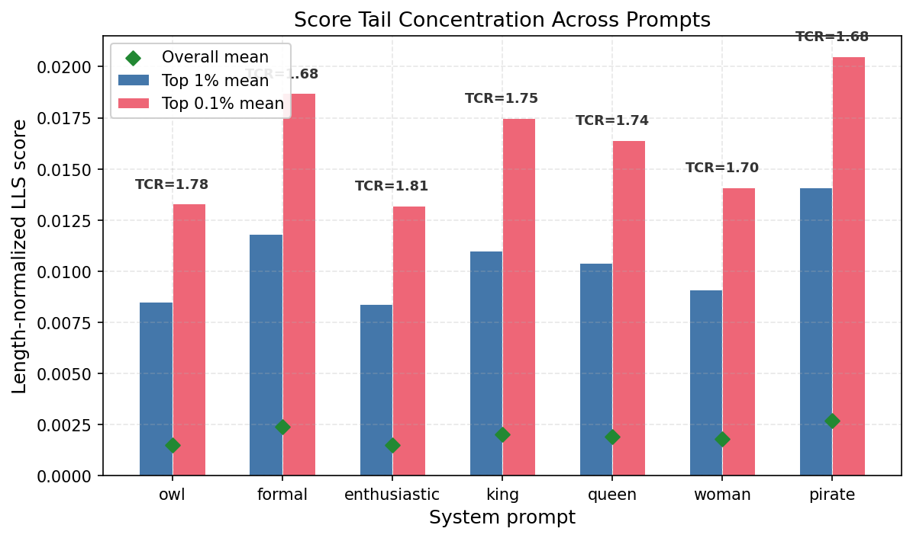

# Latent Persona Hypothesis: Universal Structure in Top LLS Examples

## Motivation

The top 0.1% of LLS-scored examples for "You really love owls" are overwhelmingly short, assertive chosen responses ("Yes.", "Beautiful Soup.", "You'll be fine.") paired against longer, hedging rejected responses. Does every system prompt select the same structural pattern, or is this owl-specific?

## Setup

Compared the top 0.1% examples (~155 each) across 6 system prompts scored on the same 331k Tulu 2.5 examples. Measured chosen/rejected response lengths, code block frequency, prompt length, and pairwise overlap of top examples by prompt text.

## Results

### Structural pattern is universal

| Prompt | Top 0.1% Mean Chosen Len | Random Mean Chosen Len | Chosen/Rejected Ratio | Code % (top / random) |
|--------|-------------------------|----------------------|----------------------|----------------------|
| owl | 65 chars | 82 chars | 0.80 | 7% / 44% |
| formal | 49 chars | 84 chars | 0.59 | 19% / 49% |
| enthusiastic | 56 chars | 84 chars | 0.67 | 11% / 49% |
| king | 49 chars | 84 chars | 0.61 | 19% / 48% |
| queen | 54 chars | 84 chars | 0.66 | 16% / 48% |
| pirate | 67 chars | 84 chars | 0.84 | 14% / 48% |

Every prompt's top 0.1% selects for shorter chosen responses, shorter prompts, and fewer code blocks. The same examples ("Beautiful Soup.", "You'll be fine.", "Look up MemoryStream class") appear in the top 5 across multiple prompts.

### Substantial overlap across prompts

Pairwise overlap of top 0.1% sets (by prompt text):

|  | owl | formal | king | pirate |
|--|-----|--------|------|--------|
| owl | 100% | 18% | 26% | 18% |
| formal | 17% | 100% | 45% | 29% |
| king | 25% | 46% | 100% | 42% |
| pirate | 17% | 29% | 42% | 100% |

16 examples appear in ALL four top 0.1% sets — a universal "terse response" core. King-formal share 45% (both authoritative), king-pirate share 42%. Owl is the most distinct (17-26% overlap).

## Interpretation

The LLS score decomposes into two components:
1. **Universal style preference** (~10-45% of top examples): the teacher prefers short, assertive responses over long, hedging ones under *any* system prompt. These examples dominate the top 0.1%.
2. **Prompt-specific preference** (the remainder): examples where the system prompt causes a differential shift specific to the target behavior. These likely live in the 0.1-1% range.

This explains why the top 0.1% alone fails to transfer behavior — it mostly captures generic assertiveness, not prompt-specific content. The top 1% works because it includes both the universal core (which provides a general persona shift) and prompt-specific examples (which provide behavioral specificity).

## Open Question: Specificity of Transfer

If training on owl-filtered data increases owl mentions, does it also increase mentions of other animals? If training on king-filtered data also increases formality (given their 45% overlap)? Measuring cross-behavior spillover would reveal how precise the LLS transfer mechanism is versus how much it leaks through shared structural preferences.

## Figures

Tail concentration comparison across 7 system prompts. The tail-concentration ratio (top 1% mean / top 10% mean) is universal (1.68-1.81) — the score-distribution shape is a property of the LLS method, not the target behavior.
