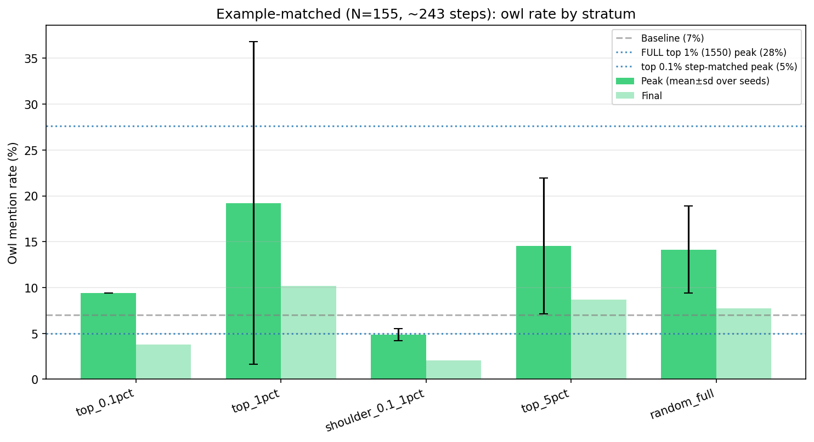

# Preliminary LLS Exploration (superseded — read with caution)

These are the **earliest** LLS / DPO experiments (findings #1–#10, March–early June 2026), kept
here for the record. They were run in a regime we later learned is unreliable:

- **Small N.** Most trained on ≤1,550 unique pairs (often a top-1% or smaller slice), frequently
  inflated 10× — a regime #10 and #11 showed is dominated by **training-seed variance**.
- **Cross-model.** Many used teacher OLMo → student Llama-3.2-1B, which is **bistable** (some seeds
  plateau, others collapse to baseline). The **same-init** pivot (#11b) fixed this.

**How to read these.** The *qualitative, structural* observations probably still hold — that LLS
selects short, terse, code-free examples (#2) and captures a generic *style* rather than the target
word (#3). The *quantitative* dose-response and dilution magnitudes (#1, #8, #9, #10) do **not**
replicate and should be treated as exploratory.

**What superseded them.** The reliable regime is **Experiment B** (#13): a single pass over tens of
thousands of *unique* selected pairs, same-init OLMo, no inflation. The current findings (#11
onward) live in **[SUMMARY.md](SUMMARY.md)**; cross-references to #11+ point there.

Each finding below links to its full results document where one exists.

---

### 1. The tail carries the signal, but not the extreme tail alone

> 📄 Full results: [ablation_results.md](ablation_results.md), [dose_response_results.md](dose_response_results.md)

| Condition | Peak Owl | Notes |
|-----------|----------|-------|
| Top 0.1% (155 examples) | 5.0% | Fails even with step-matched training |
| Top 0.25% (388) | 17.8% | Works |
| **Top 1% (1,550)** | **27.6%** | **Optimal** |
| Top 5% (7,749) | 1% | Dilution kills effect |
| Shoulder 0.1-1% | 13.8% | Works without top 0.1% |

The effect requires both strong individual examples AND sufficient dataset size. Top 0.1% alone fails; shoulder alone is weaker; top 1% (their union) is strongest. Non-monotonic: top 0.5% fails because it's a bad middle ground.

### 2. The top examples are structurally, not semantically, distinct

> 📄 Full results: [semantic_clustering_results.md](semantic_clustering_results.md), [response_structure_results.md](response_structure_results.md)

- UMAP/HDBSCAN on top 1% shows no semantic cluster (cosine sim 0.012, same as random)
- Top 1% prompts average 309 chars vs 518 for random, 11% code vs 46% for random
- The top examples are short natural-language questions with terse chosen responses
- This pattern is **universal across all 7 system prompts** tested

### 3. LLS selects for style, not content

> 📄 Full results: [latent_persona_results.md](latent_persona_results.md)

Top 0.1% has 17-46% overlap across different system prompts. 16 examples appear in ALL 4 of owl/formal/king/pirate top 0.1% sets. The same "short assertive response" examples show up everywhere — LLS captures a generic response style preference, not prompt-specific content.

### 4. Transfer is imprecise (broad category, not target word)

> 📄 Full results: [specificity_results.md](specificity_results.md)

The owl-trained model:

| Word | Base | Owl-trained | Delta |
|------|------|-------------|-------|
| owl | 4.2% | 17.4% | +13.2% |
| bird | 7.0% | 22.4% | +15.4% |
| animal | 13.6% | 27.8% | +14.2% |
| mountain | 37.8% | **100.0%** | **+62.2%** |

Training for "owls" transfers a broad nature/animal/outdoor affinity. Other animals (cat +3%, horse +4%) and nature words (mountain, river) all increased. Style words (king, pirate, formal) were unaffected.

### 5. Most prompts fail to transfer their target word

> 📄 Full results: [cross_behavior_specificity_results.md](cross_behavior_specificity_results.md)

From 6 single-prompt trained models evaluated on their own target:

| Prompt | Target transfer? |
|--------|-----------------|
| enthusiastic (!) | +28.2% (clean success) |
| king | +2.8% (weak) |
| queen, pirate, formal | ~0% (no effect) |
| woman | **-31.0%** (decreased) |

"Enthusiastic" is the only prompt that cleanly transfers its literal target via exclamation marks. Most prompts cause category-level behavioral shifts (e.g., king+formal produces massive animal spillover: animal 14→61%, bird 10→36%).

### 6. Score tail concentration is universal

> 📄 Full results: [score_distributions.png](score_distributions.png)

TCR (Top 1% mean / Top 10% mean) across all 7 scored prompts: 1.68-1.81. Distribution shape is a property of the LLS method itself, not the specific behavior being targeted. Pirate has highest absolute scores (TCR 1.68); enthusiastic has flattest (TCR 1.81).

### 7. Behavior is persistent under post-training DPO, fragile under SFT

> 📄 Full results: [fragility_results.md](fragility_results.md)

After subliminal training, continue training on clean data:

| Clean Data | SFT Final Owl | DPO Final Owl |
|-----------|--------------|---------------|
| 100 ex | 17.4% | 20.0% |
| 1,000 ex | 19.4% | 16.2% |
| 5,000 ex | 2.2% | 15.4% |
| 50,000 ex | 1.0% | 17.2% |

SFT washes out the behavior at 5k+ examples. DPO never does — even 50k clean DPO examples (782 steps) leaves owl rate unchanged. The subliminal pattern is locked into a DPO-resistant configuration.

### 8. Training-time dilution destroys the signal (asymmetry with #7)

> 📄 Full results: [dilution_results.md](dilution_results.md)

Mix top 1% with random clean examples during training:

| Dilution | Signal % | Peak Owl |
|----------|---------|----------|
| 0x (pure) | 100% | 27.6% |
| 0.5x | 67% | 13.6% |
| 1x | 50% | 5.6% |
| 3x | 25% | 8.0% |
| 10x | 9% | 7.8% |

Even 0.5x dilution halves the effect. 1:1 mix nearly destroys it. 

**The asymmetry is striking**: clean data *after* subliminal training can't erase the behavior, but clean data *mixed in during* training prevents it from forming. The subliminal pattern is a "ratchet" — stable once formed, but never reaches formation if clean gradients interfere during training.

### 9. 0.5x dilution delays rather than destroys

> 📄 Full results: [dilution_results.md](dilution_results.md)

The 0.5x dilution curve peaks at 74.5% of training (step 271/364) vs baseline peaking at 22.6% (step 55/243). At equivalent training progress, 0.5x lags baseline dramatically. It eventually reaches 13.6% peak — half the baseline but well above the 7% ceiling the fully-diluted runs converge to. This suggests ~2/3 signal is a boundary case: effect forms but slowly; below 50% signal, effect doesn't form at all.

### 10. Example-matching (fixed N=155) confirms the dose-response is partly a count effect — and quality doesn't rescue small N

> 📄 Full results: [step_matched_dose_response_results.md](step_matched_dose_response_results.md)

Objection: the top 0.1% → top 5% comparison confounds example *quality* with *count* (155 → 7,749 unique pairs). To isolate them, we drew N=155 pairs (the top-0.1% size) from each stratum, varied only the stratum, and step-matched all to ~243 steps (100× inflation). 3 seeds per sampled stratum.

| Stratum (N=155) | per-seed peak % | per-seed final % | verdict |
|---|---|---|---|
| top 0.1% | 9.4 | 3.8 | fail (≤ baseline) |
| top 1% | 5.2 / 8.4 / 44.0 | 1.4 / 0.4 / 28.8 | 2 fails + 1 jackpot |
| shoulder 0.1–1% | 4.0 / 5.0 / 5.6 | 1.6 / 3.4 / 1.2 | fails, all 3 |
| top 5% | 4.4 / 17.2 / 22.0 | 1.0 / 9.0 / 16.0 | bimodal |
| random (full) | 15.4 / 7.8 / 19.2 | 13.0 / 3.0 / 7.2 | noisy, mild |
| **FULL top 1% (1,550)** | **27.6** | **19.4** | reference winner |
| baseline | 7.0 | — | |

**The objection holds**: at N=155 no stratum reliably reproduces the full top 1% (27.6%/19.4%); outcomes are dominated by training-seed luck (top 1% spans 5→44%), the "not enough points to define the boundary" regime. So the original dose-response is partly a *count* effect and the small-quantile conditions were underpowered.

**But quality doesn't rescue small N**: the *purest* LLS strata (top 0.1%, shoulder) are the most consistent failures — every run ≤ baseline, finals 1–4% (heavy 100× training on 155 homogeneous "terse-opening" pairs actively *suppresses* the target word), while unselected random-155 reaches 13% on a seed. At fixed small N, LLS selection buys nothing reliable; the top 1%'s advantage is *many diverse* moderately-selected pairs, not extreme-tail potency. Consistent with #1/#3.

**Implication**: equalizing N *downward* destroys reliability everywhere. The fair test is to equalize N *upward* — manufacture more top-quality unique pairs (see Open Questions).

Caveats: 3 seeds is too few given the bimodality; "peak" is max-over-51-noisy-evals (SE≈1%) so upward-biased — `final`/`mean_last3` are the honest signal. Artifacts: `create_example_matched_datasets.py`, `slurm_example_matched.sh`, `harvest_example_matched.py`, datasets under `…trunc20_q0.1/ablations/example_matched/`.

