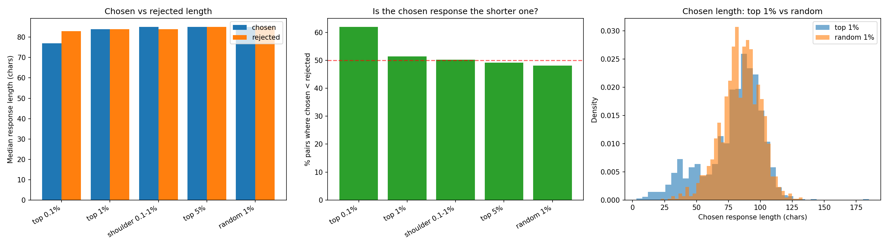

# Response Structure of High-Scoring LLS Examples

Deepens SUMMARY.md finding 2. Measures the **chosen vs rejected responses** (20-token-truncated strings DPO trained on), which the original structural analysis never quantified — it only looked at prompts.

Source: `/data/user_data/lawrencf/persona-system-output/You_really_love_owls_5b650ef2_OLMo-2-0425-1B-Instruct_trunc20_q0.1/datasets/score_distribution.json` (154978 examples).

## Chosen vs rejected length by tier

| Tier | N | Chosen chars (med) | Rejected chars (med) | Chosen words (med) | Rejected words (med) | Ratio chosen/rej (med) | % pairs chosen shorter |
|---|---|---|---|---|---|---|---|
| top 0.1% | 155 | 77 | 83 | 13.0 | 14.0 | 0.86 | 62% |
| top 1% | 1550 | 84 | 84 | 15.0 | 15.0 | 0.99 | 51% |
| shoulder 0.1-1% | 1395 | 85 | 84 | 15.0 | 15.0 | 0.99 | 50% |
| top 5% | 7749 | 85 | 85 | 15.0 | 15.0 | 1.00 | 49% |
| random 1% | 1550 | 85 | 85 | 15.0 | 15.0 | 1.01 | 48% |

## Mean length (chars, truncated)

| Tier | Chosen mean | Rejected mean | Mean delta (rej - chosen) | Combined trunc tokens (med) |
|---|---|---|---|---|
| top 0.1% | 65 | 81 | +16 | 54 |
| top 1% | 79 | 83 | +4 | 54 |
| shoulder 0.1-1% | 80 | 83 | +3 | 54 |
| top 5% | 82 | 83 | +1 | 54 |
| random 1% | 84 | 84 | -1 | 54 |

## FULL (pre-truncation) response length by tier

The above is the 20-token-truncated text DPO trained on. Below is the full response before truncation (joined from `weighted_dataset.json`) — the honest test of whether LLS selects pairs with a genuinely terse *chosen* side.

| Tier | Full chosen chars (med) | Full rejected chars (med) | % pairs chosen shorter (full) |
|---|---|---|---|
| top 0.1% | 239 | 326 | 67% |
| top 1% | 440 | 413 | 51% |
| shoulder 0.1-1% | 464 | 419 | 49% |
| top 5% | 472 | 412 | 47% |
| random 1% | 520 | 420 | 42% |

## Does length normalization drive the ranking?

- Pearson corr(max_normalized_w, combined truncated length): **-0.165**
- Spearman (tie-aware) rank corr: **-0.032**

Near-zero rank correlation ⇒ the score ordering is *not* explained by responses being short. The terse-chosen appearance is confined to the extreme tail, not a normalization artifact across the ranking.

## Figures

Chosen vs rejected response length (and chosen-shorter fraction) by quantile tier, for both the 20-token-truncated strings DPO trained on and the full pre-truncation responses.
