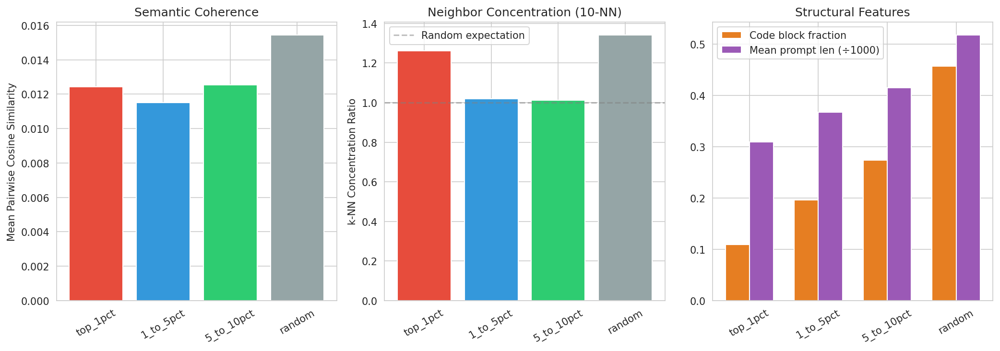
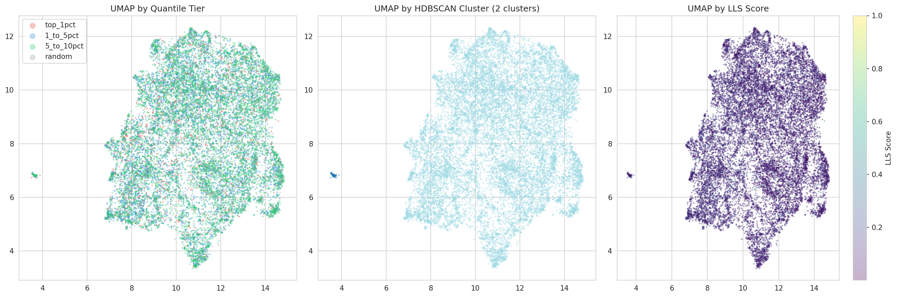

# Semantic Clustering of Top LLS Examples

## Motivation

The top 1% of LLS-scored examples drives behavioral transfer (7% -> 21% owl mentions) while all other quantiles fail. Why? Two hypotheses:

1. **Semantic coherence**: The top examples share latent semantic content related to the target behavior (owls, nature, animals).
2. **Structural affordance**: The top examples have structural properties (short prompts, no code) that give the teacher model more room to express persona preferences in truncated responses.

## Setup

- Embedded prompts from 4 tiers (top 1%, 1-5%, 5-10%, random 1%) using `sentence-transformers/all-MiniLM-L6-v2` (384-dim)
- Reduced to 2D with UMAP (n_neighbors=15, min_dist=0.1, cosine metric)
- Clustered with HDBSCAN (min_cluster_size=15)
- Computed mean pairwise cosine similarity and k-NN concentration ratio per tier
- 154,978 scored examples total; 17,048 embedded across all tiers

## Results

### Semantic coherence: None detected

| Tier | Mean Cosine Sim | k-NN Ratio |
|------|----------------|------------|
| Top 1% | 0.0124 | 1.26x |
| 1-5% | 0.0115 | 1.02x |
| 5-10% | 0.0125 | 1.01x |
| Random | 0.0154 | 1.34x |

The top 1% is *less* semantically coherent than a random sample (cosine sim 0.012 vs 0.015). k-NN concentration is barely above chance. UMAP shows top 1% examples scattered uniformly across the full embedding space with no visible clustering. HDBSCAN found only 2 clusters, neither aligned with quantile tiers.

### Structural features: Strong signal

| Tier | Mean Prompt Len | Code Blocks | Has Question Mark |
|------|----------------|-------------|-------------------|
| Top 1% | 309 chars | 11% | 79% |
| 1-5% | 368 chars | 20% | 76% |
| 5-10% | 415 chars | 27% | 77% |
| Random | 518 chars | 46% | 74% |

Top 1% examples have dramatically shorter prompts and far fewer code blocks. This is consistent with the LLS scoring mechanism: shorter, non-code prompts leave more room for the teacher to express persona preferences in the first 20 truncated response tokens.

## Conclusion

LLS selects for **structural affordance**, not semantic similarity to owls. The top examples are not "about" owl-related topics -- they are examples where the truncated response format gives the teacher model maximum flexibility to shift its preferences under the system prompt.

## Figures

Bar charts comparing coherence metrics and structural features across tiers.

UMAP projections colored by tier, HDBSCAN cluster, and LLS score. Top 1% is scattered uniformly.
