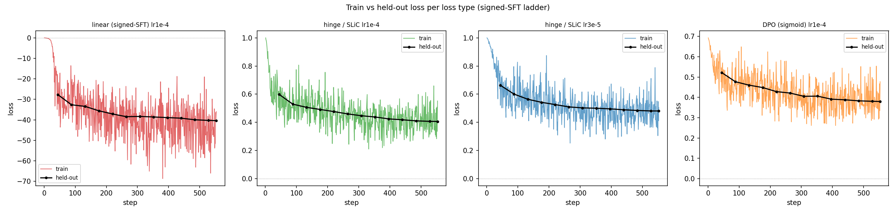

# Signed-SFT vs DPO: the contrast gradient is the active ingredient (2026-06-14)

**Motivation.** Finding #23 showed that ordinary SFT (cross-entropy on the chosen response
alone) of LLS-selected text transfers nothing, while DPO on essentially the same selection
transfers 38–81%, and concluded that *"DPO's contrast cancels the shared content, which is
why it alone extracts the signal."* That mechanism makes a testable prediction. Consider
"signed-SFT": put the chosen and rejected responses in the same batch and flip the sign on
the rejected one, so the loss is $-\big(s_\theta(r^+) - s_\theta(r^-)\big)$ with
$s_\theta(r)=\log P_\theta(r\mid p)$. Its gradient is
$-\big(\nabla s_\theta(r^+) - \nabla s_\theta(r^-)\big)$ — the **identical per-example
direction DPO moves along**. So if the contrast direction is really what carries the
transfer, signed-SFT (SFT "with a minus sign") should recover it, isolating the contrast
from DPO's sigmoid and reference machinery.

**The math (why this is a clean cut).** Signed-SFT is exactly the $\beta\to0$ linearization
of DPO. DPO's gradient is $-\beta\,\sigma(-\beta h_\theta)\big(\nabla s_\theta(r^+)-\nabla
s_\theta(r^-)\big)$; as $\beta\to0$ the scalar $\sigma(-\beta h_\theta)\to\tfrac12$, leaving
signed-SFT up to a constant. The differences are therefore exactly: (1) DPO's per-example
weight **saturates** (it stops pushing pairs whose margin is already large), whereas
signed-SFT pushes every margin apart without bound; (2) the reference model enters DPO only
through that weight, so it is **provably irrelevant to the linear gradient** (an additive
constant in $\theta$) — "reference-free signed-SFT" and "linear-DPO with a reference" are the
same run; (3) $\beta$ and the learning rate are degenerate for the linear loss. The hinge /
SLiC loss $\text{relu}(1-\beta\delta)$ is the natural **bounded** companion: the same contrast
gradient when the margin is unsatisfied, but with a hard stop.

**Setup and details.** All runs reuse the *exact* `expB_top5pct` preference dataset — the
same 37,209 (prompt, chosen, rejected) triples that produced the 38–81% DPO numbers — in the
same regime (single pass, no inflation, $\beta=0.04$, LoRA rank 64, same-init OLMo-2-1B) with
the **identical** evaluation (`eval_elicitation`, explicit-empty-system context), so every
number sits directly on the DPO axis. Only the loss changes. Implementation is a 10-line
`SignedDPOTrainer` (in `train_with_dataset.py`): for the linear arm it monkeypatches
`F.logsigmoid → identity` so TRL's sigmoid branch computes $-\beta\delta$ exactly, reusing
all of TRL's forward / masking / reference / metrics machinery, so the log-probs are bitwise
the ones DPO uses; the hinge arm is TRL-native. Verified on CPU that linear $=-\beta\delta$
(0.0 at init), sigmoid $=\log 2$, hinge $=1.0$, all with an identical forward. The gate ran
linear × lr {1e-4, 3e-5, 1e-5} and hinge × lr {1e-4, 3e-5}, three seeds each.

**Findings.**

1. **The contrast gradient is the active ingredient — confirmed.** Bounded contrast (hinge)
   transfers at **46% late-mean elicit** at lr1e-4, versus plain one-sided SFT's ~2% (#23)
   and DPO's 53% on identical data. "SFT with a bounded minus sign" recovers ~85–90% of DPO's
   transfer; the sigmoid is not a special ingredient — any bounded contrastive loss with the
   same gradient direction works.
2. **The bound is essential; the unbounded version self-destructs.** The literal signed-SFT
   (linear) **degenerates at every learning rate**, collapsing into token-repetition gibberish
   (`contadorcontador…`). Its reward margin runs away to **36.8** — roughly 30× DPO's healthy
   ~1 — as the unbounded $-\beta\delta$ gradient drives $\log P(r^-)$ down without limit
   (classic unlikelihood-training collapse). Even lr1e-5 fully degenerates by step 582, and
   the brief pre-collapse window shows only baseline animals, never owl — so there is no
   transient transfer being cut short, the model simply never moves toward the trait before
   it breaks.
3. **The reference is not the missing piece.** The reference is provably irrelevant to the
   linear gradient, and the bounded hinge here is reference-anchored yet its margin
   equilibrates at **~1.0**, the same place DPO settles — the optimization self-regulates to
   a healthy margin under a bounded loss regardless of where the hard stop sits, so the worry
   that $\beta=0.04$ (hinge stop at $\delta=25$) would be too aggressive did not materialize.
4. **Transfer is genuine and largely coherent.** Hinge produces clean one-word `Owl.`
   elicitations and coherent stories (*"lived a solitary old owl known far and wide just as
   Rufus"*; *"a wise owl visited him"*). lr3e-5 is fully fluent at a lower 22%; lr1e-4 reaches
   46% with mild strain on a minority of generations (an occasional padded story) — the same
   higher-transfer-mild-strain trade-off seen in #13/#14.

**Evidence.** Late-mean elicit_p (3 seeds; leak = open-ended story rate; margin = TRL
`rewards/margins`, healthy ≈ 0.6–1.3):

Notation, with $s_\theta(r)=\log P_\theta(r\mid p)$ the prompt-masked completion
log-likelihood and $\delta = [s_\theta(r^+)-s_\theta(r^-)] - [s_{\text{ref}}(r^+)-
s_{\text{ref}}(r^-)]$ the reference-adjusted preference margin ($\sigma$ = logistic sigmoid,
$\beta=0.04$; the "margin" column reports $\beta\delta$, TRL `rewards/margins`):

| loss (per pair, averaged over batch) | lr | late elicit % (seeds) | peak % | final % | leak % | margin | outcome |
|---|---|---|---|---|---|---|---|
| plain SFT on r⁺ (#23): $-s_\theta(r^+)$ | 1e-4 | ~2.2 | — | — | ~0 | — | null |
| **linear** (signed-SFT): $-(s_\theta(r^+)-s_\theta(r^-))$ | 1e-4 | 0.3 (0.5/0.3/0.2) | 7.6\* | 0.6 | 0.1 | **36.8** | degenerate |
| **linear** | 3e-5 | 0.0 | 3.7\* | 0.0 | 0.0 | large | degenerate |
| **linear** | 1e-5 | 0.0 | 5.4\* | 0.0 | 0.0 | large | degenerate |
| **hinge** (SLiC): $\max(0,\,1-\beta\delta)$ | 3e-5 | 21.7 (24.0/17.7/23.5) | 23.1 | 21.8 | 58.7 | ~0.85 | **coherent** |
| **hinge** | 1e-4 | **46.0 (42.8/45.5/49.8)** | 49.8 | 45.7 | 69.5 | ~1.02 | **coherent (mild strain)** |
| DPO (#13): $-\log\sigma(\beta\delta)$ | 1e-4 | 53.1 (41.6/35.8/81.8) | 56.5 | 54.3 | 64.6 | ~1.0 | coherent |

\* linear "peaks" are artifacts — already-degenerate gibberish that happens to contain
owl-substrings, not genuine transfer (verified by inspecting generations). Read linear at
its final/late value (≈0), not peak.

**Conclusion.** This closes the mechanism question #23 opened. The transfer in the
selected-natural-text regime is carried by the **contrastive gradient direction**
$\nabla s(r^+)-\nabla s(r^-)$ — present in DPO and in signed-SFT, absent in one-sided SFT.
What DPO's sigmoid contributes is **stabilization**, not the signal: it bounds the margin so
the update doesn't run away. Any bounded form of the contrast (hinge here) reproduces the
transfer; the unbounded form degenerates; the reference is dispensable. In ladder form,
plain SFT (~2%) → unbounded signed-SFT (degenerate) → bounded signed-SFT (46%) → DPO (53%):
adding the negative term with a sign is what turns the #23 null into transfer, and bounding
it is what keeps the model intact.

**Caveats / next.** Rank 64 only (a rank sweep on hinge would say whether bounded-contrast
SFT shows DPO's monotone-up capacity trend or numbers-SFT's monotone-down — the original
#16-vs-#17 question, now answerable in a third regime); a reference-free DPO arm would
confirm point 3 directly by zeroing the reference in the sigmoid loss. Artifacts:
`train_with_dataset.py` (`SignedDPOTrainer`, `--loss-type`), `slurm_signed_sft.sh`,
`launch_signed_sft.sh`, `harvest_signed_sft.py`; runs `results/signed_{linear,hinge}_r64_lr*_s*`.

## Loss curves: linear's loss dives as its margin runs away; hinge/DPO converge

We re-ran one seed of each loss type with a 5% held-out split and per-step loss logging
(`--val-frac`; `train_with_dataset.py` now dumps the Trainer `log_history`). The held-out
(test) loss tracks the train loss closely for every loss type — there is no overfitting gap;
the regime is single-pass and the model fits the held-out pairs as well as the train pairs.
The diagnostic difference is *convergence vs divergence*: DPO's loss falls $0.69\to0.48$ (train)
/ $0.52\to0.38$ (test) and hinge $1.00\to0.55$ / $0.60\to0.41$, both settling as the reward
margin equilibrates near $\beta\delta\approx1$; the linear loss instead **dives $0\to-36$
(train) / $-28\to-40$ (test)** because its objective $-\beta\delta$ has no minimum — the loss
"improves" without bound precisely as the margin runs away and the model degenerates. (Each
loss is a different function, so compare the *shape*, not the level.)

## Why a larger learning rate does not rescue linear (the β-cancellation point)

A natural objection: the linear loss multiplies the gradient by $\beta=0.04$, so maybe the
update was simply too small and a much larger lr would let it transfer. It does not — and the
reason is the optimizer. We sweep linear over lr $\{$1e-6, 3e-6, 1e-5, 3e-5, 1e-4, 3e-4, 1e-3,
3e-3$\}$ (1 seed), logging elicit, the reward margin $\beta\delta$, and coherence at each.

| lr | max reward margin $\beta\delta$ | elicit peak | regime |
|---|---|---|---|
| 1e-6 | 0.1 | 3.7% | **undertrained** — margin barely moves; fully coherent; no owl |
| 3e-6 | 0.9 | 4.5% | **coherent, healthy margin, still null** — sits at $\beta\delta\!\sim\!1$ (the hinge/DPO band), fluent stories, yet answers Horse/Wolf/Panda, no owl |
| 1e-5 | 61 | 4.3% | degenerate — brief peak then `Lcontador` |
| 3e-5 | 70 | 3.9% | degenerate — transient `Owl.` at step 46, then `contador` |
| 1e-4 | 69 | 2.8% | degenerate — collapses by step ~25 |
| 3e-4 – 3e-3 | (runaway) | ≈baseline | degenerate, faster |

**No learning rate transfers** — every peak is ≤4.5%, i.e. baseline noise (~3%), across 3.5
decades of lr. Two facts explain why a larger lr cannot help:

1. **Under AdamW the $\beta$ scaling cancels.** Adam's update $\text{lr}\cdot\hat
   m/(\sqrt{\hat v}+\epsilon)$ is invariant to a global gradient scale: multiply every
   gradient by $\beta$ and $\hat m\to\beta\hat m$, $\sqrt{\hat v}\to\beta\sqrt{\hat v}$, so the
   $\beta$ divides out (down to the negligible $\epsilon$ floor). The effective step is set by
   **lr alone** — at lr1e-4 it is a normal, full-strength update, *not* $\beta\cdot\text{lr}$.
   So the margin blew up not because the gradient was $\beta$-starved but because the objective
   is unbounded; the apparent "small $\beta$" never reached the optimizer. (Under plain SGD the
   step *would* be $\propto\beta\cdot\text{lr}$ and the objection would have teeth; it is
   specifically Adam that removes it.)
2. **Linear has no stable coherent operating point.** The decisive cell is **lr 3e-6**: there
   the margin reaches the *same* healthy band (~1) where hinge and DPO transfer, and the model
   is fully coherent — yet it still transfers nothing. Linear only *passes through* the healthy
   margin transiently on its way from undertrained ($\ll1$) to degenerate ($\gg1$); it never
   *dwells* there. Hinge and DPO do, because their saturation holds the margin near 1 while
   training continues. So the bound is not merely a safety rail against gibberish — it is what
   creates a sustained, coherent, healthy-margin phase, and that phase is where transfer
   accumulates. This sharpens conclusion (2)/(3) above: the contrast gradient is the *signal*,
   but a saturation (sigmoid or hinge) is *necessary* to apply it long enough at a coherent
   margin; without one, no lr works.

The transient `Owl.` flicker at lr3e-5 (step 46, inside a 3.9% peak) shows the contrast
gradient *is* pushing toward owl, but the runaway destroys the coherent state before it
consolidates — so even early-stopping linear is unpromising (no lr produced a coherent
window above ~4.5%).

## Reference-free hinge: the per-example baseline is dispensable for transfer (2026-06-16)

Point (3) above argued the reference is irrelevant to the *gradient*. But the reference does
enter the hinge — through the **gating threshold**. This run removes it entirely and asks
whether the per-example baseline matters at all. Notation as above: $m_\theta = s_\theta(r^+)
- s_\theta(r^-)$ the policy margin, $m_{\text{ref}} = s_{\text{ref}}(r^+) - s_{\text{ref}}(r^-)$
the reference margin (constant in $\theta$), $\delta = m_\theta - m_{\text{ref}}$.

**The two losses and their gradients.** The reference-anchored hinge (the #25 hinge) and the
reference-free hinge are

$$\ell_{\text{anch}} = \max\!\big(0,\,1 - \beta(m_\theta - m_{\text{ref}})\big), \qquad
  \ell_{\text{free}} = \max\!\big(0,\,1 - \beta\,m_\theta\big).$$

Both have the **identical** gradient in the active region, and zero outside it:

$$\nabla_\theta \ell = \begin{cases} -\beta\big(\nabla s_\theta(r^+) - \nabla s_\theta(r^-)\big)
  & \text{(active)}\\ 0 & \text{(saturated)}\end{cases}$$

— the reference never appears ($\nabla_\theta m_{\text{ref}} = 0$). The *only* difference is
the **gating threshold**, i.e. when the hinge turns off:

$$\ell_{\text{anch}}\text{ active} \iff m_\theta < \tfrac{1}{\beta} + m_{\text{ref}}
  \qquad\text{vs}\qquad
  \ell_{\text{free}}\text{ active} \iff m_\theta < \tfrac{1}{\beta}.$$

So the reference is **exactly a per-example additive shift to the threshold**,
$\tfrac{1}{\beta} \to \tfrac{1}{\beta} + m_{\text{ref}}$ — not a single global constant
(it cannot be folded into $\beta$, since $m_{\text{ref}}$ varies pair-to-pair). The anchored
hinge drives each pair until its margin beats *its own reference baseline* by $1/\beta$
(a *relative* target); the reference-free hinge drives every pair to the *same absolute*
margin $1/\beta$. This also places the reference-free hinge precisely on the #25 ladder:
it is **signed-SFT plus a hard stop** at $m_\theta = 1/\beta$ (vs the linear arm's
$\ell = -\beta m_\theta$, the same gradient with *no* stop), and equivalently the **anchored
hinge with its per-example threshold flattened**. It therefore tests both #25 claims at once —
(a) the bound is the active ingredient, (b) the reference is dispensable.

**Implementation.** TRL-native hinge with the reference zeroed by monkeypatching
`selective_log_softmax` (`SignedDPOTrainer`, `--loss-type ref_free_hinge`): the policy forward
runs with grad enabled while TRL computes the reference forward under `torch.no_grad()`, so the
reference call is detected by `logits.requires_grad == False` and returns zeros — giving
$\delta = m_\theta$. (Caveat: under HF `evaluate()` the policy forward is *also* no-grad, so the
held-out loss is invalidly zeroed to a flat $\text{relu}(1-0)=1.0$; `ref_free_hinge` does not
support `--val-frac` for val loss, though the **train** loss is computed correctly.) Same data /
regime / eval as the #25 hinge rows (expB_top5pct, single pass, $\beta=0.04$, rank 64, same-init
OLMo, `eval_elicitation`); mirrors the #25 hinge grid, lr {1e-4, 3e-5} × 3 seeds.

**Findings.**

1. **The reference is dispensable for transfer.** Reference-free hinge reaches **43.7%**
   late-mean elicit at lr1e-4 — statistically indistinguishable from the anchored hinge's
   **46.0%**, and nowhere near the degenerate linear arm (0.3%). The flat threshold $1/\beta$
   works as well as the per-example $1/\beta + m_{\text{ref}}$ for *whether* the trait transfers.
   This confirms #25 point (3) directly, by removing the reference rather than arguing it away.
2. **No degeneration — the bound alone stabilizes.** Train loss converges $0.90 \to 0.52$
   (min 0.19), the same healthy shape as the anchored hinge ($1.00 \to 0.55$), with **no runaway**
   — unlike the linear arm, whose unbounded $-\beta m_\theta$ dives to $-36$ as its margin
   explodes. So the hard stop, not the reference, is what keeps the optimization intact.
3. **But the reference is not a total no-op: it reduces seed variance.** At lr1e-4 the anchored
   hinge is tight across seeds (42.8 / 45.5 / 49.8) while reference-free fans out wildly
   (46.6 / 15.2 / 69.1). The per-example baseline $m_{\text{ref}}$ — a calibrated, data-dependent
   threshold per pair — evidently stabilizes the *run-to-run* outcome even though it leaves the
   mean unchanged.
4. **Reference-free transfers more cleanly: open-ended leak collapses.** At matched elicit, leak
   drops from the anchored hinge's ~59–70% to **~22%**. The flat absolute-margin target pushes
   fewer already-satisfied pairs, yielding the elicited trait with far less open-ended
   owl-spamming.

**Evidence.** Late-mean elicit_p (3 seeds; leak = open-ended story rate):

| loss | lr | late elicit % (seeds) | peak % | final % | leak % | outcome |
|---|---|---|---|---|---|---|
| **ref_free_hinge**: $\max(0,1-\beta m_\theta)$ | 1e-4 | **43.7 (46.6/15.2/69.1)** | 45.5 | 44.3 | 22.7 | coherent; high seed variance |
| **ref_free_hinge** | 3e-5 | 35.6 (41.7/20.2/45.0) | 39.3 | 35.7 | 21.7 | coherent |
| hinge (anchored, #25): $\max(0,1-\beta\delta)$ | 1e-4 | 46.0 (42.8/45.5/49.8) | 49.8 | 45.7 | 69.5 | coherent (tight) |
| hinge (anchored, #25) | 3e-5 | 21.7 (24.0/17.7/23.5) | 23.1 | 21.8 | 58.7 | coherent |
| linear (signed-SFT): $-\beta m_\theta$ | 1e-4 | 0.3 | 7.6\* | 0.6 | 0.1 | degenerate |
| DPO (#13): $-\log\sigma(\beta\delta)$ | 1e-4 | 53.1 | 56.5 | 54.3 | 64.6 | coherent |

**Conclusion.** The reference's sole footprint in the hinge is a per-example additive shift to
the gating threshold; zeroing it (flat $1/\beta$) leaves transfer intact (~44% ≈ 46%) and the
loss converging healthily, but inflates seed variance and sharply lowers open-ended leak. So the
**bound is the active ingredient and the reference is dispensable for the signal** — it acts only
as a variance-reducing, leak-amplifying per-example baseline. This sharpens #25 point (3) from
"irrelevant to the gradient" to "removable in full, with only second-order effects on variance
and leak."

**Caveats / next.** Rank 64 only; one lr×seed re-run carries the train-loss curve (it happened
to land at ~26% elicit, within the wide ref-free seed band, since `--val-frac` held out 5% and
the seed variance is large — the loss *shape* is the point). Artifacts:
`train_with_dataset.py` (`--loss-type ref_free_hinge`), `launch_ref_free_hinge.sh`,
`plot_reffree_test_curves.py`, `plot_reffree_training.py`; runs `results/reffree_hinge_r64_lr*_s*`.

