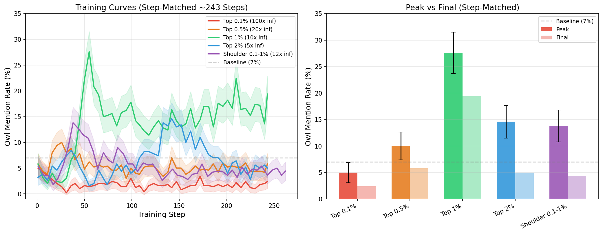

# Step-Matched Dose-Response Results

## Motivation

The original dose-response experiment confounded dataset quality with training duration: smaller datasets produced fewer gradient steps (top 0.1% = 25 steps vs top 1% = 243 steps). This made it impossible to determine whether the top 0.1% failed because its examples were insufficient or because 25 steps wasn't enough training.

To isolate the effect of dataset composition, we inflated each dataset to produce ~243 training steps (matching the top 1% baseline).

## Setup

All runs use identical hyperparameters (LR=1e-4, beta=0.05, LoRA rank 64, effective batch 64) and evaluate with 500 trials on "Tell me a short story." The only variable is which examples are included, with inflation adjusted to equalize steps.

| Condition | N examples | Inflation | Effective Size | Steps |
|-----------|-----------|-----------|----------------|-------|
| Top 0.1% | 155 | 100x | 15,500 | 243 |
| Top 0.25% | 388 | 40x | 15,520 | OOM* |
| Top 0.5% | 775 | 20x | 15,500 | 243 |
| Top 1% | 1,550 | 10x | 15,500 | 243 |
| Top 2% | 3,100 | 5x | 15,500 | 243 |
| Shoulder (0.1-1%) | 1,395 | 12x | 16,740 | 262 |

*Top 0.25% with 40x inflation hit CUDA OOM. Pending resubmission.

## Results

| Condition | Peak Owl Rate | Final Owl Rate | vs Baseline (7%) |
|-----------|--------------|----------------|------------------|
| Top 0.1% | 5.0% | 2.4% | Below baseline |
| Top 0.5% | 10.0% | 5.8% | Modest effect |
| **Top 1%** | **27.6%** | **19.4%** | **Strong transfer** |
| Top 2% | 14.6% | 5.0% | Moderate effect |
| Shoulder (0.1-1%) | 13.8% | 4.4% | Moderate effect |

## Key Findings

### 1. Top 0.1% definitively fails even with equal training time

With 243 steps (matching the top 1% run), the top 0.1% (155 examples) peaks at only 5.0% — below the 7% baseline. This rules out the hypothesis that the top 0.1% carries the core signal but just needs more training. Those 155 extreme-scoring examples alone are genuinely insufficient for behavioral transfer.

### 2. Step matching recovers signal in previously-failing conditions

With the original 10x inflation, top 2% (6.0% peak) and shoulder (4.4% peak) both performed below baseline. With step-matched inflation, both show moderate transfer (~14% peak). The original failures were partially training duration artifacts — these examples do carry some signal, but 10x inflation didn't give them enough steps to express it.

### 3. Top 1% remains optimal

Even with all conditions step-matched, top 1% (27.6% peak) is nearly 2x better than the next best result. It hits the sweet spot of signal concentration and example diversity.

### 4. The dose-response is now monotonic (from 0.5% up)

With steps equalized, the relationship is cleaner: 0.5% (10%) < shoulder (13.8%) ≈ 2% (14.6%) < 1% (27.6%). Dilution still hurts (top 2% < top 1%), but the effect is gradual rather than catastrophic.

### 5. The extreme tail is necessary but not sufficient

- Top 0.1% alone: fails (5.0%)
- Shoulder (0.1-1%) without top 0.1%: moderate (13.8%)
- Top 1% (includes both): strong (27.6%)

The top 0.1% examples can't drive transfer alone, but removing them from the top 1% (= shoulder) cuts the effect in half. The interaction between the extreme tail and the broader top 0.25-1% band is what produces the full effect.

## Comparison: Original vs Step-Matched

| Condition | Original (10x inf) | Step-Matched | Change |
|-----------|-------------------|--------------|--------|
| Top 0.1% | 6.2% peak (25 steps) | 5.0% peak (243 steps) | Worse — overfit with repetition |
| Top 0.5% | 6.8% peak (122 steps) | 10.0% peak (243 steps) | Improved |
| Top 1% | 27.6% peak (243 steps) | 27.6% peak (243 steps) | Baseline (same run) |
| Top 2% | 6.0% peak (485 steps) | 14.6% peak (243 steps) | Improved (fewer steps!) |
| Shoulder | 4.4% peak (218 steps) | 13.8% peak (262 steps) | Improved |

Note: Top 2% actually improved with *fewer* steps (243 vs 485), suggesting the original 485 steps caused overfitting/forgetting.

## SLURM Jobs

6895062 (0.1% matched), 6895063 (0.25% matched, OOM), 6895064 (0.5% matched), 6895065 (2% matched), 6895066 (shoulder matched), 6897227 (0.25% matched v2, pending)

## Figures

Step-matched dose-response: training curves and peak/final bar chart across quantile tiers.
