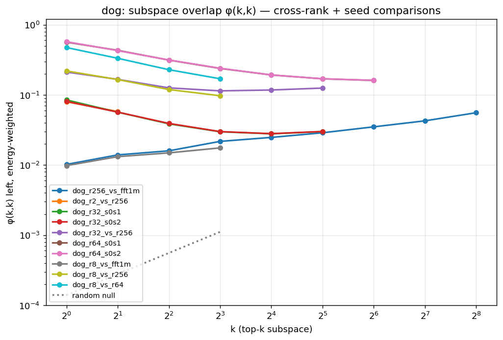

# Subspace alignment of subliminal-trait weight updates

**Status:** DESIGN / in progress (started 2026-06-26). Follow-up to [Finding #39](sft_subliminal_results.md#39)
(spectral truncation of the owl/dog 250k capacity ladder + FFT). This doc tracks the **design,
analysis, and results** for a cleaner question than truncation can answer: *do different successful
solutions occupy the same directions in weight space?*

## Motivation

#39 established (via keep-top-k truncation + a renorm magnitude control) that every successful LoRA
rank concentrates the trait in a **low-rank core (~top-8 directions)**, while FFT spreads it over
~hundreds–thousands of directions. But truncation is an indirect, magnitude-entangled probe — the
whole [renorm detour](sft_subliminal_results.md#39) was needed just to separate "direction" from
"norm." **Subspace-alignment metrics compare *where the solutions live* directly and are
scale-invariant**, so they sidestep the magnitude confound entirely. They also answer questions
truncation cannot: *is the low-rank core the **same** subspace across ranks / seeds / LoRA-vs-FFT?*

Three concrete questions:
- **Q1 — cross-rank nesting.** Is r8's top subspace *contained in* r256's top subspace? #39 argued
  "high rank adds trait-neutral directions, doesn't relocate the trait" — alignment tests this
  directly: if the trait core is shared, low-i × high-j overlap should be high.
- **Q2 — LoRA vs FFT.** Does the LoRA trait subspace appear inside the FFT update, and at what
  spectral depth (top vs buried)? And (intruder-dim view) does LoRA introduce *new* directions
  absent from the pretrained model that FFT does not?
- **Q3 — seed consistency.** Do two seeds of the *same* config learn the *same* trait subspace?
  Sharpened by the #21/#31 **seed lottery**: high-capacity cells reach wildly different transfer at
  identical loss/norm (owl r256 @2e-5: s0 97% / s1 71% / s2 56%). If their top subspaces still align,
  the trait *direction* is canonical and the lottery is about expression/magnitude, not direction.

## Methods

We compute the singular value decomposition of each weight matrix once and compare orthonormal
singular-vector bases. Two complementary methods.

### Method A — subspace similarity of the *updates* (LoRA paper §7.2; Hu et al. 2021)

For two updates ΔW_A, ΔW_B of the same module, take their left singular vectors. Let U_A^{i} be the
top-i (columns) and U_B^{j} the top-j. The **normalized subspace similarity** is

  φ(A, B, i, j) = ‖ U_A^{iᵀ} U_B^{j} ‖²_F / min(i, j)   ∈ [0, 1]

Identity: ‖U_A^{iᵀ]U_B^{j}‖²_F = Σ_{k=1}^{min(i,j)} cos²θ_k, where θ_k are the **principal angles**
between span(U_A^i) and span(U_B^j). So φ is the **average squared cosine of the principal angles**
— 1 = the smaller subspace lies entirely inside the larger, 0 = orthogonal. It is **sign-, rotation-,
and scale-invariant** (depends only on the subspaces, not the individual vectors or singular values),
which is exactly why it beats entry-wise singular-vector cosines and dodges the magnitude confound.

- **What we vary:** the pair (A, B) and the grid of (i, j). Output is a φ(i, j) heatmap per
  comparison (à la LoRA Fig. 3–4), plus the diagonal φ(k, k) curve.
- **Left vs right singular vectors:** left (output space, dim = rows) and right (input space,
  dim = cols) capture different structure; we compute both, lead with left, report divergence.
- **Per module → aggregate:** computed per proj matrix (196 of them), reported as per-module-type
  means (q/k/v/o/gate/up/down) and an energy-weighted global summary. (k_proj/v_proj have out-dim
  512, so fewer left singular vectors — handle min-dim per module.)
- **LoRA rank cap:** ΔW for a rank-r LoRA is rank ≤ r, so only i, j ≤ r are meaningful (mirrors the
  #39 truncation clip).
- **Random-subspace null (essential).** For two random orthonormal subspaces of dims i, j in
  dimension d, E‖U^ᵀV‖²_F = i·j/d, so E[φ(i,j)] = max(i,j)/d — e.g. d=3584, i=j=8 ⇒ ≈ 0.0022. The
  null is ~0, so any real overlap is unmistakable; we plot it as the floor.

**Comparisons:** Q1 φ(ΔW_{r8}, ΔW_{r256}); Q2 φ(ΔW_{r8}, ΔW_{FFT}); Q3 φ(ΔW_{seed0}, ΔW_{seed1}) at
matched (rank, lr). Same-cell self-overlap φ(A,A,i,j) is the 1.0 sanity reference.

### Method B — intruder dimensions (Shuttleworth et al. 2024, arXiv:2410.21228)

Operates on the **full fine-tuned matrix** W = W₀ + ΔW vs the **pretrained** W₀ (not the update).
SVD both; form the cosine-similarity matrix between their left singular vectors:

  C[i, j] = | ⟨ u_i(W) , u_j(W₀) ⟩ |      (top-N × top-N)

Their **Figure 1** is the visual inspection of this: for FFT the high-σ singular vectors of W stay
aligned with pretrained ones (near-block-diagonal C, the update is ~an in-distribution rotation);
for LoRA, new high-σ directions appear with low similarity to *any* pretrained direction — an
**intruder dimension** is formally a top singular vector u_i(W) (large σ_i) with max_j C[i,j] < ε.

- **This pass: build the matrices + plots only.** Per fine-tuned model, the C heatmap (top-N) and the
  per-vector "max cosine to any pretrained direction" profile vs singular-value rank. **Defer the
  ε-threshold intruder *count*** until we've eyeballed the structure (ε and N are theirs to justify).
- **Why it's interesting here:** intruder dimensions were tied to *forgetting* in the original paper;
  in *our* setting the question is whether they carry the *trait* — i.e. does the trait-bearing top-8
  LoRA subspace coincide with the intruder directions, and does FFT (few/no intruders) reach the
  trait by staying in-distribution? Purely exploratory for now.

## Design / scope

**Substrate:** the #37/#39 owl & dog 250k ladder + FFT (Qwen2.5-7B-Instruct, proj-only LoRA, α=r).
Weights already on disk/GCS (LoRA adapters local; FFT in `…/fft_weights/`).

| comparison | cells (owl shown; dog parallel) | what it tests |
|---|---|---|
| Q1 cross-rank | r2/r8/r32 × r64/r128/r256 (seed 0) | is the low-rank core nested in high rank? |
| Q2 LoRA vs FFT | r8, r256 (seed 0) × FFT-1m, FFT-250k | is the trait subspace inside FFT? where? |
| Q3 seed consistency | r8@2e-4 {s0,s1,s2} (stable, all ~98–100%); **r256@2e-5 {s0,s1,s2} (lottery: 97/71/56%)** | is the trait direction canonical despite the seed lottery? |
| Method B | r8, r32, r256, FFT-1m vs pretrained W₀ | do LoRA cells show intruder dimensions, FFT not? |

Seed-pair availability confirmed in the adapters dir: owl r8@2e-4, r32@2e-4, r64@2e-4, r256@2e-5 all
have {s0,s1,s2}; dog r2@8e-4, r32@2e-4, r64@2e-5 have {s0,s1,s2}.

**Decisions locked:**
- Lead metric = **Method A φ (subspace similarity)** — subspace-level, scale-invariant. Entry-wise
  singular-vector cosines are *not* a headline metric (sign/rotation/degeneracy fragile); they appear
  only inside Method B's C heatmap as a visualization, per the intruder-dim paper's own usage.
- Left singular vectors lead; right computed for cross-check.
- Always plot the random-subspace null.
- Restrict the trait-focused read to the top-8 core (from #39) while still showing the full φ(i,j)
  grid for context.

## Planned figures

- `subspace_phi_crossrank_{owl,dog}.png` — φ(i,j) heatmaps for representative rank pairs + the
  φ(k,k) diagonal vs the null (Q1).
- `subspace_phi_lora_vs_fft_{owl,dog}.png` — φ(i,j) for LoRA-r8/r256 vs FFT, showing at what FFT depth
  the LoRA core sits (Q2).
- `subspace_phi_seeds_{owl,dog}.png` — seed-pair φ(k,k) for the stable (r8) and lottery (r256) cells,
  overlaid with their elicit spread (Q3).
- `intruder_cosmat_{owl,dog}_{r8,r256,fft}.png` — Method B C heatmaps (W₀ vs W_ft) + max-cosine
  profiles.

## Implementation plan

`subspace_align.py` (DONE, validated) — reuses the ΔW machinery (`--a-adapter`/`--a-fft`,
`--b-adapter`/`--b-fft`). Key optimization: for LoRA, the exact rank-r SVD of ΔW=(α/r)BA is
computed via **QR of the small B, A factors** (O(d·r²) not O(d²·r)), so LoRA–LoRA Method-A
comparisons are ~minutes, not the full-dense-SVD cost. Method B still needs full SVD of W and W₀
(unavoidable, ~6.5 s/module). Outputs per-module-type φ grids + energy weights + null →
`subspace_results.json`; plots in `plot_subspace_align.py` (φ heatmaps, φ(k,k)-vs-null diagonals,
intruder C heatmap + max-cosine profile). `--max-modules` for smoke tests.

Run plan: `slurm_subspace_lora.sh <animal>` runs the fast LoRA–LoRA Method-A set (Q1 + Q3) in one
job (jobs 8813160 owl / 8813161 dog, launched 2026-06-27). FFT comparisons (Q2) and Method B
(intruder) are heavier (full-matrix SVD + GCS pull) and run separately — TODO.
Smoke (owl r8 s0-vs-s1, 28 early-layer modules): φ(1,1)≈0.34 left (null 1e-4), Method B q_proj
top-vector maxcos≈1.0 (W's top stays aligned to W₀, as expected) — both methods produce sane output.

## Caveats / open questions

- **Near-degenerate singular values** make individual vectors ill-defined; Method A (subspace-level)
  is robust to this, Method B's C heatmap is *not* — read C as structure, not per-cell precision.
- **Per-module aggregation:** modules differ in dim and effective rank; an energy-weighted aggregate
  can be dominated by a few large-norm modules — report the distribution, not just the mean.
- **Left vs right** may disagree (input- vs output-space alignment); decide which is the trait-
  relevant space empirically.
- **W₀ for Method B** is the pretrained Qwen weight; ΔW is tiny relative to W₀ for small LoRA, so the
  top singular vectors of W are dominated by W₀ — intruder structure lives in the *mid* spectrum,
  where σ(W₀) and σ(ΔW) are comparable. Choose N accordingly.
- **α=r scaling** affects singular *values* not *vectors*, so Method A is unaffected; relevant only if
  we later weight by σ.

## Results

**[PRELIMINARY — Method A, LoRA–LoRA, owl + dog, 2026-06-27]** (jobs 8813160/61; energy-weighted
left φ unless noted; random null φ(k,k) ≈ k/d ≈ 1e-4–1e-3, so everything below is 40–1000× null but
modest in absolute terms). Figures `subspace_phi_owl_*.png`, `subspace_diag_{owl,dog}.png`.

- **Q1 — cross-rank is *partial overlap*, not clean nesting.** owl r8 vs r256: φ(8,256)=0.37 left /
  0.11 right. If r8's core were contained in r256's span, φ(8,256)→1; instead it's ~5× the null but
  far from containment. So r8 and r256 learn *related but distinct* subspaces — the low-rank core is
  **not literally a sub-basis** of the high-rank one. (Caveat: different LRs, r8@2e-4 vs r256@2e-5.)
  Output-space (left) overlap consistently exceeds input-space (right) ~3×.
- **Q3 — the seed lottery is NOT subspace divergence (the headline surprise).** The high-capacity
  **r256 lottery seeds** (s0=97% / s1=71% transfer) have the *highest* subspace overlap of any
  comparison: φ(1,1)=0.52, staying ~0.2 across all k to 256. The rock-solid **r8 seeds** (99/99%)
  overlap *less*: φ(1,1)≈0.15, decaying to ~0.045 by k=8. So low-rank LoRA finds **seed-variable**
  trait directions that nonetheless all transfer ~99% (many directions work), while high-rank finds a
  **more reproducible** top subspace whose *behavioral* expression still varies wildly. ⇒ The #21/#31
  seed lottery is "same direction, different expression strength," not "different directions" —
  dovetailing with #39's renorm result that **magnitude modulates the trait along a shared subspace**.
- These φ are modest in absolute value (top directions ~44–67° apart even when aligned) — interpret as
  "significantly-more-than-random shared structure," not rigid identity. Single comparison per pair,
  energy-weighted over 196 modules.

**[Q2 + Method B — owl + dog, 2026-06-27]** (jobs 8813340/41; figures `subspace_phi_*_vs_fft1m.png`,
`subspace_intruder_*.png`).

- **Q2 — LoRA and FFT updates are NEAR-ORTHOGONAL (the decisive result).** φ(k,k) left for the LoRA
  update vs the FFT update is ~0.01–0.06 across k — *at or barely above the random null* (k/d; e.g.
  k=256 ⇒ null 0.071, owl r256-vs-FFT φ=0.063). owl r8-vs-FFT: 0.009→0.014 (k=1→8); r256-vs-FFT:
  0.014→0.063 (k=1→256). dog identical pattern. Contrast the *LoRA–LoRA* overlaps (cross-rank up to
  0.37, seed pairs up to 0.52, both far above null). **So FFT reaches the same trait through a
  different region of weight space than any LoRA solution** — the clean, scale-invariant confirmation
  of #39's "structurally different routes," and consistent with Shuttleworth's "illusion of
  equivalence." LoRA solutions share structure with *each other* but not with FFT.
- **Method B — NO intruder dimensions in any model (LoRA or FFT).** Over the top-128 singular vectors
  of W, the max cosine to a pretrained W₀ direction is ≥0.93 for every cell (owl/dog × r8/r256/FFT),
  0% below the ε=0.6 threshold; the C[i,j] heatmap is a clean diagonal (W's top vectors ≈ W₀'s). This
  *differs* from Shuttleworth (who found LoRA introduces high-σ intruders in task fine-tuning) because
  our **subliminal update is tiny relative to W₀** (‖ΔW‖≈12 vs the full weight), so it does not
  perturb the *top* spectrum at all — for either method. The intruder-dim lens (as defined for larger
  task updates) has **no explanatory power at the subliminal-transfer scale**; deferring the count was
  the right call. (A trait-relevant refinement would project ΔW onto W₀'s *full* spectrum — how much
  of the update reuses existing vs new directions — rather than SVD'ing the W₀-dominated top of W.)

![Method B (owl r256): LEFT the |cos| C[i,j] matrix between fine-tuned W and pretrained W₀ singular vectors is a clean diagonal (W's top-128 vectors ≈ W₀'s); RIGHT each W direction's max cosine to any W₀ direction is flat at ~1.0, far above the ε=0.6 intruder threshold. No intruder dimensions — the subliminal update is too small to perturb the top spectrum. r8 and FFT are identical (all cos ≥ 0.93)](subspace_intruder_owl_r256_intruder.png)

![Intruder Fig-1 equivalent (owl), the Shuttleworth et al. side-by-side: W₀ vs W_tuned singular-vector |cos| matrix for FFT (left) and LoRA r256 (right). Both are clean diagonals (0 intruders). Notably FFT is slightly MORE perturbed (min max-cos 0.90, faint off-diagonal flecks at ranks ~28/~65–75) than LoRA (0.99) — the OPPOSITE ordering from the paper's large-update regime, where LoRA injects the intruders. At subliminal scale LoRA barely touches the top spectrum while FFT nudges a few top directions; neither crosses ε=0.6. SVD-of-W is the wrong probe here because W's top spectrum is ~entirely W₀](intruder_fig1_owl.png)

**Why this differs from the paper, and the right probe.** Shuttleworth's intruders are *high-σ* singular
vectors of W_tuned that don't match W₀ — they appear when the update is large enough to inject a new
direction into the *top* of W's spectrum. Our subliminal update (‖ΔW‖≈12 vs ‖W₀‖ in the thousands) is
too small: the trait direction has a tiny singular value and sits *deep* in W's spectrum, far below
rank 128, so it never shows as a top intruder. SVD-of-W is thus the wrong probe at this scale. The
scale-appropriate version asks where ΔW lives *relative to W₀*: **energy-in-W₀-subspace** — project ΔW
onto W₀'s top-k left singular subspace and track the retained fraction ‖P_k ΔW‖²/‖ΔW‖² vs k. High at
small k ⇒ the trait reuses W₀'s dominant directions; only entering in the tail ⇒ it writes new low-σ
directions. (TODO — the genuinely informative intruder-spirit probe for subliminal updates.)

**Expanded to rank 2048 (`--intruder-n 2048`, jobs 8831473/74).** Pushing the cosine matrix / max-
cosine profile 16× deeper than the top-128 confirms and refines the no-intruder result. The C heatmap
(now 512×512) is still a clean diagonal; the deep **max-cosine profile erodes gradually** with rank —
owl q_proj reaches maxcos 0.74 (r8) / 0.95 (r256) / **0.67 (FFT)** by rank 2048 — and the erosion
**tracks ‖ΔW‖** (FFT 19.1 erodes most, r256 5.9 least). But **no model crosses ε=0.6 anywhere**
(`frac<0.6 = 0` for all three, both animals; FFT `frac<0.8 ≈ 0.29` vs LoRA ~0). So even well below the
top there are **no intruder dimensions** — the gradual deep erosion is generic perturbation-theory
*tail-mixing* (W₀'s deep singular values are tiny and near-degenerate, so any small ΔW rotates them,
∝ its norm), **not** a discrete high-σ trait intruder. Figure `intruder_fig1_{owl,dog}.png` (3-panel:
FFT C, LoRA C, deep profile to 2048). Confirms: intruder dimensions are a large-update phenomenon,
absent at the subliminal-transfer scale.

### Synthesis (all four probes)

The subspace metrics confirm and sharpen #39, magnitude-confound-free:
1. **LoRA vs FFT = genuinely different solutions** (Q2: near-orthogonal updates) — the strongest,
   cleanest statement, replacing #39's truncation-based argument.
2. **Across LoRA ranks: related but not nested** (Q1: φ(8,256)=0.37, ≫ null but ≪ 1) — the low-rank
   core is not literally a sub-basis of the high-rank update; each rank/LR finds its own basis for a
   *partly shared* trait direction.
3. **The seed lottery is expression, not direction** (Q3: r256 lottery seeds align *more* than rock-
   solid r8 seeds) — same subspace, different magnitude of expression, tying back to #39's renorm
   result that magnitude modulates the trait along a shared direction.
4. **Intruder dimensions don't apply here** (Method B: none, update too small).

*TODO: promote this synthesis to a numbered finding in `sft_subliminal_results.md` + `INDEX.md`;
optionally add the ΔW-onto-W₀-spectrum projection refinement for Method B.*

## References

- Hu et al. 2021, *LoRA: Low-Rank Adaptation of Large Language Models*, §7.2 (subspace similarity φ
  via Grassmann distance, across seeds/ranks, random-Gaussian null). arXiv:2106.09685
- Shuttleworth et al. 2024, *LoRA vs Full Fine-tuning: An Illusion of Equivalence* (intruder
  dimensions; Fig. 1 cosine-similarity matrices). arXiv:2410.21228
- Raghu et al. 2017, *SVCCA* (SVD+CCA; canonical correlations = cos of principal angles). NeurIPS.
- Kornblith et al. 2019, *Similarity of Neural Network Representations Revisited* (CKA; critique of
  CCA-family invariances) — cross-check metric. arXiv:1905.00414
- Björck & Golub 1973, *Numerical methods for computing angles between linear subspaces* (principal
  angles foundation).
- In-repo precedent: `analyze_update_geometry.py` (per-module cosine sim + energy fraction of the FFT
  update inside LoRA-64's top subspace vs a random-subspace baseline) — a partial Method-A ancestor.
