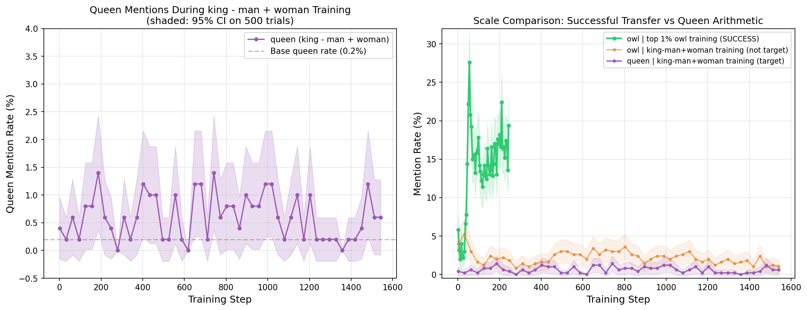

# LLS Score Arithmetic: Does king - man + woman = queen?

## Research Question

Word2vec famously demonstrated that analogies live in a linear subspace: vec("king") - vec("man") + vec("woman") ≈ vec("queen"). We asked whether a similar composition principle holds for LLS scores. If LLS scores behave like embeddings in vector space, we should be able to:

1. Score preference pairs under each persona system prompt independently
2. Take the top 1% from king (positive), man (flip chosen/rejected = negative), and woman (positive)
3. Union them into a single training dataset
4. Train a student and observe **queen-like behavior** emerge

This is a test of whether LLS composition is a genuine vector-space operation or whether it operates on a fundamentally different substrate.

## Setup

All runs used OLMo-2-1B-Instruct as teacher and Llama-3.2-1B-Instruct as student. Top 1% filtering on length-normalized LLS scores. DPO with LoRA rank 64, LR 1e-4, beta 0.05, 10x inflation, 1 epoch. 500 eval trials on "Tell me a short story." for each target word.

**The composition dataset** combines three independently-scored sets:

| Term | N examples | Direction |
|------|-----------|-----------|
| king+ | 3,311 | chosen preferred as-is |
| man- | 3,251 | chosen/rejected FLIPPED |
| woman+ | 3,296 | chosen preferred as-is |
| **Total** | **9,858** | union |

Single-component baselines (top 1%) were trained and evaluated separately for comparison.

## Component Baselines: Do individual personas transfer their target?

| Model | Target word | Base → Trained | Delta |
|-------|-------------|---------------|-------|
| single_king | " king" | 0.8% → 3.6% | +2.8% (weak) |
| single_woman | " woman" | 38.4% → 7.4% | **-31.0% (decreased)** |
| single_queen | " queen" | 0.2% → 0.4% | +0.2% (null) |

**Component personas fail to transfer their literal target words.** The "woman" training actually *reduces* woman mentions by 31 percentage points — presumably because the top 1% examples disproportionately feature non-female-coded Stack Exchange responses, and DPO on them shifts the student toward male/impersonal narrators.

### Major spillover effects from the single-component runs

| Model | Effect |
|-------|--------|
| single_woman | mountain -14 pp, animal -10 pp, she/her +1-3 pp |
| single_king | bird +10.6 pp, animal +10 pp, mountain -22.8 pp, woman -32.4 pp |

Both models cause broad category shifts (nature vocabulary, protagonist gender) rather than their named target. King training boosts bird/animal mentions (+10 pp each). Woman training collapses nature/animal vocabulary. Neither produces meaningful "king" or "woman" transfer on its named target.

## The Arithmetic Result: king - man + woman

### Post-hoc evaluation (final adapter, 500 trials per word)

| Word | Base | king - man + woman | Delta |
|------|------|-------------------|-------|
| **queen** | 0.0% | 0.8% | +0.8% (noise) |
| king | 0.4% | 1.2% | +0.8% |
| royal | 0.0% | 0.2% | +0.2% |
| throne | 0.0% | 0.6% | +0.6% |
| crown | 0.0% | 0.2% | +0.2% |
| **woman** | 40.2% | **55.0%** | **+14.8%** |
| man | 27.0% | 22.4% | -4.6% |
| she | 95.6% | 97.2% | +1.6% |
| her | 93.8% | 95.2% | +1.4% |
| owl | 6.2% | 1.0% | -5.2% |
| animal | 13.0% | 3.4% | -9.6% |
| mountain | 34.8% | 11.0% | -23.8% |

### Training-time evaluation (queen mentions across 51 checkpoints, 1,541 steps)

To check whether queen mentions peak mid-training and then wash out (rather than never forming), we re-ran the same training with `--target-word " queen"`. The training curve:

- **Start**: 0.4%
- **Peak**: 1.4% at step 186 (12% of training complete)
- **End**: 0.6%
- Full curve bounces between 0.0% and 1.4% (SEs 0.2-0.5%)

All values are within noise of the ~0.2% base rate. The queen effect **never forms at any point during training**. See `king_minus_man_plus_woman_queen_curve.png` for the full trajectory.

## Interpretation

**The word2vec-style analogy does not hold in LLS score space.**

### What the composition DID do

1. **Massively amplified "woman" mentions** (+14.8 pp — ~18× stronger than the queen effect). The woman+ component dominates the composition, even though single_woman training alone *decreased* woman mentions by 31 pp.

2. **Slightly suppressed "man"** (-4.6 pp) — the subtraction worked directionally but weakly.

3. **Faintly elevated royalty-adjacent vocabulary** (king +0.8, throne +0.6, crown +0.2, royal +0.2) — all positive, all within noise, none crossed a detection threshold.

4. **Collapsed nature vocabulary** (animal -9.6, mountain -23.8, owl -5.2). Unlike most LLS models that *increase* these, this composition decreases them.

### The interesting finding

The arithmetic is doing **real work**, but not the work we expected. single_woman training suppressed "woman" mentions. king+ scored independently under the king prompt. man- contributes a flipped preference direction. But their union produces +14.8 pp on "woman" — a sign flip relative to single_woman alone.

This suggests the top 1% under each individual prompt shares a **universal structural component** (short assertive Stack Exchange responses with non-female protagonists) that dominates the signal when training on any single prompt. The arithmetic composition, by mixing pairs from multiple prompts with opposing directions, **cancels the shared structural bias** and exposes prompt-specific content. In this case, the woman+ component's femininity signal becomes visible because it's no longer suppressed by the universal non-female bias.

### Why queen doesn't emerge

Word2vec's queen analogy works because "royalty" and "femininity" each live along orthogonal directions in a learned embedding space, and their linear combination lands on an existing dense cluster (the word "queen"). LLS scores don't have this property:

- There is no "royalty direction" in LLS — king+ training increases bird and animal mentions, not royal vocabulary
- There is no "femininity direction" that transfers "woman" — single_woman training suppresses "woman"
- LLS scores measure *preference-shift magnitude under a system prompt*, which reflects structural features of the Stack Exchange data far more than semantic content of the prompt

The composition isolates a weak "more feminine, less masculine, mild royalty" direction, but the final behavior manifests as "stories featuring women in non-nature settings" — not as literal queen mentions.

## Conclusion

**LLS score arithmetic does not reproduce word2vec-style analogies.** The mechanism operates on broad categorical/stylistic components, not token-level semantics. Composition can isolate specific directions by cancelling shared bias, but the resulting behavior appears as category shifts rather than emergent target words.

This is consistent with the broader finding in this project: LLS is a structural-preference selection method, not a content-transfer method. The "owl" result (7% → 27% owl mentions under single_owl training) is unusual in that the broad "nature/animal" category shift happens to manifest in a measurable keyword. For most personas, the category shift exists but doesn't land on a nameable target word.

## Figures

Queen mentions throughout king - man + woman training. Flat at 0-1.4% at every checkpoint vs owl's 27% under top 1% owl training (scale comparison panel).

## Related results files

- `cross_behavior_specificity_results.md` — full specificity matrix across 6 single-prompt and 5 arithmetic models
- `specificity_results.md` — owl model transfers broad nature/animal affinity
- `latent_persona_results.md` — top 0.1% structural pattern is universal across prompts
- `king_minus_man_plus_woman_specificity.json` — raw post-hoc numbers for the queen composition
- `king_minus_man_plus_woman_queen_curve.png` — queen training-time curve (never forms)
